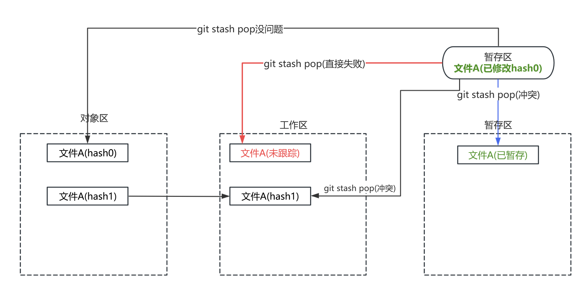
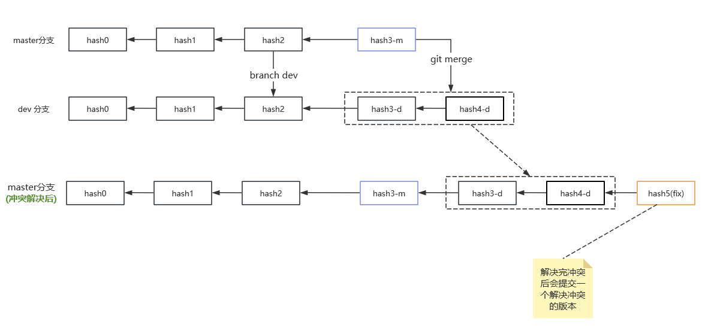
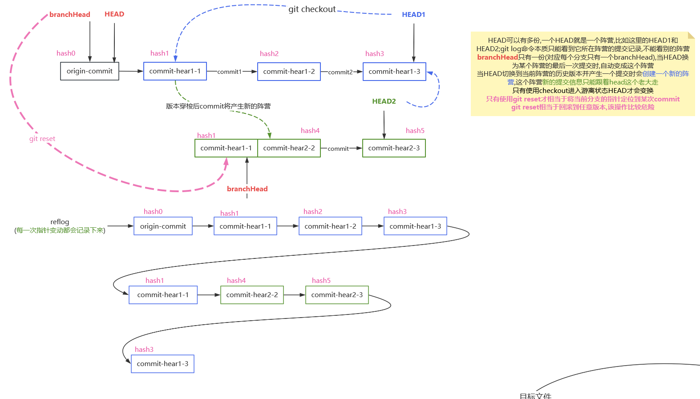

# 目录:  
1.初始化相关命令  
2.修改当前的更改(包括工作区和暂存区)  
3.分支、版本相关命令  
4.远程协作  
5.检查历史/状态相关命令  

**附录:**  
A.Git常用技巧  
B.SourceTree安装教程  


## 1.初始化相关命令
* `git init` 初始化git项目
- - - 
* `git clone [remoteAddress]` 克隆远程仓库的代码
* `git clone [addr] [projectName]` 将远程项目克隆到本地并且命名该项目的名称
* `git clone [addr] --recurisuc` 果克隆的项目依赖别的项目时使用该命令
* `git clone --branch [tags] [addr]` 克隆指定Tag(标签)的项目到本地
- - -
* `git help` 获取git帮助

  
## 2.修改当前的更改(包括工作区和暂存区)
* `git add [file0] [file1...]` 将某个文件添加到暂存区
- - -
* `git mv [originalFile] [targetFile]`  
  将`[originalFile]`重命名为`[targetFile]`,底层在执行顺序:第一步是复制原始文件并将该文件命名为targetFile->删除originalFile.所以对于git而言就是创建了一个文件并且删除了一个文件.第二步是将工作区的这两步操作提交到暂存区.既然是删除就可以利用上面的知识把这个删除的文件还原.<font color="#00FF00">该命令就是Linux的移动命令,除了重命名当然也可以移动一个文件</font>(当然我感觉这些都没什么意义)
  由于移动是先复制再删除,所以此时<font color="#00FF00">从工作区提交到暂存区就有两个命令</font>;一个是新增文件一个是删除文件,所以执行restore命令之后,<font color="#FF00FF">新增的文件状态变为未跟踪,删除的文件状态存在于暂存区</font>
- - -  
* `git restore [file]` 将工作区修改的某个文件回滚到当前分支指向的版本库的版本
* `git restore --staged [file]`  
  放弃某个文件被添加到暂存区的这一步操作(只是放弃,在工作区的该文件不会回滚到暂存区的该文件)此时提交就不会提交该文件了  
  假设文件A的内容一开始是1,添加到暂存区后;修改文件A的内容为2,接着使用该命令放弃暂存区,此时再查看该文件的内容为2(并没有变为暂存区的1),所以可以理解为从来没有这次暂存,既然没有这次暂存,则工作区的文件内容当然是你现在的内容了
- - -  
* `git rm [-f] [--cache] [file]`  
  * 删除一个文件;这种删除会分为两步第一步是在工作区中有删除的操作,第二步是将工作区的删除操作提交到暂存区.所以如果要恢复该文件,首先要放弃本次暂存,其次由于在工作区也删除了,所以要回滚工作区到当前分支指向的版本库,所以这种情况<font color="#00FF00">只适用于文件没有修改的情况</font>  
  * `-f`:如果文件已经在工作区进行了修改(**这次修改可以添加到暂存区也可以不添加到暂存区**),则必须使用`-f`进行强制删除;恢复的时候流程与上一条一样,所以这次修改就不会保留了
  * `--cache`:如果文件已经在工作区进行了修改(**这次修改可以添加到暂存区也可以不添加到暂存区**),使用`--cache`的本质和-f没有什么区别,都会把文件删除的操作一直推到暂存区,只不过`--cache`会取消跟踪该文件;该文件还是会存在于工作区,只不过git不对它进行管理了.<font color="#00FF00">如果此时提交则版本库中确实会把该文件删除,但是工作区还是有的</font>.该命令和`.gitignore`搭配使用效果非常好.  
  * 如果是直接删除文件即在操作系统层面的删除,则这次删除就是工作区的改变;如果想回滚的话会回滚到HEAD指向的版本
- - -  
* `git diff [-u] [objectHash] [--cached [objectHash]] [activeObjectHash targetObjectHash]` 比较工作区、暂存区、对象区中文件的差异,文件差异比较中需要弄清楚谁是<font color="#FF00FF">主动文件</font>,因为比较结果的意思是当<font color="#FF00FF">主动文件</font>应用<font color="#00FF00">差异信息</font>后得到<font color="#FFC800">目标文件</font>  
  diff命令用减号`-`代表主动文件,用加号`+`代表目标文件  
  如果不加任何参数即执行`git diff -u`则默认比较暂存区和工作区所有文件的差异(暂存区是主动文件,工作区是目标文件)  
  * `-u`:显示更详细的信息,一般都会加上该参数
  * `objectHash`:比较objectHash对应对象区和工作区的差异(对象区是主动文件,工作区是目标文件)  
  * `--cached [objectHash]`:比较objectHash对应对象区和工作区的差异(对象区是主动文件,暂存区是目标文件)
  * `activeObjectHash targetObjectHash` 比较两个对象区之间的差异(activeObjectHash是主动文件,targetObjectHash是目标文件)  
  - - -
  假设现在工作区中b.txt文件的内容如下:  
  ```java
  11111
  22222
  33333
  44444
  ```
  现在暂存区中b.txt文件的内容如下:  
  ```java
  11111
  22222
  33333
  44444-change
  ```  
  执行`git diff`命令后的效果如下:  
  ```java
  diff --git a/b.txt b/b.txt
  index 9589b4b..c387961 100644
  --- a/b.txt
  +++ b/b.txt
  @@ -1,4 +1,4 @@
   111111
   222222
   333333
  -444444-change
  +444444
  ```
  `---`代表主动文件,这里就是暂存区中的文件b.txt为主动文件  
  `+++`代表目标文件,这里就是工作区中的文件b.txt为目标文件  
  `-1,4`代表从主动文件的第1行开始与目标文件进行差异分析,负号代表是主动文件,1代表是从第一行开始;4代表一共比较四行(不是到第4行)  
  `+1,4`代表从目标文件的第1行开始与主动文件进行差异分析,加号代表是目标文件,1代表是从第一行开始;4代表一共比较四行(不是到第4行)  
  后面的内容都是针对主动文件而言的,意识是对于主动文件的这1-4行,前三行不变(前三行前面没有符号就代表不变);把第四行删掉(-444444-change前面的减号就是删除),再加上444444(+44444前面的加号就是增加)的内容就能变为目标文件  
  **所以通过差异信息就能将主动文件变为目标文件**  
  - - -
  工作区、暂存区、对象区之间的比较关系:  
    
  一句话总结:<font color="#00FF00">右边的是主动文件,左边的是被动文件</font>  


## 3.分支、版本相关命令 
* `git commit [-a] [-m "message"]` 将缓存区的所有文件提交版本库 
  * -m:添加注释信息 
  * -a:先将工作区的所有文件添加到暂存区,然后再将暂存区的文件提交(一步暂存和提交)
* `git commit --amend -m ["message"]`  
  修改最近一次提交的提示信息,并且本次修改不会产生commit,这个最好少用
- - -
* `git branch [-a] [-v] [-vv]` 查看分支信息 
  * -v:附加最近一次提交的hash值和注释 
  * -a:附加所有远程分支
  * -vv:查看本地分支的当前版本、当前commit、和远程分支关联的情况
  * -avv:查看本地分支+远程分支的当前版本、当前commit、和远程分支关联的情况
* `git branch [branchName]` 创建分支
* ~~`git branch [newBranchName] [originBranchName/tagName]` 基于分支/标签创建分支,该方法可以基于一个分支或者标签去创建一个分支;所以仅从创建分支角度而言<font color="#00FF00">标签可以视作分支</font>,方法被废弃,详情见`git switch`~~
* `git branch [-d] [branchName]`  
  删除分支,不能删除当前分支,并且<font color="#00FF00">当前分支不能删除比自已版本高的分支</font>
* `git branch [-D] [branchName]`  强制删除该分支(不建议使用)
* `git branch -m [oldBranchName] [newBranchName]`	重命名分支(一切分支m)
* `git branch [branchName] [hash]`  
  游离状态下创建新分支,当进入游离状态时会提示一个hash值,我们就根据这个hash值去创建分支.
- - - 
* `git switch [-c] [branchName]` 切换到`branchName`分支  
  * `-c`:如果不存在该分支就创建该分支
* `git switch -c [localBranch] [originBranchName/tagName]` 基于分支/标签创建分支,该方法可以基于一个分支或者标签去创建一个分支;所以仅从创建分支角度而言<font color="#00FF00">标签可以视作分支</font>  
  该方法同样可以基于远程分支创建一个本地分支,<font color="#00FF00">使用该方法创建的本地分支会默认关联远程分支</font>  
- - - 
* ~~`git checkout [-b] [branchName]`~~ 切换到一个分支  
  提示:checkout语义不明确,改用`git switch`  
  * -b:如果该分支不存在就创建该分支(新分支的版本就是创建新分支的分支的版本)
* ~~`git checkout [-b] [branchName] [remoteBranch]`~~  
  其实这条命令的意思应该是基于某个分支创建一个分支;改用`git branch`
  通过git pull只会拉取所有远程分支并且将这些分支和本地分支合并,但如果一个分支远程有本地没有,首先通过git fetch/git pull拉取所有的远程分支分支到本地origin/分支  
  然后执行git checkout -b -[分支名称] origin/[分支名称] (之前说过远程分支名称就是 origin/分支名称)  
  <font color="#00FF00">在本地创建一个新分支并关联远程分支</font>
* `git checkout [file]`  
  放弃工作区某个文件的修改(和git restore形成对比),将工作区的内容回滚到暂存区  
  git restore是放弃某次暂存好像从来不存在一样,工作区不受影响  
  git checkout是放弃当前工作,<font color="#00FF00">即让暂存区的内容覆盖当前工作区的文件</font>,暂存区的内容不变
* `git checkout [hash]`  
  进入游离状态(如果要修改则必须提交、游离状态是创建分支的好时机,所以此时HEAD指向的是游离的版本)
- - -
* `git merge [Branch]` 将[Branch]分支的内容合并到当前分支.
  fast-forward触发流程:  
  当分支A处于commit-A状态时创建了分支B,分支B在这之后提交了两次来到的commit-C的状态,此时分支A将B合并到当前分支(A);此时会找到分支A和分支B的最后一个<font color="#FF00FF">同源点</font>(即这里的commit-A),假设分支A在同源点之后没有任何提交,则此时会触发<font color="#00FF00">fast-forward</font>
  触发fast-forward之后分支A和分支B会<font color="#00FF00">规于一点</font>(即commit-C),底层是让分支A的版本指针指向分支B指向的那个版本,例如31条中图上的<font color="#FF00FF">hash4</font>  
* `git merge --no-ff [Branch]` 禁止fast-forward  
  将[Branch]分支的内容合并到当前分支,如果没有冲突即触发了fast-forward,则<font color="#00FF00">当前分支会多进行一次提交.</font>并且本次提交信息是自动生成的(和上面的区别是合并之后两条分支处于同一版本,而现在<font color="#00FF00">主动合并</font>的分支会多一次commit)  
  可以查看第32条  
  

- - - 
* `git reset [--mixed/soft/hard] [hash]`  
  回滚到任意版本,无视冲突 
  * --mixed:只有版本库回滚 
  * --soft:只有工作区不回滚 
  * --hard:工作区、缓存区、版本库全部回滚(这种回滚就是真正的回滚了)
- - -
* `git revert [hash]`  
  让某个提交不生效,但是该提交并没有真正消失(每一步都会记录).该命令会新提交一次,这个提交就是某个提交不生效后的提交.
- - -
* `git stash`  
  保存现场(该命令针对分支而言,第12条说过没有commit之前是不可以切换分支的,但现在就想切换该怎么办呢?首先git add将内容保存到缓存区、再执行git stash保存现场,此时切换别的分支进行工作,当你再切换回来的时候只会显示当前分支HEAD指向的版本,此时调用git stash list显示所有的现场,通过git stash apply/pop还原现场)当调用完该命令后此时<font color="#00FF00">暂存区变更为现场中保存的内容</font>  
  <font color="#00FF00">保存现场是将暂存区中的内容保存起来</font>  
  *提示:git stash就是`git stash push`命令的简写*  
* ~~`git stash save ["message"]` 保存现场并给现场添加一个message,以便list能轻松查看.如果是git stash保存现场,则现场的信息是hash值.~~
* `git stash push  [-m "message"] ` 保存现场
  * `-m "message"` 并给现场添加一个message,以便list能轻松查看.如果是git stash保存现场,则现场的信息是hash值.
* `git stash list` 显示所有现场,该命令可以得到stashVersion值  
  *提示:stashVersion是形如`stash{0}`一类的值*  
  git stash是按照<font color="#00FF00">栈</font>的方式进行存放的,最后存放的现场最先被还原,最先存放的现场最后被还原  
* `git stash pop ["stashversion"]` 指定还原某个现场并删除该现场,如果不加stashversion则会默认还原最新的现场.
* `git stash apply ["stashversion"]` 指定还原某个现场但是不会删除该现场,如果不加stashversion则会默认还原最新现场.
* `git stash drop ["stashversion"]`	删除一个现场 
- - -
* `git tag ["tag"]`  
  给最新一次提交打上一个标签,一次commit可以添加多个标签,使用这种方式创建的标签的hash值和当前HEAD指向的hash值相同.  
  标签是针对整个项目的,跟某个分支没有关系,也可以理解标签就是一种分支  
* `git tag -a ["tag"] -m ["tagMessage"]`  
  给最新一次提交打上一个标签并且添加提示信息,使用这种方式创建的标签的hash值和HEAD指向的commit的hash值不相同.但使用该方法创建的标签包含当前HEAD指向的commit的hash值这个信息.<font color="#00FF00">一般用这个!!!</font>  
* `git tag -d ["tag"]` 删除一个标签
* `git tag` 查看所有标签(标签就是github里的relessases)
* `git tag -l ["vagueTag"]` 模糊查询一个标签
  模糊查询支持*通配符
* `git show ["tag"]` 查看标签的详细信息
- - - 
* `git cherry-pick [hash]`  
  将otherBranch分支的<font color="#00FF00">一次提交</font>复制到当前分支(复制的时候不会复制hash值,相当于otherBranch的某次提交的所有操作再执行一次)分支必然都是来自同一节点,所以使用该命令的时候必须从otherBranch和当前节点分开的<font color="#00FF00">第一个commit开始复制</font>(否则会冲突).
- - - 
* `git rebase [branch]`  
  将当前分支和branch断开后的所有commit复制到branch.该命令的作用和git cherry-pick类似,只不过当前命令是一次性将两个分支分叉后的<font color="#00FF00">所有commit全部复制一份</font>,另外注意是复制到,所以你要先切换到被复制的那个分支.(复制的时候不会复制hash值),并且该命令只在本机操作不要推送GitHub、branch(想要复制的分支)不能是master(因为master总是要提交到远程)
* `git reabase --continue`  
  使用git rebase复制的时候同样会产生冲突(有点像merge的冲突,但是这里不能和merge混淆了!!!merge是一次操作而reabase是复制分叉后所有的commit),当解决完冲突后git add -> git reabse --continue
* `git reabase --skip`  
  当使用git rebase产生冲突时,不使用当前分支的内容,而是使用branch(想要复制的分支)的内容.(注意commit是一次一次执行的,当每次commit冲突时都会让你去解决冲突,所以你可能需要多次 --skip或者--continue)当前命令实际上是放弃本次commit(因为需要执行多次commit嘛.放弃后Git log就看不到这次commit的日志了,因为已经放弃了)
* `git reabase --abort`  
  放弃本次git rebase操作(如果git rebase完后想后悔的话使用该命令)
- - - 
* `git submodule add [addr]`  
  将当前项目关联另外一个项目(此时当前项目就可以引用别人项目的内容)
* `git submodule foreach git pull`  
  更新当前项目所依赖的所有项目(如果依赖项目发生了改变),但是注意远程还是不会更新依赖项目的(要更新见25条)
- - - 
* `git subtree add -P [projectASName] [addrAS] [branch]`  
  将当前项目互相依赖另一个项目(互相依赖概念见27).
  * `projectASName`:给依赖的项目起的别名 
  * `branch`:依赖的项目的分支(也就是说通过这种方式依赖只能是依赖目标项目的一个分支,只能拿到这个分支的内容) 
  * `addr`:这个地方并不是目标项目的远程地址,还记得之前说过由于远程项目的地址一般很长,可以使用git remote add origin [addr]指代一个远程项目的地址,所以这里需要先调用git remote add origin [addr]命令用一个origin指代远程的依赖项目的地址.  
  另外你可以创建多个依赖,这些依赖都指向同一个addrAS(项目),然后起不同的依赖别名也可以.
* `git subtree pull -P [projectASName] [addrAS] [branch]`  
  更新本地的依赖项目,更新的时候这些projectASName、addrAS、branch都要和上面一条命令指定的一样.(假设现在依赖项目发生更新,同样我们的原项目的本地和远程都无法感知到这次更新.另外该命令只能更新本地,如果要更新远程则类比第25条)
* `git subtree push -P [projectASName] [addrAS] [branch]`  
  如果是依赖项目更新基本上都没什么问题,27条说过原项目是可以更新依赖项目的,假设现在原项目更新直接Git push只是更新原项目的远程仓库,使用git subtree push -P [projectASName] [addrAS] [branch]更新依赖项目的远程仓库.
* `git subtree add -P [projectASName] [addrAS] [branch] --squash`  
  这条命令就不讲了,主要是自已要知道git subtree有些时候会产生冲突(面试的时候就说:要么所有git subtree的命令最后全加--squash,要么全不加否则容易产生冲突)


## 4.远程协作
* `git remote add [remoteAddressName] [remoteAddr]`  
  将当前项目关联一个远程仓库,注意`remoteAddressName`是可变内容,一个项目可以关联多个远程仓库,<font color="#00FF00">比如源项目为upstream,自已fork的仓库为origin</font>,详情见第2条
  * `remoteAddressName`:远程仓库的名称
  * `remoteAddr`:远程仓库地址
* `git remote rm [remoteAddressName]`  
  解除当前与`remoteAddressName`远程仓库的关联;见22条
* `git remote show` 查看当前项目关联了哪些远程仓库(一个项目可以关联多个远程仓库,一般返回origin、upstream)
* `git remote show origin`  
  查看当前对应分支是否过期(相较于远程)以及显示远程仓库地址,以及本地分支与远程分支关联的情况
* `git remote prune origin --dry-run`  
  查看当前计算机不需要的远程分支(第1点说过一个分支就关联一个本地分支),有一种情况就是本地不需要远程分支,但是本地任然有用于感应远程分支的分支.
* `git remote prune origin`  
  删除当前计算机不需要的远程分支(那么以后调用git fetch就不会拉取这些分支了)
* `git remote set-head origin [remoteBranch]`
  设置远程HEAD指向某个分支;remoteBranch:远程分支的名称
- - - 
* `git push [-u] [remoteAddressName] [LocalBranch]`  
  将本地的<font color="#FF00FF">一个</font>分支<font color="#00FF00">推送到远程的`remoteAddressName`仓库</font>执行该命令时需要进入将要关联的本地分支,并且LocalBranch要和本地分支的名称一致.  
  *注意:如果远程已经有该分支了,<font color="#FF00FF">并且远程分支和本地分支不是同一个分支则会直接报错</font>,如果是同一个分支则会将本地分支与远程分支关联*
  * `remoteAddressName`:远程仓库的名称
  * `-u`:如果远程没有该分支则需要该参数(即第一次推送需要该参数),<font color="#00FF00">添加该参数会使当前分支默认关联远程分支</font>,后续将本地分支推送到远程时就不需要使用该参数了
* `git push [remoteAddressName] --delete [remoteBranch]` 删除远程分支,见22条  
  <font color="#00FF00">这条命令实际上就是把本地的远程分支删除然后再同步给远程</font>  
  * `remoteBranch`:远程分支名称
* `git push [remoteAddressName] [localBranch]:[remoteBranch]`  
  将本地的localBranch分支推送到远程仓库`remoteAddressName`并命名远程分支名为<font color="#00FF00">remoteBranch</font>(如果远端没有就创建),和git push -u不同的是 <font color="#00FF00">git push -u [LocalBranch] 就等于创建一个本地的远程分支,该分支名为本地分支名前面加上origin/</font>,而当前命令是让本地分支去关联远端任意名称的分支.比如git push origin dev:dev2就是让远程的dev2和本地的dev分支关联.
* `git push origin ["tags"]` 将本地的一个标签推送到远程
* `git push origin --tags` 将本地所有的标签推送到远程
* `git push origin :["tags"]` 删除远程标签
- - -
* `git fetch origin [localBranch]`  
  将远程所有的origin/分支拉取到本地(更新本地的origin/分支).(远程分支在本地保留一份用于感知远程分支),如果不加 origin [localBranch]默认就是当前分支  
* `git fetch origin tag ["tags"]` 从远程拉取指定标签
- - - 
* `git pull`
  该命令是git fetch和git merge的组合,拉取远程仓库最新的版本并将远程的同名分支合并到本地分支.(第一条,每个远程分支都有与之对应的本地分支).这条命令也会拉取所有本地没有的标签.
* `git pull [remoteBranch]:[localBranch]`  
  该命令和`git checkout [-b] [branchName] [remoteBranch]`类似,都是将本地没有的远程有的分支关联到本地.区别在于和本地关联的时候本地分支的名称可以和远程分支的名称不一致.


## 5.检查历史/状态相关命令
* `git status` 查看Git本地仓库的状态
* `git log [-graph]` 查看所有commit操作
  更准确的说这条命令是<font color="#00FF00">查看当前HEAD指针指向的版本及该版本之前的commit信息</font>,至于采用这种说法就是为了描述<font color="#FF00FF">版本穿梭</font>和`git reflog`命令形成对比
  * `-graph`:以图的形式显示所有提交记录
  * `--pretty=oneline`:只显示hash值和提交信息(这个选项会忽略很多信息)
  * `--abbrev-commit`:只显示提交hash值的前7位
* `git reflog` 查看所有操作记录
* `git show ["tag"]` 查看标签的详细信息
* `git blame [files]` 查看一个文件的每一行是谁写的
- - - 
* `git diff` 比较暂存区和工作区文件的差异(要知道diff命令的差别)
* `git diff [hash]` 比较任意版本库和工作区的差异
* `git diff --cached [hash]` 比较任意版本库和暂存区的差异
- - -
* `git config -l`  
  显示git自身的配置信息,本质上该命令就是显示两个文件的内容,一个是git安装目录下/etc/gitconfig配置文件,一个是用户目录下的~/.gitconfig配置文件
* `git config [--system|--global|--local] [propertiesKey] [propertiesValue]` 设置git配置  
  * `--system|--global|--local` 指定配置的级别  
    * `--system`:设置系统级别的配置  
    * `--global`:设置当前用户级别的配置  
    * `--local`:设置项目级别的配置  
  - - -
  例如:  
  `git config --global user.name "userName"` 设置提交的用户名  
  `git config --global user.email xxx@qq.com` 设置提交的邮箱  
* `git config --global --unset [propertiesKey]` 重置全局配置
- - -
* `git version` 查看Git的版本  
* `git blame [file]` 追踪文件责任人,通过该命令可以看到某个文件的每一行是被谁写的被谁修改的,并且每一行都有一个hash值  
  * `file`:具体要查看的文件


## 附录:  
A.Git常用技巧
B.SourceTree安装教程  


### A.Git常用技巧
1. 名词解释:
   * HEAD:当前版本的指针 
   * origin:远程分支(原始的) 
   * branch:分支 
   * remote:远程 
   * hash:版本的哈希码 
   * file:文件的相对路径 
   * addr:项目的远程地址 
   * stashversion:现场版本号(该值是通过git stash list得到的冒号前的  内容,使用的时候一定要加双引号) 
   * vague:模糊 
   * tag:标签(github中的releases),给某一次提交打上一个标签,该标签就  相当于一个版本可以被单独下载(就是GitHub中的项目的每个版本).
   * addrAS:特指通过git remote add origin [addr]命令用一个值指代远程项目地址
   * cache:在git中cache就是指代暂存区
2. 远程的origin相当于一个单独的分支(远程的分支名称就是origin/本地分支名,<font color="#00FF00">前提是已经关联</font>)通过这个分支感知远程仓库的内容(这个分支在本地也有一份,相当于<font color="#FFC800">本地的远程分支</font>),而本地的master又相当于一个单独的分支.
  一个项目可以关联多个仓库,比如<font color="#00FF00">关联自已的fork仓库origin,也可以关联原仓库upstream</font>;并且origin和upstream可以是<font color="#FF00FF">异构的远程仓库</font>,比如origin是Gitee的,upstream是github的都可以.  
3. 每一步操作都会被记录,但是该操作是否生效则不一定
4. 可以通过执行`git config --global http.proxy http://127.0.0.1:7890`和`git config --global https.proxy http://127.0.0.1:7890`来让git走代理,把这里的IP和端口替换为代理的IP+端口即可  
5. 一般每个开发者都有自已专属的分支  
  假设远程的公共的开发分支为dev,可以将该远程分支拉到本地;然后基于该分支开辟一个自已的分支,自已平常在该分支上修改,修改的代码commit之后合并到本地的dev分支,然后再将dev推送到远程分支.  
  这种思想就类似于fork的思想,两种思想差不多  
6. 合并分支并不是真正意义上的融合,<font color="#00FF00">只是说将otherBranch分支上所有版本库的操作再对被合并的分支执行一次</font>.(首先AB分支版本相同,A分支删除了一些文件,此时将A分支合并到B分支,B分支就会删除这些文件)  
7. 合并分支产生冲突时,记住<font color="#00FF00">master分支不应该去处理冲突</font>,而是应该让和master产生冲突的那条分支去处理冲突.(<font color="#FF00FF">即中央分支不解决冲突</font>)冲突分支的那一方首先应该<font color="#00FF00">将master分支合并到当前分支</font>,然后冲突分支再去处理冲突,冲突解决完后再让master分支去合并刚刚冲突的分支.master要做的就是<font color="#FF00FF">通过git reset命令回到合并之前的版本</font>(原因是当master主动去与冲突分支合并时默认就会让master去处理这个冲突,但是不能让master去处理冲突所以要让master回滚到冲突之前的版本)
  这套思想对于fork也是适用的,如果某个仓库发起merge request产生冲突,则当前中央仓库不解决该冲突,而是<font color="#00FF00">让merge request发起方来解决冲突</font>.
8. 首先需要先了解fast-forward的产生条件<font color="#00FF00">fast-forward的产生条件</font>,<font color="#FF00FF">当把某个分支合并到当前分支不能产生fast-forward时,并且目标分支修改的内容与当前分支修改的同一行内容时</font>就会产生冲突;  
   **<font color="#FFC800">判断不能产生fast-forward的条件是:</font>** 找到目标分支和当前分支的最后一个<font color="#00FF00">同源点</font>,如果当前分支在同源点之后还有修改则本次合并就不是fast-forward  
   *也即当前分支的最后一次提交就是同源点*  
   **<font color="#FFC800">判断目标分支和当前分支有没有修改同一行的条件是:</font>** 只看目标分支的最后一次提交的内容和当前分支的最后一次提交的内容是否修改了同一行(是这两个commit之间进行比较),<font color="#00FF00">而不是把目标分支的版本库对当前分支重新做一遍</font>  
   合并之后的版本效果图:  
   假设分支A和分支B的第一个同源点是commit-origin;之后分支A进行了一次提交commit-A-1;分支B进行了两次提交commit-B-1、commit-B-2;并且它们都修改了同一行  
   此时将分支B合并到分支A会产生冲突,<font color="#FF00FF">产生冲突就要解决冲突</font>;当冲突解决完毕之后冲突本身会形成一次提交,所以最后分支A的提交记录就应该是<font color="#FFC800">origin-commit->commit-A-1->commit-B-1->commit-B-2->fix CONFLICT</font>  
   *提示:如果分支B和分支A没有修改同一行,但也构不成fast-forward的话,则分支B(被合并的分支)的提交会放到分支A最后一次提交的后面,即:*  
   <font color="#FF00FF">commit-origin->主动合并的分支的所有commit->目标分支的所有commit</font>  
   另外冲突产生的原因还有不规范(比如git cherry-pick [hash]命令跨节点复制)、分支不是同一祖先.

9. 远端分支的更改本地是感知不到的
10.  pull request和Fork,Fork完项目后我们在Fork的项目的dev分支中修改代码后在主页点击Compare&pull request,然后填入当前修改的提交信息 然后点击create pull request.然后仓库的拥有者就会审查你的代码进行合并操作.
11.  如果想忽略某些文件,在.git同级目录下创建.gitignore,然后在该文件中填入你需要屏蔽的文件,另外文件的目录也是支持通配符的.
12.  建议(规范):在功能没有开发完之前不要commit
13.  规定(必须):在没有开发完毕之前(commit)不能checkout(切换分支),<font color="#00FF00">如果硬要切换分支可以保存现场</font>
14.  在游离状态下,如果对过去的版本进行了修改并且提交了,那么过去版本的后面的版本是不会感知到这次修改的,只有通过新建分支然后合并来达到修改的目的.
15.  保存现场的前提是要添加到暂存区中,<font color="#00FF00">如果一个文件只存在于工作区那么这个文件是属于任何一个分支的</font>(不然怎么让你切换分支前要commit呢?)
    <font color="#FF00FF">切换分支之前暂存区不能有内容,否则会直接报错</font>*(除非这两个分支处于同一个commit版本,但需要记住暂存区有内容就不要切换分支)*  
    <font color="#FF00FF">切换分支前,如果工作区有未跟踪的文件,并且该文件存在于目标分支,则会直接报错;</font>  
16. * <font color="#00FF00">还原现场的时候如果工作区新建了一个文件(<font color="#FF00FF">未跟踪</font>)并且该文件已经存在于现场中,则本次还原会直接报错</font>  
    * <font color="#00FF00">还原现场的时候如果暂存区,拥有现场里的文件则会产生冲突</font>  
    * <font color="#00FF00">还原现场的时候如果现场里的文件和工作区中的文件不是来源于同一commit则会产生冲突</font>  
    假设现在的master分支对file.txt文件做了修改然后将本次修改提交到暂存区,再保存现场;接着master又对file.txt文件做了修改然后将其提交,此时如果还原现场则会产生冲突.  
    * 流程图:  
      
17. 标签和分支是没有关系的,标签不针对分支可以被任意分支看到.
18. master分支一般很少改变,dev分支一般用来开发,test分支用来测试.master一般就是生产阶段了
19. 当通过git checkout origin/master切换到远程分支时会处于一个游离状态.所以既然是处于游离状态,就不是真正意义上的切换分支,而是到达了远程分支的某个版本,即没有切换远程分支的说法,切换到远程分支就是进入游离状态.
20. 如果项目是克隆下来的,则这个项目是不需要执行`git push -u origin [LocalBranch]`操作的.
21. 假设A和B同时修改了同一行,A先commit并且push到远程.B再commit并且push到远程,由于修改了同一行必然产生冲突,所以B的这次push压根就不会成功,此时B就需要先pull,pull完了之后因为修改了同一行必然有冲突所以此时B就要去解决这个冲突,解决完后push(会有两次commit)
22. 本地有的远程没有的分支,用`git push -u origin [branchName]`(或者`git push origin`) 在远程创建分支并和本地关联,远程有的本地没有的可以使用`git branch [newBranchName] [originBranchName/tagName]`命令来基于本地的远程分支创建本地分支或者看git pull [remoteBranch]:[localBranch]
23. 对于一个有关联的分支,实际上是有3条分支.第一条就是本地的分支,第二条就是远程的分支,第三条是本地的远程分支(用该分支来感应远程分支)
24. 标签的性质和文件是一样的,如果一个标签本地有远程没有,调用<font color="#00FF00">git pull之后本地有的标签是不会删除的</font>.所以有些时候文件和标签是可以类比的,实际上一个标签在.git目录里就有与之对应的文件.
25. 当我们通过git submodule关联另外一个项目时,假设另外一个项目的内容发生改变并且push了,但是原项目是感知不到这次提交的,所以我们必须进入到原项目的依赖项目然后通过git pull更新依赖项目,但是这次pull只是将本地的依赖项目更新了,远程的依赖还没有更新,此时在原项目执行 git add->git commit->git push才能让远程更新.
26. 没有命令直接解除当前项目的关联项目,首先执行git restore --staged [file]将依赖项目的文件夹从缓存区删除,然后删除依赖项目文件夹.->git add ->git commit ->git push
27. 25、26介绍的都是单向依赖,在这种依赖环境下原项目是不能直接修改依赖项目的远程内容的(当然本地的可以修改).而在互相依赖状态下当前项目修改完依赖项目后可以push到远程,远程就可以被改变.
28. Git与SVN的区别:  
    SVN是<font color="#00FF00">集中式版本控制系统</font>,需要联网才能工作必须不停地与服务器进行同步.  
    而Git是<font color="#00FF00">分布式版本控制系统</font>,每个人的电脑都是一个<font color="#FFC800">完整</font>的版本库,工作的时候不需要联网,只要把修改的文件推送给对方即可.
29. <font color="#FFC800">.gitignore</font>指定跟踪规则,主要看/在前面还是在后面  
    *提示:如果一个文件夹里面没有任何内容则该文件夹默认被屏蔽,而且这个<font color="#00FF00">文件夹无法被添加到暂存区</font>*  
    <font color="#00FF00">temp</font>:取消跟踪当前项目下temp文件及所有temp目录,假设现在项目路径结构如下:  
    > .gitignore  
    > src  
    > > temp <font color="#00FF00"># 该文件夹会被屏蔽</font>  
    > > java
    > > > temp  <font color="#00FF00"># 该文件会被屏蔽</font>    
    > 
    > temp  <font color="#00FF00"># 该文件夹会被屏蔽</font>  
    > > a.txt

    <font color="#00FF00">temp/</font>:取消跟踪与`.gitignore`文件同级及所有子路径下的temp文件夹,假设现在项目路径结构如下:  
    > .gitignore  
    > src  
    > > temp <font color="#00FF00"># 该文件夹会被屏蔽</font>  
    > > java
    > > > temp  <font color="#FFC800"># 该文件不会被屏蔽</font>    
    > 
    > temp  <font color="#00FF00"># 该文件夹会被屏蔽</font>  
    > > a.txt

    <font color="#00FF00">/temp</font>:取消跟踪与`.gitignore`同级路径下的temp文件/文件夹,假设现在项目路径结构如下:  
    > .gitignore  
    > src  
    > > temp <font color="#FFC800"># 该文件夹不会被屏蔽</font>  
    > > java
    > > > temp  <font color="#FFC800"># 该文件不会被屏蔽</font>    
    > 
    > temp  <font color="#00FF00"># 该文件夹会被屏蔽</font>  
    > > a.txt  
    > 
    > temp <font color="#00FF00"># 如果这里temp是文件的话它也会被屏蔽</font>  
30. Git的当前分支不能删除比自已版本高的分支
      
31. fast-forward流程  
      
    假设分支A处于commit-A在此状态下创建了分支B,接着分支B提交了两次来到了<font color="#FFC800">commit-C</font>状态,此时将分支B合并到分支A,找到分支A和分支B的第一个<font color="#00FF00">同源点(这里是commit-A)</font>,由于分支A在此之后没有任何commit,所以会直接把分支A的<font color="#FF00FF">指针</font>指向<font color="#FFC800">commit-C</font>这次提交  
    <font color="#00FF00">fast-forward最终会归为一点</font>,例如上图中的hash4  
32. 禁止fast-forward
      
    此时将dev的两个commit合并到master之后,master还会再创建一个commit,即图中的hash5  
33. 冲突解决流程图  
      
34. 工作区的回滚(各种意义上的)使用的都是`git restore`,而暂存区的回滚(各种意义上的)使用的都是`git restore --staged`  
35. 版本回滚流程图
    
    HEAD可以有多份,<font color="#00FF00">一个HEAD就是一个阵营</font>,比如这里的HEAD1和HEAD2;git log命令本质只能看到<font color="#FF00FF">origin-head</font>所在阵营的提交记录,不能看别的阵营  
    <font color="#FF00FF">origin-head只有一份</font>,当origin-head切换为某个阵营的<font color="#FFC800">最后一次提交</font>时,自动变成这个阵营  
    当origin-head切换到当前阵营的历史版本并产生一个提交时会<font color="#00FF00">创建一个新的阵营</font>,<font color="#FFC800">这个阵营新的提交信息只能跟着origin-head这个老大走</font>  
36. 版本穿梭的本质是创建一个看不到的分支,并且该分支的名称就是目标版本的hash值,该分支的版本就是目标版本;
    在游离状态(版本穿梭后的状态就是游离状态)下<font color="#FFC800">如果对文件进行修改就必须要提交</font>,提交就会产生新的hash,因为版本穿梭是创建新的分支所以本次提交对源分支master是不可见的  
    <font color="#FF00FF">游离状态是创建分支的好时机,版本穿梭就是用于创建分支的</font>  
    如果想退出版本穿梭,只要执行`git switch`切换分支(例如master)即可  
    实际上版本穿梭并不是分支,<font color="#00FF00">游离的本意就是当前不处于任何分支</font>,这里只是便于理解;因为它并不具有分支的一些特征,比如分支重命名  


### B.SourceTree安装教程
1.跳过注册步骤  
  

2.自动转换LF  
  

*提示:LF是Linux的换行编码,CRLF是Windows的换行编码*  

3.设置账户信息  
  
这里如果已经安装了Git则会自动读取Git配置的全局账户信息  

4.点击下一步即可  
注意SourceTree默认会安装到系统盘,所以可以通过mklink来链接到D盘  

