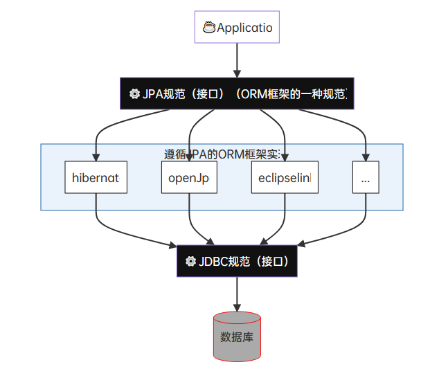
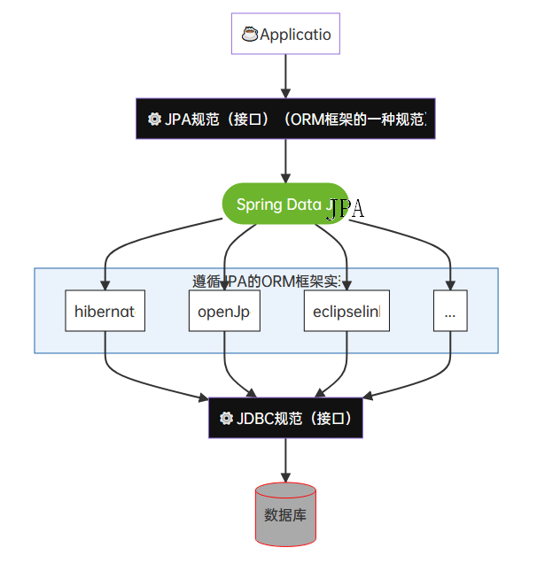
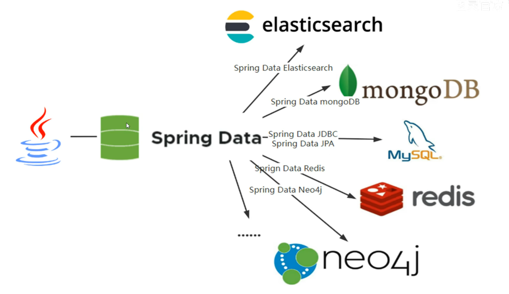
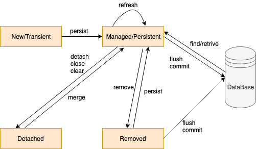

# 目录  
1.JPA基本概念介绍  
2.Spring Data JPA  
3.杂项  


## 1. JPA基本概念介绍
1.ORM  
ORM全称Object Relation Mapping;用于解决JDBC访问数据库太麻烦的问题,Mybatis、Hibernate就是ORM框架.  
java针对ORM提出提出了`JPA`,JPA本质上是一种ORM规范,并不是ORM框架,也就是JPA为了实现ORM这一功能制定了规范,其中Hibernate就是JPA的实现,所以Hibernate拥有ORM功能.  

application、JPA、JPA实现、JDBC和数据库的关系图:  
  

2.JPA Query和SQL Query的对比  
* JPA Query:面向JavaBean;代表作hibernate  
* SQL Query:面向数据库;代表作mybatis


|         mybatis         |                       hibernate                        |
|:-----------------------:|:------------------------------------------------------:|
|   小巧、半自动、直接    |                   方便、全自动、复杂                   |
| 国内更流行,处理复杂查询 | 优势在简单查询,不太适合太复杂的查询,但符合`微服务`趋势 |

3.JPA  
JPA是Sun在JDK1.5时提出的一种ORM规范,是一种对JDBC的`升级`  
* 减少对sql语句的依赖,减少基本的开发成本(但也提高了高级的开发成本)
* 提高数据库的移植性
* 进一步明确java对象和数据库类的映射关系

*提示:JPA之于ORM(持久层框架,如MyBatis、Hibernate等,用于管理应用层Object与数据库Data之间的映射)正如JDBC之于数据库驱动(好好理解这句话)*  

规范提供了如下特性:  
* ORM映射元数据  
  JPA支持XML和注解两种元数据形式,元数据描述对象和表之间的关系,框架据此将实体对象持久化到数据库表中  
  如:`@Entity`、`@Table`、`@Id`、`@Column`等注解
* JPA提供API可以直接通过操作实体来操作数据库,拜托JDBC、SQL  
* 通过面向对象而非面向数据库的查询语言查询数据,避免程序的SQL语句紧耦合  
  如:`from Student s where s.name = ?` 注意这里的Student不是表,而是对象(实体类)  

4.Spring Data JPA  
Spring Data JPA是Spring提供的一套简化JPA开发的框架,Spring Data JPA`通过约定好的方法命名规则来编写dao接口`,从而在不写接口实现的情况下实现对数据库的访问和操作.同时Spring Data JPA还提供了很多除了CRUD之外的功能,如分页、排序、复杂查询等  
  
*相当于Spring Data JPA再在之上包装了一层*  

此外,Spring Data JPA致力于为数据访问(DAO)提供熟悉且一致的编程模板;对于每种持久性存储,dao通常需要为不同存储库提供不同CRUD(增删改查)持久化操作.Spring Data为这些持久性存储以及特定实现提供了通用接口(`CrudRespository、PagingAndSortingRespository`)和模板(`jdbcTemplate、redisTemplate、RestTemplate、MongoTemplate`)  
这也是为什么使用Spring Data JPA的原因之一,<font color="#FF00FF">因为Spring Data JPA提供了对各种类型的数据库的存储服务的支持.</font>  
*注意:这里说的dao是笼统的一种叫法,指的就是数据访问层*

Spring Data主要模板(Spring Data支持的持久层技术非常多):  
* Spring Data common:用于支持每个Spring Data模块的核心公共模块
* Spring Data JDBC:对JDBC的Spring Data存储库支持
* Spring Data JPA:对JPA的Spring Data存储库支持
* Spring Data MongoDB:对MongoDB的基于Spring对象文档的存储库支持
* Spring Data Redis:封装Jedis技术,对redis实现访问操作
* Spring Data Elasticsearch:对Elasticsearch实现访问操作
* Spring Data REST:将Spring Data存储库导出为超媒体驱动的RESTful资源

  


5.对象/数据存储映射  

`JPA:`  
```java
@Entity
@Table(name="TUSR") // 一个类就是一个表
public class User {
  @Id
  private String id;
	@Column(name="fn") // 一个属性就是一个列
	private String name;
	private Date lastLogin;
	@OneToMany // 表的关系
	private List<Role roles;
}
```

`MongoDB`:  
```java
@Document(collection="usr")
public class User {
	@Id
	private String id;
	@Field("fn")
	private String name;
	private DAte lastLogin;
	private List<Role> roles;
}
```

`Neo4j`:  
```java
@NodeEntity
public class User {
	@GraphId
	Long id;
	private String name;
	private Date lastLogin;
	@RelatedTo(type="has", direction=Direction.OUTGOING)
	private List<Role> roles;
}
```

6.类的继承关系  
在JPA中`Repository`接口作为一个标识,它的子接口扩展了一些功能  
* Repository:仅仅是一个标识,表示任何继承它的类就一个仓库接口  
  * CrudRepository:实现了CRUD相关方法
    * PagingAndSortingRepository:实现了分组排序相关方法
    * QueryByExampleExecutor
      * JpaRepository:实现了JPA规范相关方法

7.底层实现  
JPA底层采用hibernate实现  

## 2.Spring Data JPA
**目录:**  
2.1 Spring Data JPA中的基本概念  
2.2 JPA注解(表/属性)  
2.3 JPA注解(关联)  

### 2.1 Spring Data JPA中的基本概念  
1.JPA对象(Entity)的四种状态  
Entity的生命周期由EntityManager管理,其生命周期在persistence context内  

* 临时状态(New/Transient):刚创建出来,没有与entityManager发生关系,没有被持久化,不处于entityManager中的对象
* 持久状态(Managed/Persistent):与entityManager发生关系,已经被持久化,可以把持久化状态当作`实实在在的数据库记录`(此状态的属性值修改,将在提交时,同步数据库)
* 删除状态(Removed):执行remove方法,事务提交之前
* 游离状态(Detached):游离状态就是提交到数据库后,事务commit后实体的状态.因为事务已经提交了,此时实体的属性的任何改变,`都不会同步到数据库`



Entity生命周期的四个基本操(CRUD)  
```java
EntityManager em = factory.createEntityManager();

EntityTransaction tx = em.getTransaction();
tx.begin();

Customer customer = new Customer(); // 临时状态
customer.setCustId(6L); // 游离状态
customer = em.find(Customer.class, 5L); // 持久状态
em.remove(customer); // 删除状态

tx.commit();
```

*注意:这里EntityManager是来源于hibernate中的概念*  

2.JPA中的持久性上下文  
* 持久化上下文的生命周期与系统事务一致
* 持久化上下文提供自动脏检查
* 持久化上下文是一级缓存

**持久化上下文提供自动脏检查:**  
在事务提交的时候,JPA会执行一个脏检查机制,会检查持久化上下文中的对象状态和数据库中的状态是否一致,如果不一致,就会根据持久化上下文中的状态去更新数据库中的状态.**但是这个动作只有在数据库事务提交的时候在会做,如果事务回滚了,不会做这个动作**

可以调用JpaRepository提供的flush或saveAndFlush方法立刻同步状态到数据库,而不是等到事务提交的时候在同步.需要注意的是,这里的立刻同步到数据库是指将修改/删除操作所执行的SQL语句先执行,此时事务并没有提交,只有在事务提交后,这个更新/删除才会起作用  

### 2.2 JPA注解
1.Entity命名策略  
* 显示命名:即通过`@Table`的name属性指定对应的数据库表名称,`@Column`的name属性指定实体字段对应数据库字段的名称  
* 隐式命名(默认):交给框架来进行隐式命名

如果我们没有使用@Table或@Column指定了表或字段的名称,则由SpringImplicitNamingStrategy为我们隐式处理,表名隐式处理为类名,列名隐式处理为字段名.如果指定了表名列名,SpringImplicitNamingStrategy不起作用  
将上面处理过的逻辑名称解析成物理名称.无论在实体中是否显示指定表名列名,SpringPhysicalNamingStrategy都会被调用

2.JPA对象属性与数据库字段的映射  
|                             Java Type                              |             Database Type             |
|:------------------------------------------------------------------:|:-------------------------------------:|
|                        String(char,char[])                         |   varchar(char,varchar2,clob,text)    |
| Number(BigDecimal,BigInteger,Integer,Double,Long,Float,Short,Byte) | numeric(number,int,long,float,double) |
|                  int,long,float,double,short,byte                  | numeric(number,int,long,float,double) |
|                               byte[]                               |        varbinary(binary,blob)         |
|                          boolean(Boolean)                          |   BOOLEAN(bit,smallint,int,number)    |
|                           java.util.Date                           |       timestamp(Date,DateTime)        |
|                           java.sql.Date                            |       Date(timestamp,datetime)        |
|                           java.sql.Time                            |       Time(timestamp,datetime)        |
|                         java.sql.Timestamp                         |       TIMESTAMP(datetime,Date)        |
|                         java.util.Calendar                         |       TIMESTAMP(datetime,Date)        |
|                           java.lang.Enum                           |         NUMERIC(varchar,char)         |
|                       java.util.Serializable                       |        varbinary(binary,blob)         |

3.注解大全  
`@Entity`  
用于添加在实体类上,定义该JAVA类成为被JPA管理的实体,将映射到指定的数据库表.如定义一个实体类Category,它将映射到数据库中的category表中  

`@Table`  
指定数据库的表名,与`@Entity`一同使用;添加在实体类上
* name:指定表的名称;如果不写默认表名为类名
* catalog,schema:用于设置目录和此表所在的schema(模式),一般不需要填写
* uniqueConstraints:唯一性约束;只有创建表的时候有用
* indexes:索引;只有创建表的时候需要,默认不需要

`@Id`  
定义属性为数据库表中的主键列,一个实体里面必须有一个;添加在属性上

`GeneratedValue`  
主键生成策略;添加在被@ID注解修饰的属性上  
* strategy:id的生成策略
  * GenerationType.TABLE:通过表产生主键,框架由表模拟序列产生主键,使用该策略可以使应用更易于数据库移植
  * GenerationType.SEQUENCE:通过序列产生主键;通过`@SequenceGenerator`注解指定序列名;MySql不支持这种方式
  * GenerationType.IDENTITY:数据库id自增长,多用于MySql
  * GenerationType.AUTO:JPA自动选择合适的策略,默认选项
* generator:通过Sequence生成id,常见Orcale数据库id生成,需要配合`@SequenceGenerator`使用

`@Column`  
定义该属性对应数据库中的列名  
* name:数据库中的列名,如果不写默认和实体属性名一致
* unique:是否唯一,默认为false
* nullable:是否允许为空,默认为false
* insertable:执行insert操作的时候是否包含此字段,默认为true
* updatable:执行updatable操作时是否包含次字段,默认为true
* columnDefinition:表示该字段在数据库中的实际类型
* length:数据库字段的长度,默认为255
* table:
* precision:
* scale:

*提示:这里面有些字段是用于生成数据库表时使用的*  

`IdClass`  
联合主键;通过外部类来实现联合主键  
```java
@Data
@Entity
@IdClass(value = UnionKey.class)
public class IdClassDemo{

  @Id
  private String idOne;

  @Id
  private String idTwo;

  private String context;
}
```
假设有上述这样的实体类,它由idOne和idTwo这两个键构成联合主键,除了在这两个属性上都标注@Id注解之外,还需要在类上标注一个@IdClass注解,并且该注解内的value属性指定了一个外部类;看看这个外部类的定义结构  

```java
@Getter
@Setter
@NoArgsConstructor
@EqualsAndHashCode
public class UnionKey implements Serializeable {
  private String idOne;

  private String idTwo;
}
```
UnionKey类必须实现Serializeable接口,必须有默认的无参构造方法,必须重写equals和hashcode方法  

**使用方法:**  
在Repository接口的编写时还需要注意,Repository接口要把主键改为外部主键类  
```java
public interface IdClassRepository extends JpaRepository<IdClassDemo,UnionKey> {

}
```

`@Basic`  
表示属性是到数据库表字段的映射,如果实体的字段上没有任何注解,默认即为@Basic
* fetch:抓取方式,默认FetchType.EAGER(立即加载),FetchType.LAZY(延迟加载,主要应用在大字段上面)
* optional:设置这个字段是否可以为null,默认是true

`@Transient`  
表示该属性并非是一个到数据库表的字段的映射,<font color="#00FF00">与@Basic作用相反</font>.JPA映射数据库的时候忽略它  

`@Temporal`  
用来设置Date类型的属性映射到对应精度的字段;标注在属性上  
* TemporalType.DATE 映射为数据库date
* TemporalType.TIME 映射为数据库time
* TemporalType.TIMESTAMP 映射为datetime

`@Enumerated`  
映射枚举类  
* value
  * EnumType.ORDINAL 枚举字段的下标
  * EnumType.STRING 枚举字段的Name

`@Lob`  
将属性字段映射成数据库支持的大对象类型,支持以下两种数据库类型的字段  
* Clob(Character Large Objects)类型:长字符串类型,java.sql.Clob、Character[]、char[]和String将被映射成Clob类型
* Blob(Binary Large Objects)类型:字节类型,java.sql.Blob、Byte[]、byte[]和实现了Serializable接口的类型将被映射为Blob类型

*注意:由于Clob、Blob占用内存空间较大,一般配合@Basic(fetch=FetchType.LAZY)将其设置为延迟加载*

`@NamedQuery`  

`@NamedNativeQuery`  

`@MappedSuperClass`  
可以把一些公共的属性提取到添加该注解的类里,如id,creteTime,updateTime等.该类不会生成表,该类中相应的字段都会生成在子类中.该类没有被@Entity注释,不是一个实体  

`@Inheritance`  
控制实体之间的继承关系 

### 2.3 JPA注解(关联)
`@JoinColumn`  
用于指定连接实体关联或元素集合的列  
* name:外键列的名称
* table:外键所在的表名
* referencedColumnName:这个外键列引用的列的名称
* unique:是否唯一,默认false
* nullable:能否为null,默认为true
* insertable:是否跟随一起新增,默认为true
* updatable:是否跟随一起修改,默认为true
* columnDefinition:DDL SQL片段
* foreignKey:于在表生成时指定或控制外键约束的生成.如果未指定此元素,则将应用持久性提供程序的默认外键策略.一般默认即可

`@JoinTable`  
指定关联的目标表配置,如果没有@JoinTable注解,则使用注解元素默认值
* name:连接表名称.(默认:两个关联的主实体表的连接名称,用下划线分隔,如:table_b_table_b)
* catalog:表的目录;默认为默认目录.一般默认即可.
* schema:表的schema.默认为用户的默认schema.一般默认即可.
* joinColumns:连接表的外键列,它引用拥有关联的实体的主表.
* inverseJoinColumns:连接表的外键列,它引用不拥有关联的实体的主表.(即相反的一面).
* foreignKey::用于在表生成时为joinColumns元素对应的列指定或控制外键约束的生成.* 一般默认即可.
* inverseForeignKey:于指定或控制在表生成时对应于inverseJoinColumns元素的列的* 外键约束的生成.一般默认即可.
* uniqueConstraints:要放在表上的唯一约束.只有在表生成时才使用这些方法.默认没有* 附加约束.一般默认即可.
* indexes:表的索引.只有在表生成时才使用这些方法.一般默认即可.

`@OneToOne`  
指定与具有一对一多重性的另一个实体的单值关联  
*提示:非拥有方必须使用OneToOne注释的mappedBy元素来指定拥有方的关系字段或属性*  
* targetEntity:关联的目标实体类,默认字段或属性的类型
* cascade:级联操作策略,默认情况下没有级联操作
* fetch:数据获取方式,默认EAGER,立即获取
* optional:是否允许为空,默认为true
* mappedBy:拥有关系的字段,此元素仅在关联的反(非拥有)端指定,关联关系被谁维护
  * mappedBy不能与@JoinColumn、@JoinTable同时使用
  * mappedBy指的是另一方实体属性的名称
* orphanRemoval:是否级联删除,和CascadeType.REMOVE效果一样,只要配置其中一种就会级联删除;默认false

*提示:@OneToOne配合@JoinColumn一起使用,可以单项关联也可以双向关联,是具体情况而定.双向一对一决定哪一方来管理外键,通常使用常用的一方来管理*

`@OneToMany`  
指定一个具有一对多的多值关联
*提示:如果使用泛型定义集合以指定元素类型,则不需要指定关联的目标实体类型;否则,必须指定目标实体类*  
*提示:如果关系是双向的,则必须使用mappedBy元素指定关系的所有者实体的关系字段或属性*

* targetEntity:关联的目标实体类
  * 只有使用java泛型定义集合时,才是可选的;否则必须指定
  * 使用泛型定义时,默认为集合的参数化类型
* cascade:级联操作策略;默认情况下没有级联操作
* fetch:数据获取方式,默认LAZY,延迟加载(与一对一、多对一不同)
* mappedBy:拥有关系的字段.除非关系是单向的,否则是必需的
* orphanRemoval: 是否级联删除,和CascadeType.REMOVE效果一样,只要配置其中一种就会级联删除.默认false,指定集合中的一个元素中集合中移除,是否从数据库中删除

*提示:@OneToMany单独使用建立单项一对多关系时,如果不配合@JoinColumn使用,会额外产生一张表来维护关联关系.配合@JoinColumn使用时,外键会生成在目标表中*  
*提示:这个注解修饰的集合元素必须是被@Entity修饰的JPA类.如果集合的元素是基本类型,则需要使用内嵌表示@ElementCollection*

`@OrderBy`  
指定关联查询时的排序,一般和`@@OneToMany`一起使用  


Specifications:是一个用于构建动态查询条件的抽象类  
该接口有如下方法:  
```java
Predicate toPredicate(Root<T> root, CriteriaQuery<?> query, CriteriaBuilder criteriaBuilder);
```
通过<font color="#00FF00">实现</font>该抽象方法来构建动态查询条件,查询条件最终会生成一个查询条件对象(该方法最终需要返回一个Predicate对象);该方法有三个回调参数:  
* Root:用户获取需要查询的列  
  如:`root.get("id")`
* CriteriaQuery:用于自定义查询方式  
  如:`query.distinct(true).select(...).where(...).groupBy(...).having(...).getRestriction()`最后通过getRestriction()方法,可以获得一个`Predicate`对象
* CriteriaBuilder:构造查询条件(用于构建`Predicate`对象)  
  通过`criteriaBuilder.and(...)`、`criteriaBuilder.equal(...)`、`criteriaBuilder.greaterThan()`等方法来构建一个Predicate对象  

通用的查询模板:  
```java
Specification<InfoCommentENT> specification = (root, criteriaQuery, cb) -> {
  // 通过Predicate对象来构建SQL语句
  Predicate predicate = cb.conjunction();
  /**
   * predicate.getExpressions()代表获取到当前动态SQL中的所有构成SQL的片段,该方法返回的是一个List集合,接着调用add方法表明添加筛选条件
   * cb.equal()代表其中一个筛选条件是SQL中的=等于条件
   * root.get("id")和上面的解释一致代表当前等于条件的查询字段是id,后面的1代表匹配值为1的记录
   * 最终将predicate对象返回即可
   */
  predicate.getExpressions().add(cb.equal(root.get("id"), 1));
}
```

PageRequest:  
`static of(int,int,Direction,String...) return PageRequest`  
在JPA中可以通过PageRequest的of静态方法来创建一个分页查询对象  
agrs0:代表当前是第几页(默认从第0页开始计算)  
args1:每页的大小  
args2:排序的顺序;这是一个枚举类,可以自已查看该类的内容就懂了  
args3:哪些字段参与排序  
例如:`PageRequest.of(1, 50, Sort.Direction.DESC, "id");`  
查找第一页,每页大小为50,按照id降序返回结果  


