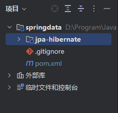
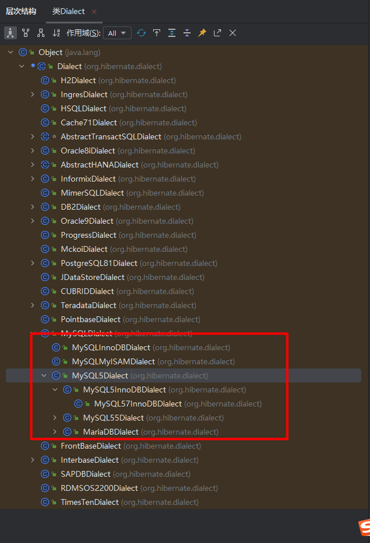
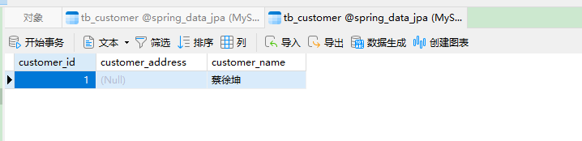
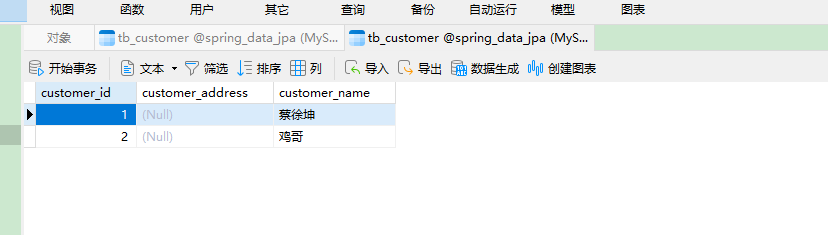
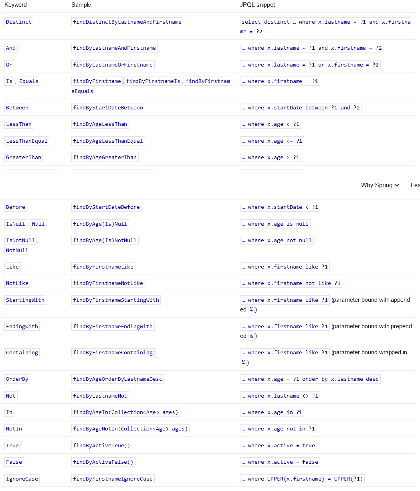

# 目录  
1.JPA基本概念介绍  
2.Spring Data JPA  
3.杂项  


## 1. JPA基本概念介绍
**目录:**  
1.1 JPA基本概念介绍  
1.2 Hibernate上手  
1.3 切换JPA实现  
1.4 JPA对象的四种状态  

### 1.1 JPA基本概念介绍
1.ORM  
ORM全称Object Relation Mapping;用于解决JDBC访问数据库太麻烦的问题,Mybatis、Hibernate就是ORM框架.  
java针对ORM提出提出了`JPA`,JPA本质上是一种ORM规范,并不是ORM框架,也就是JPA为了实现ORM这一功能制定了规范,其中Hibernate就是JPA的实现,所以Hibernate拥有ORM功能.  
application、JPA、JPA实现、JDBC和数据库的关系图:  
  

2.JPA Query和SQL Query的对比  
* JPA Query:面向JavaBean;代表作hibernate  
* SQL Query:面向数据库;代表作mybatis


|                     mybatis                      |                       hibernate                        |
|:------------------------------------------------:|:------------------------------------------------------:|
|                小巧、半自动、直接                |                   方便、全自动、复杂                   |
| 国内更流行,处理复杂查询;在比较复杂的系统进行使用 | 优势在简单查询,不太适合太复杂的查询,但符合`微服务`趋势 |

**注意:**  
实际上mybatis并不能算是ORM框架,<font color="#00FF00">严格来说ORM框架的定义是使用实体类来操作数据库</font>,所以mybatis只是一个半自动的ORM框架  


3.JPA&JDBC  
JPA是Sun在JDK1.5时提出的一种ORM规范,是一种对JDBC的`升级`  
* 减少对sql语句的依赖,减少基本的开发成本(但也提高了高级的开发成本)
* 提高数据库的移植性
  为了提高移植性,<font color="#00FF00">JPA推荐NOSQL</font>也就是不写SQL语句来对数据库进行查询  
  *注意:这里NOSQL的意思不是非关系型数据库的意思,而是不写SQL的意思;因为SQL是和数据库强绑定的,移植性不好*
* 进一步明确java对象和数据库类的映射关系

*提示:JPA之于ORM(持久层框架,如MyBatis、Hibernate等,用于管理应用层Object与数据库Data之间的映射)正如JDBC之于数据库驱动(好好理解这句话)*  

<font color="#00FF00">所以JPA和JDBC是两种用于操作数据库的不同规范</font>,只不过JPA是基于JDBC的;需要依赖JDBC  

JPA规范提供了如下特性:  
* ORM映射元数据  
  JPA支持XML和注解两种元数据形式,元数据描述对象和表之间的关系,框架据此将实体对象持久化到数据库表中  
  如:`@Entity`、`@Table`、`@Id`、`@Column`等注解
* JPA提供API可以直接通过操作实体来操作数据库,摆脱JDBC、SQL  
* 通过面向对象而非面向数据库的查询语言查询数据(HQL),避免程序的SQL语句紧耦合  
  如:`from Student s where s.name = ?` 注意这里的Student不是表,而是对象(实体类)  
  这种面向对象的HQL是低耦合的  

4.Spring Data JPA  
Spring Data JPA是Spring提供的一套简化JPA开发的框架,Spring Data JPA`通过约定好的方法命名规则来编写dao接口`,从而在不写接口实现的情况下实现对数据库的访问和操作.同时Spring Data JPA还提供了很多除了CRUD之外的功能,如分页、排序、复杂查询等  
  
*相当于Spring Data JPA再在之上包装了一层*  

此外,Spring Data JPA致力于为数据访问(DAO)提供熟悉且一致的编程模板;对于每种持久性存储,dao通常需要为不同存储库提供不同CRUD(增删改查)持久化操作.Spring Data为这些持久性存储以及特定实现提供了通用接口(`CrudRespository、PagingAndSortingRespository`)和模板(`jdbcTemplate、redisTemplate、RestTemplate、MongoTemplate`)  
这也是为什么使用Spring Data JPA的原因之一,<font color="#FF00FF">因为Spring Data JPA提供了对各种类型的数据库的存储服务的支持.</font>  
*注意:这里说的dao是笼统的一种叫法,指的就是数据访问层*

虽然说spring data jpa默认是基于hibernate实现的,但如果要想切换底层的实现框架也是完全可以的(可以切换为openJPA),即<font color="#FF00FF">spring data jpa支持随时切换底层的实现框架</font>  

Spring Data主要模板(Spring Data支持的持久层技术非常多):  
* Spring Data common:用于支持每个Spring Data模块的核心公共模块
* Spring Data JDBC:对JDBC的Spring Data存储库支持
* Spring Data JPA:对JPA的Spring Data存储库支持
* Spring Data MongoDB:对MongoDB的基于Spring对象文档的存储库支持
* Spring Data Redis:封装Jedis技术,对redis实现访问操作
* Spring Data Elasticsearch:对Elasticsearch实现访问操作
* Spring Data REST:将Spring Data存储库导出为超媒体驱动的RESTful资源

  


5.对象/数据存储映射  

`JPA:`  
```java
@Entity
@Table(name="TUSR") // 一个类就是一个表
public class User {
  @Id
  private String id;
	@Column(name="fn") // 一个属性就是一个列
	private String name;
	private Date lastLogin;
	@OneToMany // 表的关系
	private List<Role roles;
}
```

`MongoDB`:  
```java
@Document(collection="usr")
public class User {
	@Id
	private String id;
	@Field("fn")
	private String name;
	private DAte lastLogin;
	private List<Role> roles;
}
```

`Neo4j`:  
```java
@NodeEntity
public class User {
	@GraphId
	Long id;
	private String name;
	private Date lastLogin;
	@RelatedTo(type="has", direction=Direction.OUTGOING)
	private List<Role> roles;
}
```

### 1.2 Hibernate上手
1.创建项目  
首先创建springdata根项目,在根项目下创建jpa-hibernate作为hibernate的上手项目  
创建后的模块示意图如下:  
  

2.修改pom  
```xml
<dependencies>
    <dependency>
        <groupId>junit</groupId>
        <artifactId>junit</artifactId>
        <version>4.13</version>
        <scope>test</scope>
    </dependency>

    <dependency>
        <groupId>org.hibernate</groupId>
        <artifactId>hibernate-entitymanager</artifactId>
        <version>5.3.32.Final</version>
    </dependency>

    <dependency>
        <groupId>mysql</groupId>
        <artifactId>mysql-connector-java</artifactId>
        <version>8.0.30</version>
    </dependency>
</dependencies>
```

3.创建实体类  
```java
@Entity
@Table(name = "tb_customer")
public class Customer {

    @Id
    @GeneratedValue(strategy = GenerationType.IDENTITY)
    @Column(name = "customer_id")
    private Long customerId;

    @Column(name = "customer_name")
    private String customerName;

    @Column(name = "customer_address")
    private String customerAddress;

    public Long getCustomerId() {
        return customerId;
    }

    public void setCustomerId(Long customerId) {
        this.customerId = customerId;
    }

    public String getCustomerName() {
        return customerName;
    }

    public void setCustomerName(String customerName) {
        this.customerName = customerName;
    }

    public String getCustomerAddress() {
        return customerAddress;
    }

    public void setCustomerAddress(String customerAddress) {
        this.customerAddress = customerAddress;
    }
}
```

*提示:*  
在JPA中讲究代码先行,现在数据库中是没有Customer这个实体类的,但是hibernate会帮助我们自动创建对应的表  
不过数据库是需要自已创建的,这里我们创建spring_data_jpa数据库  

3.1 Entity命名策略  
* 显示命名:即通过`@Table`的name属性指定对应的数据库表名称,`@Column`的name属性指定实体字段对应数据库字段的名称  
* 隐式命名(默认):交给框架来进行隐式命名

如果我们没有使用@Table或@Column指定了表或字段的名称,则由SpringImplicitNamingStrategy为我们隐式处理,表名隐式处理为类名,列名隐式处理为字段名.如果指定了表名列名,SpringImplicitNamingStrategy不起作用  
将上面处理过的逻辑名称解析成物理名称.无论在实体中是否显示指定表名列名,SpringPhysicalNamingStrategy都会被调用

3.2 JPA对象属性与数据库字段的映射  
|                             Java Type                              |             Database Type             |
|:------------------------------------------------------------------:|:-------------------------------------:|
|                        String(char,char[])                         |   varchar(char,varchar2,clob,text)    |
| Number(BigDecimal,BigInteger,Integer,Double,Long,Float,Short,Byte) | numeric(number,int,long,float,double) |
|                  int,long,float,double,short,byte                  | numeric(number,int,long,float,double) |
|                               byte[]                               |        varbinary(binary,blob)         |
|                          boolean(Boolean)                          |   BOOLEAN(bit,smallint,int,number)    |
|                           java.util.Date                           |       timestamp(Date,DateTime)        |
|                           java.sql.Date                            |       Date(timestamp,datetime)        |
|                           java.sql.Time                            |       Time(timestamp,datetime)        |
|                         java.sql.Timestamp                         |       TIMESTAMP(datetime,Date)        |
|                         java.util.Calendar                         |       TIMESTAMP(datetime,Date)        |
|                           java.lang.Enum                           |         NUMERIC(varchar,char)         |
|                       java.util.Serializable                       |        varbinary(binary,blob)         |


4.写配置文件  
在resource目录下创建hibernate.cfg.xml作为hibernate的配置文件  
```xml
<?xml version="1.0" encoding="UTF-8"?>
<!DOCTYPE hibernate-configuration PUBLIC
        "-//Hibernate/Hibernate Configuration DTD 3.0//EN"
        "http://hibernate.sourceforge.net/hibernate-configuration-3.0.dtd">
<hibernate-configuration>
    <session-factory>
        <property name="connection.username">root</property>
        <property name="connection.password">root</property>
        <property name="connection.driver">com.mysql.jdbc.Driver</property>
        <property name="connection.url">jdbc:mysql://192.168.149.131:7901/jdd_sport_info?useSSL=FALSE</property>


        <!-- 选择数据库方言 -->
        <property name="dialect">org.hibernate.dialect.MySQL8Dialect</property>
        <!-- 是否在控制台打印sql语句 -->
        <property name="show_sql">true</property>
        <!-- 是否格式化sql语句，也就是是否使sql语句按标准规范打印出来 -->
        <property name="format_sql">true</property>
        <!-- 表的生成策略;
        none:不自动生成;
        update:没有的表会创建,已经存在的表会检查更新;
        create:每次都会将表重新生成一遍 -->
        <property name="hbm2ddl.auto">update</property>
        <!-- 指定具体的pojo类路径,指定了路径后相当于被hibernate接管 -->
        <mapping class="com.cnsukidayo.hibernate.Customer"/>
    </session-factory>
</hibernate-configuration>
```

**关于SQL方言**  
方言说白了就是不同的数据库产品有不同的SQL语法规则,所以需要选择方言;这里选择的是MySQL8  
找到Dialect类,按下`Ctrl+H`查看类继承关系  
  
比如这里使用的MySQL就选择MySQL对应的方言,还可以根据不同的引擎选择不同的方言,选择方言实际上就是选择数据库  

5.创建测试类  
在测试目录下创建测试类来测试hibernate  
```java
public class HibernateTest {
    // session工厂,类似mybatis中的sqlSession;是数据库的一次会话
    private SessionFactory sessionFactory;

    @Before
    public void init() {
        StandardServiceRegistry registry = new StandardServiceRegistryBuilder().configure("/hibernate.cfg.xml").build();
        // 根据服务注册类创建一个元数据资源集,同时构建元数据并生成应用
        sessionFactory = new MetadataSources(registry).buildMetadata().buildSessionFactory();
    }

    @Test
    public void testC() {
        // 通过Session进行持久化操作
        Session session = sessionFactory.openSession();
        Transaction transaction = session.beginTransaction();
        Customer customer = new Customer();
        customer.setCustomerName("蔡徐坤");
        session.save(customer);
        transaction.commit();
        session.close();
    }

}
```

运行上述testC方法后成功在数据库中看到插入的数据  
  

6.更多的示例  
```java
@Test
public void testR() {
    // 通过Session进行持久化操作
    Session session = sessionFactory.openSession();
    // 通过实体类进行查询
    Customer customer = session.find(Customer.class, 1L);
    System.out.println(customer);
    session.close();
}

@Test
public void testR_lazy() {
    // 通过Session进行持久化操作
    Session session = sessionFactory.openSession();
    // 懒加载查询,通过控制台的日志可以发现,当调用load方法时并不会立即去数据库中查询数据,而是当真正使用customer对象时才会查询;所以这里会先打印===========这段内容,然后才去数据库中查询数据
    Customer customer = session.load(Customer.class, 1L);
    System.out.println("=======================");
    System.out.println(customer);
    session.close();
}

@Test
public void testU() {
    Session session = sessionFactory.openSession();
    Customer customer = new Customer();
    //customer.setCustomerId(1L);
    customer.setCustomerName("鸡哥");
    // 如果设置了id则会更新,如果没有设置id则会插入数据
    session.saveOrUpdate(customer);
    session.close();
}

@Test
public void testJPQL() {
    Session session = sessionFactory.openSession();
    // JPQL可以省略 select * 步骤;而且这里from的不是一张表,而是一个对象
    // 这里customerId使用的不是数据库的字段,而是对象的字段,并且后面的:id是占位符的意思,在setParameter中指定查询的具体参数即可
    String jpql = "from Customer where customerId=:id";
    List<Customer> resultList = session.createQuery(jpql, Customer.class)
            .setParameter("id",1L)
            .getResultList();
    System.out.println(resultList);
    session.close();
}

```

### 1.3 切换JPA实现
*提示:*hibernate只是一种JPA的实现,本节展示如何切换JPA的实现  
在resource目录下创建META-INF目录,接着在该目录下创建persistence.xml配置文件  
```xml
<?xml version="1.0" encoding="UTF-8" ?>
<persistence xmlns="http://java.sun.com/xml/ns/persistence" version="2.0">
    <!--
    持久化单元,在这里可以定义多个持久化单元;以后就可以通过这里的name来切换多个不同的JPA的实现
    name:持久化名称
    transaction-type:事务管理方式
        JTA:分布式事务管理
        RESOURCE_LOCAL:本地事务管理
    -->
    <persistence-unit name="hibernateJPA" transaction-type="RESOURCE_LOCAL">
        <!--JPA的实现-->
        <provider>org.hibernate.jpa.HibernatePersistenceProvider</provider>
        <!--需要进行ORM的POJO类-->
        <class>com.cnsukidayo.hibernate.Customer</class>
        <!--可选配置,配置JPA实现方的配置-->
        <properties>
            <property name="javax.persistence.jdbc.user" value="root"/>
            <property name="javax.persistence.jdbc.password" value="root"/>
            <property name="javax.persistence.jdbc.driver" value="com.mysql.jdbc.Driver"/>
            <property name="javax.persistence.jdbc.url" value="jdbc:mysql://192.168.149.131:7901/spring_data_jpa?useSSL=FALSE"/>
            <!--配置hibernate的配置信息-->
            <property name="hibernate.show_sql" value="true"/>
            <property name="hibernate.hbm2ddl.auto" value="update"/>
            <property name="hibernate.dialect" value="org.hibernate.dialect.MySQL8Dialect"/>
        </properties>

    </persistence-unit>
</persistence>
```

1.创建测试类  
*提示:既然是使用JPA的方式,所以肯定就不是使用hibernate的SessionFactory来操作数据库了,而是要使用JPA规范的API来进行实现了,就有点像JDBC了;我们使用的JDBC都是抽象API它背后的实现是数据库厂商进行实现的*  

```java
public class JPATest {

    private EntityManagerFactory entityManagerFactory;

    @Before
    public void init() {
        // args0:指定持久化单元的名称,和persistence.xml配置文件中的name对应
        entityManagerFactory = Persistence.createEntityManagerFactory("hibernateJPA");
    }

    @Test
    public void testC() {
        EntityManager entityManager = entityManagerFactory.createEntityManager();
        EntityTransaction transaction = entityManager.getTransaction();
        transaction.begin();

        Customer customer = new Customer();
        customer.setCustomerName("鸡哥");
        entityManager.persist(customer);

        transaction.commit();
    }

}
```
EntityManager说白了就是JPA规范提供的API,就像Connect一样;<font color="#00FF00">只不过真正的实现是hibernate而已</font>.  

运行代码,查看数据库发现数据已经被插入  
  

*提示:如果需要另外的实现,只需要在persistence.xml配置文件中添加一个新的持久化单元,并且在调用createEntityManagerFactory方法的时候指定对应的name即可*  

2.更多的示例  
```java
@Test
public void testR() {
    EntityManager entityManager = entityManagerFactory.createEntityManager();
    EntityTransaction transaction = entityManager.getTransaction();
    transaction.begin();
    // 懒加载查询
    Customer customer = entityManager.getReference(Customer.class, 1L);

    transaction.commit();
}

```
<font color="#00FF00">提示:JPA没有单独的更新语句,如果传入的对象有id则会先查询,查询有结果就更新否则就插入,这是JPA的特性</font>  

3.另外,JPA也是支持原生SQL的;如果有业务场景必须使用原生SQL完成,JPA也是支持的  

4.无法删除游离状态的实例  
```java
@Test
public void testD() {
    EntityManager entityManager = entityManagerFactory.createEntityManager();
    EntityTransaction transaction = entityManager.getTransaction();
    transaction.begin();
    /*
    无法删除处于游离状态的实例
    Customer customer = new Customer();
    customer.setCustomerId(1L);
    */
    // 只有从数据库中查出的实例才可以被删除
    Customer customer = entityManager.find(Customer.class, 1L);
    entityManager.remove(customer);

    transaction.commit();
}
```

### 1.4 JPA对象的四种状态
1.JPA对象(Entity)的四种状态  
Entity的生命周期由EntityManager管理,其生命周期在persistence context内  

* 临时状态(New/Transient):刚创建出来,由手动New出来的对象,没有与entityManager发生关系,没有被持久化,不处于entityManager中的对象(不被entityManager管理的对象)
* 持久状态(Managed/Persistent):与entityManager发生关系,已经被持久化,可以把持久化状态当作`实实在在的数据库记录`(此状态的属性值修改,将在提交时,同步数据库)  
  <font color="#FF00FF">在持久状态下的任何修改,都将在事务提交之后同步到数据库</font>  
* 删除状态(Removed):执行remove方法,事务提交之前
* 游离状态(Detached):游离状态就是提交到数据库后,事务commit后实体的状态.因为事务已经提交了,此时实体的属性的任何改变,`都不会同步到数据库`

<font color="#00FF00">对象状态转换图如下:</font>  


Entity生命周期的四个基本操(CRUD)  
```java
EntityManager em = factory.createEntityManager();

EntityTransaction tx = em.getTransaction();
tx.begin();
// 临时状态
Customer customer = new Customer();
// 游离状态
customer.setCustId(6L);
// 持久状态
customer = em.find(Customer.class, 5L);
// 删除状态
em.remove(customer);

tx.commit();
```

持久状态:  
```java
EntityManager em = factory.createEntityManager();

EntityTransaction tx = em.getTransaction();
tx.begin();
// 持久状态
customer = em.find(Customer.class, 5L);
customer.setCustomerName("鸡哥");

tx.commit();
```
最终的结果是,虽然没有调用merge方法(merge方法是JPA的update效果);但当事务提交之后也会修改数据库中对应的实体的数据  

2.JPA中的持久性上下文  
* 持久化上下文的生命周期与系统事务一致
* 持久化上下文提供自动脏检查
* 持久化上下文是一级缓存

**持久化上下文提供自动脏检查:**  
在事务提交的时候,JPA会执行一个脏检查机制,会检查持久化上下文中的对象状态和数据库中的状态是否一致,如果不一致,就会根据持久化上下文中的状态去更新数据库中的状态.**但是这个动作只有在数据库事务提交的时候在会做,如果事务回滚了,不会做这个动作**

可以调用JpaRepository提供的flush或saveAndFlush方法立刻同步状态到数据库,而不是等到事务提交的时候在同步.需要注意的是,这里的立刻同步到数据库是指将修改/删除操作所执行的SQL语句先执行,此时事务并没有提交,只有在事务提交后,这个更新/删除才会起作用  

3.hibernate中的缓存  
hibernate中缓存的概念类似于mybatis中缓存的概念  
hibernate中有一级缓存和二级缓存  
* 一级缓存:在同一个EntityManager中查询同一条记录时只会查询一次
* 二级缓存:不同的EntityManager查询同一条记录也只会查询一次

一级缓存实验:  
```java
@Test
public void testCache() {
    EntityManager entityManager = entityManagerFactory.createEntityManager();
    EntityTransaction transaction = entityManager.getTransaction();
    transaction.begin();

    Customer customer0 = entityManager.find(Customer.class, 1L);
    Customer customer1 = entityManager.find(Customer.class, 1L);

    transaction.commit();
}
```
通过查看日志发现,这里只会查询一次  


## 2.Spring Data JPA
**目录:**  
2.1 Spring Data JPA基本环境搭建  
2.2 Spring Data Repository  
2.3 自定义操作  
2.4 JPA注解(表/属性)  
2.5 JPA注解(关联)  

### 2.1 Spring Data JPA基本环境搭建
1.创建Spring Data JPA的项目  
在springdata根模块下创建spring-data-jpa模块  

2.修改pom  
修改父项目的pom文件,添加一个类似parent的依赖来统一之后jpa需要使用的各种依赖的版本  
```xml
<!-- 统一管理springdata子项目的版本 -->
<dependencyManagement>
    <dependencies>
        <dependency>
            <groupId>org.springframework.data</groupId>
            <artifactId>spring-data-bom</artifactId>
            <version>2021.1.0</version>
            <scope>import</scope>
            <type>pom</type>
        </dependency>
    </dependencies>
</dependencyManagement>
```

来到刚才创建的spring-data-jpa模块的pom文件,修改引入spring-data-jpa依赖  
```xml
<dependencies>
    <dependency>
        <groupId>org.springframework.data</groupId>
        <artifactId>spring-data-jpa</artifactId>
    </dependency>
    <!--由于spring-data-jpa只是基于JPA框架的封装,所以这里需要为spring-data-jpa指定当前使用的底层jpa实现框架是什么-->
    <dependency>
        <groupId>org.hibernate</groupId>
        <artifactId>hibernate-entitymanager</artifactId>
        <version>5.5.0.Final</version>
    </dependency>

    <dependency>
        <groupId>junit</groupId>
        <artifactId>junit</artifactId>
        <version>4.13</version>
        <scope>test</scope>
    </dependency>

    <dependency>
        <groupId>mysql</groupId>
        <artifactId>mysql-connector-java</artifactId>
        <version>8.0.30</version>
    </dependency>

    <!--连接池-->
    <dependency>
        <groupId>com.alibaba</groupId>
        <artifactId>druid</artifactId>
        <version>1.2.8</version>
    </dependency>
    <!--spring-test-->
    <dependency>
        <groupId>org.springframework</groupId>
        <artifactId>spring‐test</artifactId>
        <version>5.3.10</version>
        <scope>test</scope>
    </dependency>

</dependencies>
```

3.编写实体类  
在项目下创建com.cnsukidayo.jpa.pojo包,在该包下创建Customer和上面的定义一样  
详情见1.2 Hibernate上手=>3.创建实体类  

4.编写dao层的repository接口  
在项目下创建com.cnsukidayo.jpa.repository包,再在该包下创建CustomerRepository接口,定义如下  
```java
public interface CustomerRepository extends CrudRepository<Customer, Long> {
}
```

5.编写config配置类  
在项目下创建com.cnsukidayo.jpa.config包,在该包下创建SpringDataJPAConfig配置类,其中的内容如下:  
```java
@Configuration
// 设置repository接口的路径
@EnableJpaRepositories(basePackages = "com.cnsukidayo.jpa.repository")
@EnableTransactionManagement
public class SpringDataJPAConfig {

    @Bean
    public DataSource dataSource() {
        DruidDataSource druidDataSource = new DruidDataSource();
        druidDataSource.setUsername("root");
        druidDataSource.setPassword("root");
        druidDataSource.setDriverClassName("com.mysql.jdbc.Driver");
        druidDataSource.setUrl("jdbc:mysql://192.168.149.131:7901/spring_data_jpa?useSSL=FALSE");
        return druidDataSource;
    }

    @Bean
    public LocalContainerEntityManagerFactoryBean entityManagerFactory() {

        HibernateJpaVendorAdapter vendorAdapter = new HibernateJpaVendorAdapter();
        vendorAdapter.setGenerateDdl(true);

        LocalContainerEntityManagerFactoryBean factory = new LocalContainerEntityManagerFactoryBean();
        factory.setJpaVendorAdapter(vendorAdapter);
        // 注意这里要添加实体类的包路径
        factory.setPackagesToScan("com.cnsukidayo.jpa.pojo");
        factory.setDataSource(dataSource());
        return factory;
    }

    @Bean
    public PlatformTransactionManager transactionManager(EntityManagerFactory entityManagerFactory) {

        JpaTransactionManager txManager = new JpaTransactionManager();
        txManager.setEntityManagerFactory(entityManagerFactory);
        return txManager;
    }

}
```

6.编写测试类  
```java
@ContextConfiguration(classes = SpringDataJPAConfig.class)
@RunWith(SpringJUnit4ClassRunner.class)
public class SpringDataJPATest {

    @Autowired
    private CustomerRepository customerRepository;

    @Test
    public void testR(){
        Optional<Customer> customer = customerRepository.findById(1L);
        System.out.println(customer.get());
    }
}
```
最终的结果是成功查询到数据  

### 2.2 Spring Data Repository
*解释:Spring官方提供了很多Repository,通过这些Repository来实现对数据库不同的操作*  

1.Repository的继承关系  
在JPA中`Repository`接口作为一个标识,它的子接口扩展了一些功能  
* Repository:仅仅是一个标识,表示任何继承它的类就一个仓库接口  
  * CrudRepository:实现了CRUD相关方法
    * PagingAndSortingRepository:实现了分组排序相关方法
      * JpaRepository:实现了JPA规范相关方法
* QueryByExampleExecutor:详情见2.3 自定义操作=>2.3.3 Query By Example
* JpaSpecificationExecutor:详情见2.3 自定义操作=>2.3.4 Specification
* QuerydslPredicateExecutor:详情见2.3 自定义操作=>2.3.5 QueryDSL

2.CrudRepository  
*基本的CRUD接口*
* `save(S) return S`
  用于插入和修改,有主键就是修改;没有主键就是插入;如果是插入该方法返回的对象会携带插入后的自增ID
* `saveAll(Iterable<S>) return Iterable<S>`
  插入一个集合
* `findById(ID) return Optional<T>`
  根据ID查询一个数据
* `existsById(ID) return boolean`  
  通过主键查询是否存在返回布尔值
* `findAllById(Iterable<ID>) return Iterable<T>`
  通过ID集合查询出所有的数据
* `count() return long`
  获取当前实体的数量
* `deleteById(ID) return void`
  根据ID删除实体
* `delete(T) return void`
  根据一个实体删除实体
* `deleteAllById(Iterable<? extends ID>) return void`
  根据ID批量删除实体
* `deleteAll(Iterable<? extends T>) return void`
  根据实体批量删除所有的实体
* `deleteAll() return void`
  删除所有实体

3.PagingAndSortingRepository
*实现了分页和排序的接口,该接口继承自CrudRepository*  
* `findAll(Sort) return Iterable<T>`
  查询所有的数据,通过Sort进行排序
* `findAll(Pageable) return Page<T>`

4.QueryByExampleExecutor  
详情见2.3 自定义操作=>2.3.3 Query By Example

**通过一个示例来演示该接口的用法**  
3.1 修改CustomerRepository接口如下  
```java
public interface CustomerRepository extends PagingAndSortingRepository<Customer, Long> {
}
```

3.2 编写测试类
```java
@ContextConfiguration(classes = SpringDataJPAConfig.class)
@RunWith(SpringJUnit4ClassRunner.class)
public class SpringDataJPAPagingAndSortTest {

    @Autowired
    private CustomerRepository customerRepository;

    @Test
    public void testPaging(){
        System.out.println(customerRepository.findAll(PageRequest.of(0, 2)).getContent());
    }
    @Test
    public void testSort(){
      // 采用属性硬编码的方式,有个问题是属性名可能发生变化
        Sort.by("customer_id")
                .descending()
                .and(Sort.by("customer_address"));
    }

    @Test
    public void testTypeSafe() {
        // 通过类型安全的方式来构建Sort
        Sort.TypedSort<Customer> sortType = Sort.sort(Customer.class);
        Sort sort = sortType.by(Customer::getCustomerId)
                .ascending()
                .and(
                        sortType.by(Customer::getCustomerAddress)
                                .descending()
                );
    }
}
```

3.3 PageRequest  
`static of(int,int,Direction,String...) return PageRequest`  
在JPA中可以通过PageRequest的of静态方法来创建一个分页查询对象  
agrs0:代表当前是第几页(默认从第0页开始计算)  
args1:每页的大小  
args2:排序的顺序;这是一个枚举类,可以自已查看该类的内容就懂了  
args3:哪些字段参与排序  
例如:`PageRequest.of(1, 50, Sort.Direction.DESC, "id");`  
查找第一页,每页大小为50,按照id降序返回结果  

3.4 Sort  
当然Sort对象也是可以调用它的静态方法来构造的,用的时候只需要把sort传入到args2处即可;单独构造Sort可以使查询更加灵活  
<font color="#00FF00">一般而言都是结合PageRequest和Sort进行使用的,单独调用findAll(Sort)方法查询所有数据比较少用</font>  
<font color="#FF00FF">另外推荐使用类型安全的方式构建Sort避免以后数据库字段发生改变</font>  

### 2.3 自定义操作
**介绍:**  
2.2节介绍的repository还是有很多局限性的,如果需要更加灵活的SQL查询就需要自定义擦做
**目录:**  
2.3.1 JPQL  
2.3.2 规定方法名称  
2.3.3 Query By Example  
2.3.4 Specification  
2.3.5 QueryDSL  

#### 2.3.1 JPQL
```java
public interface CustomerRepository extends PagingAndSortingRepository<Customer, Long> {
    /**
     * 在JPA中如果要查询表中所有字段则可以省略select * 直接从from开始写
     * 这里from的后面是实体类,而不是表
     * where后面的条件customerName也是实体类的属性
     * 并且该方法的参数是通过顺序来指定的,即?1占位符表示方法的第一个参数
     */
    @Query("from Customer where customerName = ?1")
    Customer findCustomerByCustomerNameWithOrder(String customerName);

    /**
     * 这里如果想要使用参数名来指代占位符,不能直接使用形参的名称
     * 而必须指定@Param注解,在该注解中指定该占位符的名称与形参的对应情况
     * 并且必须要加冒号:
     */
    @Query("from Customer where customerName =: customerName")
    Customer findCustomerByCustomerNameWithName(@Param("customerName") String customerName);

    /**
     * 更新操作
     * 在spring-data-jpa中,增删改操作必须使用事务;
     * @Transactional 注解可以标注在service层,也可以标注在dao层;
     * 此外还必须标注@Modifying注解告知spring-data-jpa这是增删改的操作
     */
    @Modifying
    @Transactional
    @Query("update Customer c set c.customerName =: customerName where c.customerId =: customerId")
    int updateCustomer(@Param("customerName") String customerName, @Param("customerId") Long customerId);

    // 删除操作
    @Modifying
    @Transactional
    @Query("delete from Customer c where c.customerId = ?1")
    int deleteCustomer(Long id);

    /**
     * JPQL其实是不支持新增的
     * 但可以通过hibernate实现伪新增的方式
     * 如果你把以下代码复制进IDEA你会发现语法提示也没有了,而且insert爆红;
     * 说明JPQL它是不支持插入的,但这里如果执行该方法是会插入成功的
     * 并且这种该方法只能在hibernate中才能成功
     */
    @Modifying
    @Transactional
    @Query("insert into Customer(customerName) select c.customer from Customer c where c.customerId = ?1")
    int insertCustomerBySelect(Long id);
}
```

*JPQL也是支持使用原生SQL的*  
```java
public interface CustomerRepository extends PagingAndSortingRepository<Customer, Long> {
    @Query(value = "select * from tb_customer where customer_name =: customerName",nativeQuery = true)
    Customer findCustomerByCustomerNameWithNative(@Param("customerName") String customerName);
}
```
需要指定`nativeQuery = true`参数  

#### 2.3.2 规定方法名称
1.Spring Data JPA的查询约定  


2.方法名的命名规范  
spring-data-jpa中方法命名主要由两部分组成:  
* 主题关键字:用于决定当前方法的作用(通常用于方法的前缀)
  * 以`find...By、read...By、get...By、query...By、search...By、stream...By`关键字开头的方法都是用于查询数据的
  * `exists...By` 是否存在
  * `count...By` 计数
  * `delete...By、remove...By` 删除
  * `...First[number(default=1)]...、...Top[number(default=1)]...`  
    First和Top关键字可以放在find(以及其它关键字)与by之间的任意位置,其中`number`指代前多少条数据被本次方法所影响
    例如:  
    `findFirst8ByName()、deleteTop3ByTime()`
  * `...Distinct...` 去重,Distinct关键字可以放在find(以及其它关键字)与by之间的任意位置
* 谓词关键字:决定查询条件(这里只举部分例子)
  * `And` and条件
  * `Or` or条件
  * `Like` 模糊查询,<font color="#00FF00">在JPA中模糊查询是需要自已拼接模糊查询%%符号的</font>

**<font color="#FF00FF">通过约定的名称进行CRUD也是需要在增删改方法上面标注@Modifying注解的</font>**

#### 2.3.3 Query By Example
**不足:** 通过2.3.1节JPQL和2.3.2节的规定方法名称是不能实现动态查询条件的;
动态查询条件的意思就是,例如做搜索查询的时候,有时需要根据名称查询,有时需要根据时间查询,只通过上述的两种方式是没办法实现这种动态查询的功能的,它不像mybatis一样如果是null就没有这个条件  

通过2.3.3、2.3.4、2.3.5这三节讲述的内容都是可以实现动态查询的,但是它们的使用场景都各不相同  

1.Query By Example特点介绍  
* 它只支持查询
* 不支持嵌套或分组的查询
  例如查询name = '张三' or name = '李四' 这种嵌套查询就不支持,要查只能查单个
* 只支持字符串查询 `start/contains/ends/regex`匹配和其他属性类型的精确匹配
  即开头/包含/结尾/正则 这四种方式的匹配

2.创建CustomerQBERepository  
```java
public interface CustomerQBERepository extends
        PagingAndSortingRepository<Customer, Long>,
        QueryByExampleExecutor<Customer> {
    
}
```

*多提一嘴:这里的QueryByExampleExecutor包括后面的JpaSpecificationExecutor、QuerydslPredicateExecutor这些执行器都是需要搭配PagingAndSortingRepository或者说是CrudRepository使用的,如果这里的接口只继承QueryByExampleExecutor这一个接口肯定是不行的,具体原理涉及到spring-data-jpa底层执行时的一些逻辑*  

3.编写测试类  
```java
@ContextConfiguration(classes = SpringDataJPAConfig.class)
@RunWith(SpringJUnit4ClassRunner.class)
public class QBETest {
    @Autowired
    private CustomerQBERepository customerQBERepository;

    @Test
    public void testR() {
        // 通过这种方式就可以做到类似mybatis一样的效果
        // 只查询前端传过来的字段,对于对象为null的字段不进行查询
        // 再次说明该方法只能用于查询一个对象,不能嵌套查询
        Customer customer = new Customer();
        customer.setCustomerName("吴亦凡");
        customer.setCustomerAddress("朝阳看守所");
        Example<Customer> example = Example.of(customer);
        List<Customer> result = (List<Customer>) customerQBERepository.findAll(example);
        System.out.println(result);
    }

    /**
     * 通过匹配器来进行条件的限制
     * 对应上述讲的start/contains/ends/regex这四个条件
     */
    @Test
    public void testMatch() {
        Customer customer = new Customer();
        customer.setCustomerName("吴亦凡");
        customer.setCustomerAddress("BEIJING");
        // 通过该匹配器表示在查询的时候忽略customerName这个条件
        ExampleMatcher exampleMatcher = ExampleMatcher.matching()
                .withIgnorePaths("customerName")    // 忽略customerName条件
                .withIgnoreCase("customerAddress") // 忽略customerAddress属性的大小写
                .withStringMatcher(ExampleMatcher.StringMatcher.CONTAINING)
                .withMatcher("customerName", ExampleMatcher.GenericPropertyMatcher::endsWith); //对单个属性进行匹配,第二个参数是lambda表达式
        // 把exampleMatcher匹配器传入到Example中
        Example<Customer> example = Example.of(customer, exampleMatcher);
        List<Customer> result = (List<Customer>) customerQBERepository.findAll(example);
    }
}
```

*提示:ExampleMatcher提供了很多静态方法来对条件进行限制;再次强调它只适用于字符串查询或其它类型的精确匹配*  


4.QueryByExampleExecutor  
* `findOne(Example<S>) return Optional<S>`
* `findAll(Example<S>) return Iterable<S>`
* `findAll(Example<S>,Sort) return Iterable<S>`
* `findAll(Example<S>,Pageable) return Page<S>`
* `count(Example<S> example) return long`
* `exists(Example<S>) return boolean`

*注意:其实这些方法和CrudRepository中的方法没什么两样(从结果层面来说)*

#### 2.3.4 Specification
1.创建CustomerSpecificationRepository  
```java
public interface CustomerSpecificationRepository extends
        PagingAndSortingRepository<Customer, Long>,
        JpaSpecificationExecutor<Customer> {
}
```

2.编写测试类  
```java
@ContextConfiguration(classes = SpringDataJPAConfig.class)
@RunWith(SpringJUnit4ClassRunner.class)
public class SpecificationTest {
    @Autowired
    private CustomerSpecificationRepository customerSpecificationRepository;

    @Test
    public void testR() {
        List<Customer> result = customerSpecificationRepository.findAll((root, query, criteriaBuilder) -> {
            /*
            root:用户获取需要查询的列;得到的返回值的泛型是该属性对应的泛型(需要手动设置,默认是Object)
            criteriaBuilder:构造查询条件
            query:组合 orderBy,where
             */
            Path<Long> customerId = root.get("customerId");
            Path<String> customerName = root.get("customerName");
            Path<String> customerAddress = root.get("customerAddress");
            // 通过criteriaBuilder来设置查询条件;args0:为那个字段设置条件;args1:值
            criteriaBuilder.equal(customerAddress, "BEIJING");
            // 返回最后一个生成的predicate即可
            Predicate predicate = criteriaBuilder.greaterThan(customerId, 0L);
            return predicate;
        });
        System.out.println(result);
    }

    @Test
    public void testSearch() {
        // 模拟一个真实的查询效果,假设这里的Customer是前端传过来的
        Customer customer = new Customer();
        customer.setCustomerName("蔡徐坤");

        List<Customer> result = customerSpecificationRepository.findAll((root, query, criteriaBuilder) -> {
            Path<Long> customerId = root.get("customerId");
            Path<String> customerName = root.get("customerName");
            Path<String> customerAddress = root.get("customerAddress");
            // 需要一个List来保存所有的动态条件
            List<Predicate> list = new ArrayList<>();
            if (customer.getCustomerId() != null) {
                list.add(criteriaBuilder.equal(customerId, customer.getCustomerId()));
            }
            if (StringUtils.hasText(customer.getCustomerName())) {
                list.add(criteriaBuilder.equal(customerName, customer.getCustomerName()));
            }
            if (StringUtils.hasText(customer.getCustomerAddress())) {
                list.add(criteriaBuilder.equal(customerAddress, customer.getCustomerAddress()));
            }
            Predicate predicate = criteriaBuilder.and(list.toArray(new Predicate[list.size()]));
            return predicate;
        });
        System.out.println(result);
    }

    @Test
    public void testSearchAndSort() {
        // 模拟一个真实的查询效果,假设这里的Customer是前端传过来的
        Customer customer = new Customer();
        customer.setCustomerName("蔡徐坤");

        List<Customer> result = customerSpecificationRepository.findAll((root, query, criteriaBuilder) -> {
            Path<Long> customerId = root.get("customerId");
            Path<String> customerName = root.get("customerName");
            Path<String> customerAddress = root.get("customerAddress");
            // 需要一个List来保存所有的动态条件
            List<Predicate> list = new ArrayList<>();
            if (customer.getCustomerId() != null) {
                list.add(criteriaBuilder.equal(customerId, customer.getCustomerId()));
            }
            if (StringUtils.hasText(customer.getCustomerName())) {
                list.add(criteriaBuilder.equal(customerName, customer.getCustomerName()));
            }
            if (StringUtils.hasText(customer.getCustomerAddress())) {
                list.add(criteriaBuilder.equal(customerAddress, customer.getCustomerAddress()));
            }
            Predicate[] where = list.toArray(new Predicate[list.size()]);
            // 如果需要按某些字段排序
            // 需要使用query对象的方法来进行实现,最终调用getRestriction方法返回Predicate对象
            Order desc = criteriaBuilder.desc(customerId);
            return query.where(where).orderBy(desc).getRestriction();
        });
        System.out.println(result);
    }

}
```

<font color="#00FF00">这里的第三个测试方法是比较重要的,可以重点看一下</font>  

3.Specifications详解  
<font color="#00FF00">Specifications是一个用于构建动态查询条件的抽象类 </font> 
该接口有如下方法:  
```java
Predicate toPredicate(Root<T> root, CriteriaQuery<?> query, CriteriaBuilder criteriaBuilder);
```
通过<font color="#00FF00">实现</font>该抽象方法来构建动态查询条件,查询条件最终会生成一个查询条件对象(该方法最终需要返回一个Predicate对象);该方法有三个回调参数:  
* Root:用户获取需要查询的列  
  如:`root.get("id")`
* CriteriaQuery:用于自定义查询方式  
  如:`query.distinct(true).select(...).where(...).groupBy(...).having(...).getRestriction()`最后通过getRestriction()方法,可以获得一个`Predicate`对象
  *注意:虽然这里有groupBy和having方法,但实际上调用该方法也不会生效,因为它的底层会将你设置的值改掉,即Specification不支持分组、聚合函数;像这样的函数还有multiselect等方法,需要自已鉴别*
* CriteriaBuilder:构造查询条件(用于构建`Predicate`对象)  
  通过`criteriaBuilder.and(...)`、`criteriaBuilder.equal(...)`、`criteriaBuilder.greaterThan()`等方法来构建一个Predicate对象  

*注意:这三个参数都是JPA规范提供的抽象类,而不是spring提供的;实际上你可以通过EntityManager来得到这三个参数构造自已的查询参数,摆脱SpringDataJPA对CriteriaQuery的限制(但要求也变高了)*

通用的查询模板:  
*提示:这里查询的方式和第2步的方式实际上是大同小异*  
```java
Specification<InfoCommentENT> specification = (root, criteriaQuery, cb) -> {
  // 通过Predicate对象来构建SQL语句
  Predicate predicate = cb.conjunction();
  /**
   * predicate.getExpressions()代表获取到当前动态SQL中的所有构成SQL的片段,该方法返回的是一个List集合,接着调用add方法表明添加筛选条件
   * cb.equal()代表其中一个筛选条件是SQL中的=等于条件
   * root.get("id")和上面的解释一致代表当前等于条件的查询字段是id,后面的1代表匹配值为1的记录
   * 最终将predicate对象返回即可
   */
  predicate.getExpressions().add(cb.equal(root.get("id"), 1));
}
```

4.缺陷  
* 不支持分组、聚合函数

#### 2.3.5 QueryDSL
1.介绍  
QueryDSL是基于ORM框架或SQL平台上的一个`通用查询框架`.借助QueryDSL可以在任何支持的ORM框架或SQL平台上`以通用API方式构建查询`  
JPA是QueryDSL的主要集成技术,是JPQL和Criteria查询的代替方法.目前QueryDSL支持的平台包括**JPA,JDO,SQL,Mongodb**等等  

2.加入QueryDSL相关的依赖  
```xml
<querydsl.version>4.4.0</querydsl.version>
<apt.version>1.1.3</apt.version>

<dependency>
    <groupId>com.querydsl</groupId>
    <artifactId>querydsl-jpa</artifactId>
    <version>${querydsl.version}</version>
</dependency>
<!--添加maven插件-->
<!--这个插件是为了让程序自动生成query type(查询实体,命名方式为:"Q"+对应实体名)-->
<build>
    <plugins>
        <plugin>
            <groupId>com.mysema.maven</groupId>
            <artifactId>apt‐maven‐plugin</artifactId>
            <version>${apt.version}</version>
            <dependencies>
                <dependency>
                    <groupId>com.querydsl</groupId>
                    <artifactId>querydsl‐apt</artifactId>
                    <version>${querydsl.version}</version>
                </dependency>
            </dependencies>
            <executions>
                <execution>
                    <phase>generate‐sources</phase>
                    <goals>
                        <goal>process</goal>
                    </goals>
                    <configuration>
                        <outputDirectory>target/generated‐sources/queries</outputDirectory>
                        <processor>com.querydsl.apt.jpa.JPAAnnotationProcessor</processor>
                        <logOnlyOnError>true</logOnlyOnError>
                    </configuration>
                </execution>
            </executions>
        </plugin>
    </plugins>
</build>
```

*提示:springboot项目引入插件可能报错,所以直接引入apt包就可以了*

3.编写测试类  
*提示:这里没跑起来,依赖导入不进来;暂时跳过,而且也不是很常用*

3.QuerydslPredicateExecutor  
* `findOne(Predicate) return Optional<T>`
* `findAll(Predicate) return Iterable<T>`
* `findAll(Predicate,Sort) return Iterable<T>`
* `findAll(Predicate,OrderSpecifier<?>...) return Iterable<T>`
* `findAll(OrderSpecifier<?>...) return Iterable<T>`
* `findAll(Predicate,Pageable) return Page<T>`
* `count(Predicate) return long`
* `exists(Predicate) return boolean`


### 2.4 JPA注解(表/属性)  
`@Entity`  
用于添加在实体类上,定义该JAVA类成为被JPA管理的实体,将映射到指定的数据库表.如定义一个实体类Category,它将映射到数据库中的category表中  

`@Table`  
指定数据库的表名,与`@Entity`一同使用;添加在实体类上
* name:指定表的名称;如果不写默认表名为类名
* catalog,schema:用于设置目录和此表所在的schema(模式),一般不需要填写
* uniqueConstraints:唯一性约束;只有创建表的时候有用
* indexes:索引;只有创建表的时候需要,默认不需要

`@Id`  
定义属性为数据库表中的主键列,一个实体里面必须有一个;添加在属性上

`GeneratedValue`  
主键生成策略;添加在被@ID注解修饰的属性上  
* strategy:id的生成策略
  * GenerationType.TABLE:通过表产生主键,框架由表模拟序列产生主键,使用该策略可以使应用更易于数据库移植
  * GenerationType.SEQUENCE:通过序列产生主键;通过`@SequenceGenerator`注解指定序列名;MySql不支持这种方式
  * GenerationType.IDENTITY:数据库id自增长,多用于MySql
  * GenerationType.AUTO:JPA自动选择合适的策略,默认选项
* generator:通过Sequence生成id,常见Orcale数据库id生成,需要配合`@SequenceGenerator`使用

`@Column`  
定义该属性对应数据库中的列名  
* name:数据库中的列名,如果不写默认和实体属性名一致
* unique:是否唯一,默认为false
* nullable:是否允许为空,默认为false
* insertable:执行insert操作的时候是否包含此字段,默认为true
* updatable:执行updatable操作时是否包含次字段,默认为true
* columnDefinition:表示该字段在数据库中的实际类型
* length:数据库字段的长度,默认为255
* table:
* precision:
* scale:

*提示:这里面有些字段是用于生成数据库表时使用的*  

`IdClass`  
联合主键;通过外部类来实现联合主键  
```java
@Data
@Entity
@IdClass(value = UnionKey.class)
public class IdClassDemo{

  @Id
  private String idOne;

  @Id
  private String idTwo;

  private String context;
}
```
假设有上述这样的实体类,它由idOne和idTwo这两个键构成联合主键,除了在这两个属性上都标注@Id注解之外,还需要在类上标注一个@IdClass注解,并且该注解内的value属性指定了一个外部类;看看这个外部类的定义结构  

```java
@Getter
@Setter
@NoArgsConstructor
@EqualsAndHashCode
public class UnionKey implements Serializeable {
  private String idOne;

  private String idTwo;
}
```
UnionKey类必须实现Serializeable接口,必须有默认的无参构造方法,必须重写equals和hashcode方法  

**使用方法:**  
在Repository接口的编写时还需要注意,Repository接口要把主键改为外部主键类  
```java
public interface IdClassRepository extends JpaRepository<IdClassDemo,UnionKey> {

}
```

`@Basic`  
表示属性是到数据库表字段的映射,如果实体的字段上没有任何注解,默认即为@Basic
* fetch:抓取方式,默认FetchType.EAGER(立即加载),FetchType.LAZY(延迟加载,主要应用在大字段上面)
* optional:设置这个字段是否可以为null,默认是true

`@Transient`  
表示该属性并非是一个到数据库表的字段的映射,<font color="#00FF00">与@Basic作用相反</font>.JPA映射数据库的时候忽略它  

`@Temporal`  
用来设置Date类型的属性映射到对应精度的字段;标注在属性上  
* TemporalType.DATE 映射为数据库date
* TemporalType.TIME 映射为数据库time
* TemporalType.TIMESTAMP 映射为datetime

`@Enumerated`  
映射枚举类  
* value
  * EnumType.ORDINAL 枚举字段的下标
  * EnumType.STRING 枚举字段的Name

`@Lob`  
将属性字段映射成数据库支持的大对象类型,支持以下两种数据库类型的字段  
* Clob(Character Large Objects)类型:长字符串类型,java.sql.Clob、Character[]、char[]和String将被映射成Clob类型
* Blob(Binary Large Objects)类型:字节类型,java.sql.Blob、Byte[]、byte[]和实现了Serializable接口的类型将被映射为Blob类型

*注意:由于Clob、Blob占用内存空间较大,一般配合@Basic(fetch=FetchType.LAZY)将其设置为延迟加载*

`@NamedQuery`  

`@NamedNativeQuery`  

`@MappedSuperClass`  
可以把一些公共的属性提取到添加该注解的类里,如id,creteTime,updateTime等.该类不会生成表,该类中相应的字段都会生成在子类中.该类没有被@Entity注释,不是一个实体  

`@Inheritance`  
控制实体之间的继承关系 

### 2.5 JPA注解(关联)
*提示:spring-data-jpa本身并没有提供关联表支持,这里的关联完全是由hibernate实现JPA规范从而得到支持的*  

`@JoinColumn`  
用于指定连接实体关联或元素集合的列  
* name:外键列的名称
* table:外键所在的表名
* referencedColumnName:这个外键列引用的列的名称
* unique:是否唯一,默认false
* nullable:能否为null,默认为true
* insertable:是否跟随一起新增,默认为true
* updatable:是否跟随一起修改,默认为true
* columnDefinition:DDL SQL片段
* foreignKey:于在表生成时指定或控制外键约束的生成.如果未指定此元素,则将应用持久性提供程序的默认外键策略.一般默认即可

`@JoinTable`  
指定关联的目标表配置,如果没有@JoinTable注解,则使用注解元素默认值
* name:连接表名称.(默认:两个关联的主实体表的连接名称,用下划线分隔,如:table_b_table_b)
* catalog:表的目录;默认为默认目录.一般默认即可.
* schema:表的schema.默认为用户的默认schema.一般默认即可.
* joinColumns:连接表的外键列,它引用拥有关联的实体的主表.
* inverseJoinColumns:连接表的外键列,它引用不拥有关联的实体的主表.(即相反的一面).
* foreignKey::用于在表生成时为joinColumns元素对应的列指定或控制外键约束的生成.* 一般默认即可.
* inverseForeignKey:于指定或控制在表生成时对应于inverseJoinColumns元素的列的* 外键约束的生成.一般默认即可.
* uniqueConstraints:要放在表上的唯一约束.只有在表生成时才使用这些方法.默认没有* 附加约束.一般默认即可.
* indexes:表的索引.只有在表生成时才使用这些方法.一般默认即可.

`@OneToOne`  
指定与具有一对一多重性的另一个实体的单值关联  
*提示:非拥有方必须使用OneToOne注释的mappedBy元素来指定拥有方的关系字段或属性*  
* targetEntity:关联的目标实体类,默认字段或属性的类型
* cascade:级联操作策略,默认情况下没有级联操作
* fetch:数据获取方式,默认EAGER,立即获取
* optional:是否允许为空,默认为true
* mappedBy:拥有关系的字段,此元素仅在关联的反(非拥有)端指定,关联关系被谁维护
  * mappedBy不能与@JoinColumn、@JoinTable同时使用
  * mappedBy指的是另一方实体属性的名称
* orphanRemoval:是否级联删除,和CascadeType.REMOVE效果一样,只要配置其中一种就会级联删除;默认false

*提示:@OneToOne配合@JoinColumn一起使用,可以单项关联也可以双向关联,是具体情况而定.双向一对一决定哪一方来管理外键,通常使用常用的一方来管理*

`@OneToMany`  
指定一个具有一对多的多值关联
*提示:如果使用泛型定义集合以指定元素类型,则不需要指定关联的目标实体类型;否则,必须指定目标实体类*  
*提示:如果关系是双向的,则必须使用mappedBy元素指定关系的所有者实体的关系字段或属性*

* targetEntity:关联的目标实体类
  * 只有使用java泛型定义集合时,才是可选的;否则必须指定
  * 使用泛型定义时,默认为集合的参数化类型
* cascade:级联操作策略;默认情况下没有级联操作
* fetch:数据获取方式,默认LAZY,延迟加载(与一对一、多对一不同)
* mappedBy:拥有关系的字段.除非关系是单向的,否则是必需的
* orphanRemoval: 是否级联删除,和CascadeType.REMOVE效果一样,只要配置其中一种就会级联删除.默认false,指定集合中的一个元素中集合中移除,是否从数据库中删除

*提示:@OneToMany单独使用建立单项一对多关系时,如果不配合@JoinColumn使用,会额外产生一张表来维护关联关系.配合@JoinColumn使用时,外键会生成在目标表中*  
*提示:这个注解修饰的集合元素必须是被@Entity修饰的JPA类.如果集合的元素是基本类型,则需要使用内嵌表示@ElementCollection*

`@OrderBy`  
指定关联查询时的排序,一般和`@@OneToMany`一起使用  
