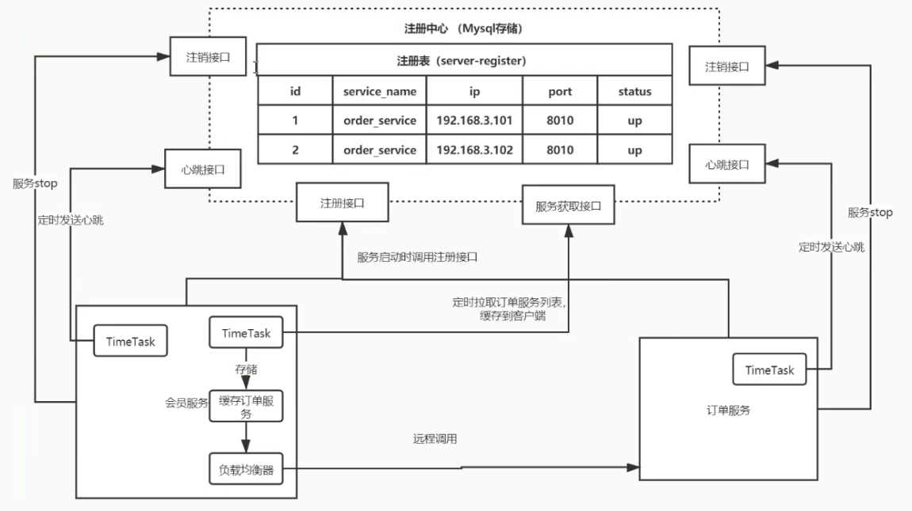
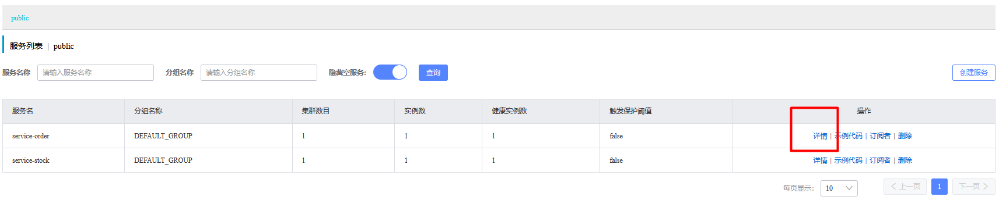
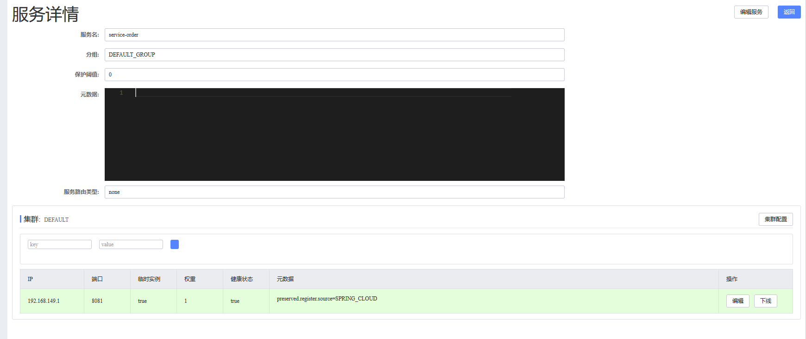
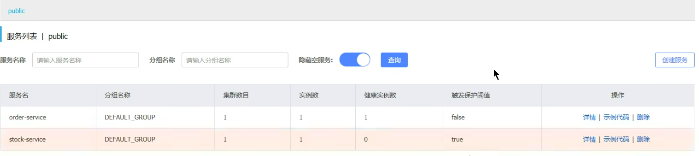
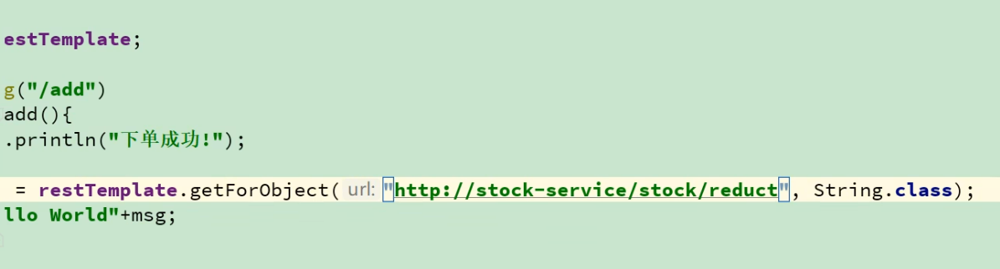
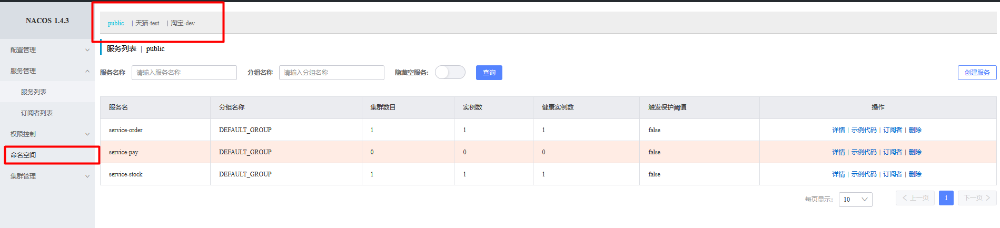
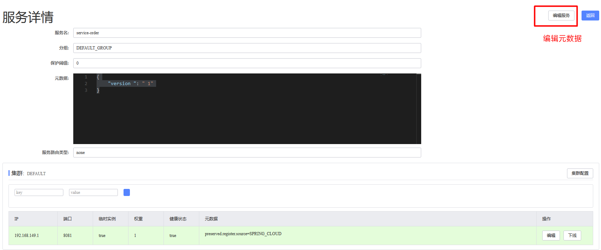
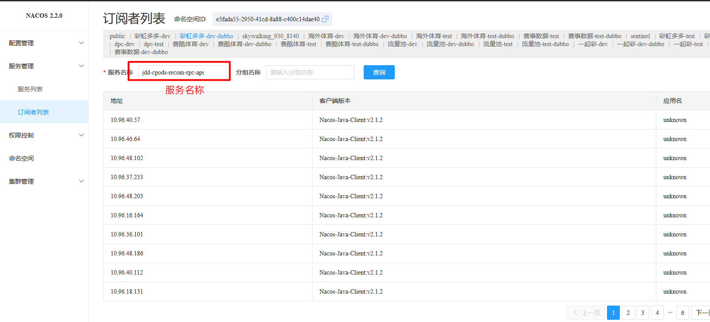
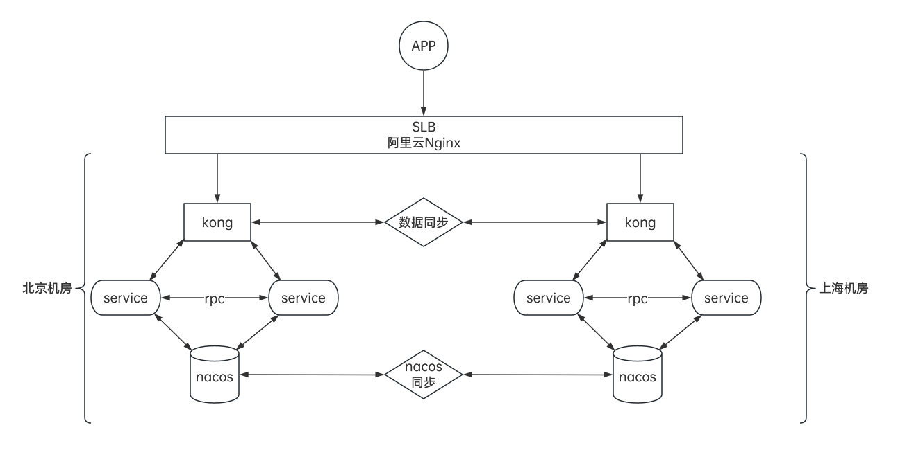
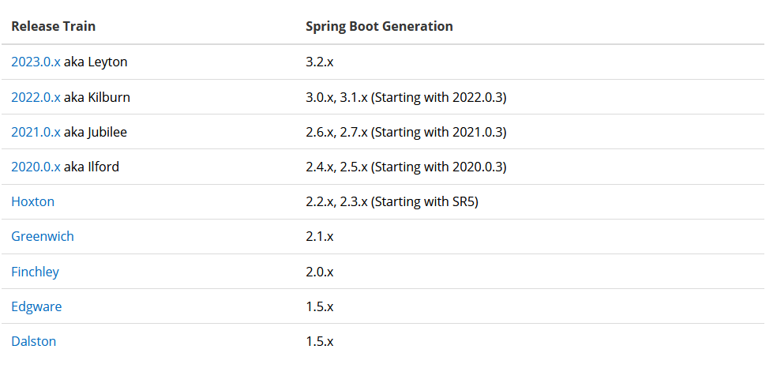

# 目录  
1.服务注册中心  


**附录:**  
1.微服务基本概念介绍  


## 1.服务注册中心
**目录:**  
1.1 服务注册中心基本介绍  
1.2 nacos基本环境搭建  
1.3 nacos界面说明  
1.4 nacos集群搭建  

### 1.1 服务注册中心基本介绍  
*提示:服务注册中心的基本概念将不在赘述*  

1.`nacos`基本介绍  
nacos是一个更易于构建**云原生**应用的动态服务发现、服务配置和服务管理平台  
特点:  
* 服务发现和服务健康检测
* 动态配置服务
* 动态DNS服务
* 配置及其元数据管理
  所谓的元数据就是服务的基本信息,比如服务的地址、服务名称等;服务通过与注册中心交换数据从而感知与被感知,从而进行远程调用  

**核心功能:**  
* 服务注册:服务会通过Rest请求像nacos中注册自已,提供自身的元数据,比如IP地址、端口等信息.nacos服务器接受到注册请求后,就会把这些元数据信息存储在一个双层的内存Map中
* 服务心跳:服务每隔5s会主动向注册中心发送一次心跳检测,表明该服务一直可用
* 服务同步:nacos集群之间会互相同步服务实例
* 服务发现:服务会发送Rest请求到nacos中获取服务列表,并缓存在本地(不需要每次请求都获取列表),同时会开启一个定时任务拉取服务列表信息更新本地缓存
* 服务健康检查:nacos会开启一个定时任务用来检查注册的服务的健康状况,每隔15秒如果没有收到心跳包会将该服务的健康状态设为false,每隔30s会将服务直接踢出

2.注册中心演变过程  
最开始服务之间的调用就类似RPC分布式系统中那样,一个服务使用类似RestTemplate通过HTTP去请求另外一个服务;但这种方式是十分不可靠的,如远程服务器的地址是不可以变更的;  

现在演变为注册中心,注册中心使用MySQL存储了一张<font color="#00FF00">注册表(server-register)</font>,注册表中的内容包含服务名称、服务地址、服务的健康状态  
当服务启动的时候就会去服务注册中心将自已注册到注册表中,接着会从注册表中获取服务列表  
服务自已会在本地维护一个定时任务,每5s向注册中心发送一个心跳,一旦注册中心超过5s没有收到心跳,则注册中心就视作当前的这个服务已经宕机,注册表就会把服务的状态设置为down;如果30s都没有收到服务的心跳,则注册表会把该服务移除  
当服务获取到所有健康的节点之后,如果要进行远程调用则不会再走nginx(如果还走nginx,则nginx还是要维护所有的节点信息,徒增消耗),而是会直接调用目标服务;在调用目标服务的时候就需要使用负载均衡,所以<font color="#00FF00">现在的负载均衡是在服务端(消费者端)来做的</font>  

  

3.CAP一致性协议  
* C:一致性
  必须保障每个节点之间的数据完全一致
  所以zookpeer是CP
* A:可用性
  无需保障每个节点数据的一致性,尽力保障节点的可用性  
  所以redis是AP
* P:分区容错性
  任何一个分布式架构都会保障分区容错性,所谓分区容错性是相对于单体服务而言的,单体服务的服务器宕机了整个服务就不可用了,而在分布式系统中一台服务器的宕机不影响整体对外提供服务.所以P是分布式系统的基本特性
`nacos`支持CP/AP之间的协议切换,别的注册中心是不支持的  

### 1.2 nacos基本环境搭建
1.docker安装nacos  
```shell
docker run \
-p 8848:8848 \
-p 9848:9848 \
-p 9849:9849 \
--name nacos2 \
--env MODE=standalone \
--env NACOS_AUTH_TOKEN_EXPIRE_SECONDS=18000 \
-v ~/software/nacos/logs:/home/nacos/logs \
-e JVM_XMS=256m \
-e JVM_XMX=256m \
-d nacos/nacos-server:v1.4.3
```

2.修改服务pom配置  
引入微服务相关组件,pom配置如下  
在service-stock和service-order中添加如下配置  
```xml
<dependency>
    <groupId>com.alibaba.cloud</groupId>
    <artifactId>spring-cloud-starter-alibaba-nacos-discovery</artifactId>
</dependency>
```

*提示:在IDEA中删除模块是比较复杂的,当然如果全权交由Maven来管理其实也还可以;如果在IDEA中删除一个模块,还需要到设置=>Maven=>已忽略的文件 将之前的排除的模块恢复*  

3.修改yml配置文件  
在service-stock和service-order中添加如下配置  
```yml
server:
  port: 8081
spring:
  application:
    name: service-order
  cloud:
    nacos:
      discovery:
        # 配置服务地址
        server-addr: 192.168.149.130:8848
        # 配置用户名,默认是nacos;高版本nacos必须配置该项
        username: nacos
        # 配置密码
        password: nacos
        # 命名空间,默认是public
        namespace: public
        # ephemeral: false 永久实例,默认是true临时实例,哪怕宕机了也不会删除实例
        # service: 服务名称,默认为${spring.application.name}
        # group: 分组,默认是DEFAULT_GROUP
        # weight: 权重,默认是1;通常需要结合负载均衡的策略
        # access-key: 上阿里云时需要使用的云账号
        # secret-key: 上阿里云时需要使用的云账号密码
        # metadata: 元数据,K-V键值对
        # cluster-name: 集群名称,如果要部署为多集群时会用到;注意多集群,意思就是还有但集群1.4 nacos集群搭建是单集群,比如分机房这种情况就是多集群
```

*注意:*  
其中命令空间用于隔离不同的环境,例如开发环境、生产环境;<font color="#00FF00">不同的命名空间的服务之间是无法相互感知的</font>  

4.编写主启动类  
正常编写即可,两个模块分别创建io.github.cnsukidayo.cloud  
然后再该路径下创建OrderApplication和StockApplication这两个主启动类  

5.启动服务  
查看注册中心  

点击右侧详情可以看到一些相关配置,包括元数据  
  
宕机服务等待大约15s后服务变为不可用  
  

6.服务调用  
nacos本身也是支持服务调用的,假设现在在order模块中使用RestTemplate进行服务调用stock模块;将请求地址写成以下这种形式  
  
<font color="#00FF00">结果是调用成功,将域名处写为目标服务的名称即可</font>  
*注意这里我省略了RestTemplate这个Bean的代码,现在补上*  

```java
@Bean
@LoadBalanced
public RestTemplate restTemplate(RestTemplateBuilder builder){
  RestTemplate restTemplate =  builder.build();
  return restTemplate;
}
```
`@LoadBalanced`:负载均衡器,使用该注解之后RestTemplate在调用的时候就会使用负载均衡;这个注解有用到过!!!
这个负载均衡器的默认调用方式是轮询;<font color="#00FF00">而且它默认还是使用的ribbon负载均衡</font>  

### 1.3 nacos界面说明
1.服务列表  
可以点击左侧route的命名空间界面进行命名空间的管理
  
<font color="#FF00FF">命名空间的约定:产品线+环境</font> 例如这里有两个命名空间,淘宝-dev、天猫-test  
另外可以点击右上角的创建服务,该功能用于创建一个空服务等待服务进行注册  

* 服务名称:在yml配置文件中配置的服务名称,后续远程调用就是以此来进行调用的
* 分组名称:它的作用和命名空间差不多,命名空间是大方向的分类,而分组名称是更细粒度的分类;<font color="#00FF00">也就是说在做服务隔离的时候会先按照命名空间进行隔离</font>,再按照分组名称进行隔离;不过工作中不太用到
* 集群数目:
* 实例数:当前服务有多少个实例
* 健康实例数:当前服务有多少个健康的实例
* 触发保护阈值
  这个就是用于解决之前提到的雪崩保护  
  可以填写<font color="#00FF00">0-1之间的一个数值</font>
  触发阈值还必须结合临时实例的概念,当将服务的yml配置ephemeral设置为false时表示这不是一个临时实例(即永久实例);如果此时该实例宕机是不会从注册表中剔除的,那么此时就会存在健康实例和不健康实例  
  此时如果 健康实例数/总实例数 < 保护阈值 nacos依旧会把不健康的实例传给服务调用者调用;防止洪峰流量到来时导致整个服务宕机;
  (<font color="#00FF00">总实例数=健康实例 + 不健康实例</font>)  
  <font color="#FF00FF">假设有两个实例,每个实例能够承受10W流量;假设一个宕机了,当打来20W流量时如果全部给存活的那一个实例最终就会导致服务雪崩;所以通过设置保护阈值把一部分流量转到宕机的节点上从而保护健康的节点不会接受到过多的流量(类似负载均衡)</font>
  一般不会设置该值,因为<font color="#00FF00">可以通过服务熔断降级来保护服务</font>
* 元数据:就是在服务与nacos同步元数据的时候额外添加这里设置的元数据,元数据实际上就是<font color="#00FF00">K-V键值对</font>;后续确实是可以在远程调用的时候通过该元数据做ribbon的一些策略;但实际上用的不是很多
* 权重:后续ribbon在负载均衡调用策略时会使用该权重,权重越大的能接受的流量就越多
  *注意:这里设置的负载均衡作用于远程调用,如果是流量进入服务的话是通过网关来实现负载均衡的*
* 下线:相当于剔除服务,不允许调用该服务了(由于服务节点是定时更新服务列表,所有会有缓存,下线之后不会立马生效)

2.订阅者列表  
  
选择一个命名空间并且在服务名称处输入某个服务名称,显示所有调用该服务的记录  

### 1.4 nacos集群搭建
**说明:**  
nacos集群需要配置三个节点  
docker启动nacos的配置可以从官网获取:[https://nacos.io/zh-cn/docs/quick-start-docker.html](https://nacos.io/zh-cn/docs/quick-start-docker.html)
1.更换数据源  
nacos默认使用的数据库是内嵌的derby数据库,这是一种内存型的数据库;因为现在有三个nacos为了让它们之间的数据同步就需要使用外置的统一的数据源MySQL  


# 附录:  
**目录:**  
1.微服务基本概念介绍  


## 1.微服务基本概念介绍
**目录:**  
1.1 微服务基本概念介绍  
1.2 实验环境介绍  
1.3 SpringBoot与Springcloud版本对应表  
1.4 组件说明  
1.5 基本环境搭建  

### 1.1 微服务基本概念介绍
一个微服务需要由哪些内容组成  
服务的注册与发现、服务调用、服务网关、服务配置中心、负载均衡、服务熔断、服务降级、服务消息队列、服务监控、全链路追踪  
*提示:这里的服务监控包含日志收集*  
SpringCloud是一套服务的总和  

**发展历史介绍:**  
1.ORM单体应用  

2.MVC垂直架构  
这种架构说白了就是拆分系统,例如将淘宝、天猫、支付宝都单独拆分为一个独立的单体应用  
*这种架构的问题是,系统与系统之间没有交互性,无法相互调用*  

3.RPC分布式服务  
这种架构就是将所有系统公共的部分抽离出一个单独的系统,供这些系统进行使用;例如淘宝、天猫这两个系统都有用户模块、订单模块、库存模块;于是乎就将这些模块拆分出来  
*在这个阶段很多分布式场景下的问题开始出现,比如分布式缓存、分布式session、分布式锁;并且在这种架构中使用远程调用一般是通过HTTP、Dubbo的方式去进行请求,还算不上真正的远程调用,因为真正的远程调用还要考虑负载均衡、节点的健康状况等因素,在这种架构下的实现是比较复杂的*  

4.SOA  
SOA架构就是为了解决在RPC分布式架构中调用关系复杂,难以维护的问题  
SOA使用治理中心ESB,ESB会管理所有的服务(模块),每个服务都需要将自已注册到治理中心ESB的总线(BUS)中,那么治理中心就会监控所有的服务,当某一个服务出现宕机的情况,那么治理中心就会将该服务排除  
并且ESB还可以进行协议转换,例如使用ESB就可以完成两个异构系统之间的服务调用  
*缺点:服务间会有依赖关系,一旦某个环节出错会影响较大(服务雪崩)*  
什么是服务雪崩,假设下单服务需要调用订单服务、库存服务、短信服务,此时短信服务崩溃那就有可能导致整个服务的不可用,从而使得服务雪崩;这种也称为<font color="#00FF00">扇出</font>  

5.微服务架构  

**一种可用的微服务架构**  
  
*提示:最外层的流量肯定还是走NGINX的,NGINX要通过负载均衡的算法把流量转到网关上,当然在这中间可以做分片*  

**名词解释:**  
* 水平扩容:增加节点的数量
* 垂直扩容:增加单台服务器的硬件

### 1.2 实验环境介绍  
经过慎重考虑,决定本次实验环境完全按照教程,使用OpenJdk9+SpringBoot2.0  

### 1.3 SpringBoot与Springcloud版本对应表  
  
也可以访问以下连接查看最新版本支持情况:[https://start.spring.io/actuator/info](https://start.spring.io/actuator/info)  
还可以访问SpringCloudAlibaba的说明:[https://github.com/alibaba/spring-cloud-alibaba/wiki/版本说明](https://github.com/alibaba/spring-cloud-alibaba/wiki/%E7%89%88%E6%9C%AC%E8%AF%B4%E6%98%8E)  


### 1.4 组件说明  
排名分先后顺序  
* 服务注册中心:`zookpeer`、`nacos`、consul、eureak
* 服务调用:`Dubbo`、`OpenFeign`、Ribbon、LoadBalancer、Feign
* 服务降级:`Sentinel`、Resilience4j、Hystrix
* 服务网关:`Kong`、`gateway`、Zuul
* 服务配置:`nacos`、Config
* 服务总线:`nacos`、Bus
* 链路追踪:`Zipkin`、`Skywalking`
* 分布式事务:`Seata`
* 服务网格:`Istio`

### 1.5 基本环境搭建
1.创建父工程  

2.修改pom文件  
```xml
<?xml version="1.0" encoding="UTF-8"?>
<project xmlns="http://maven.apache.org/POM/4.0.0"
         xmlns:xsi="http://www.w3.org/2001/XMLSchema-instance"
         xsi:schemaLocation="http://maven.apache.org/POM/4.0.0 http://maven.apache.org/xsd/maven-4.0.0.xsd">
    <modelVersion>4.0.0</modelVersion>

    <groupId>io.github.cnsukidayo</groupId>
    <artifactId>springcloud</artifactId>
    <version>1.0-SNAPSHOT</version>
    <!--修改为pom打包的时候不会打包为jar包,因为父工程只管理配置-->
    <packaging>pom</packaging>
    <modules>
        <module>service-order</module>
        <module>service-stock</module>
    </modules>

    <properties>
        <maven.compiler.source>9</maven.compiler.source>
        <maven.compiler.target>9</maven.compiler.target>
        <project.build.sourceEncoding>UTF-8</project.build.sourceEncoding>
        <spring.cloud.alibaba.version>2.2.5.RELEASE</spring.cloud.alibaba.version>
        <spring.boot.version>2.3.11.RELEASE</spring.boot.version>
        <spring.cloud.version>Hoxton.SR8</spring.cloud.version>
    </properties>

    <dependencies>
        <dependency>
            <groupId>org.springframework.boot</groupId>
            <artifactId>spring-boot-starter</artifactId>
        </dependency>


        <dependency>
            <groupId>org.springframework.boot</groupId>
            <artifactId>spring-boot-starter-test</artifactId>
            <scope>test</scope>
            <exclusions>
                <exclusion>
                    <groupId>org.junit.vintage</groupId>
                    <artifactId>junit-vintage-engine</artifactId>
                </exclusion>
            </exclusions>
        </dependency>
    </dependencies>

    <dependencyManagement>
        <!--type:pom 因为一个项目只能有一个parent,所以这里使用这种方式来变相让SpringCloudAlibaba来管理项目-->
        <dependencies>
            <dependency>
                <groupId>com.alibaba.cloud</groupId>
                <artifactId>spring-cloud-alibaba-dependencies</artifactId>
                <version>${spring.cloud.alibaba.version}</version>
                <type>pom</type>
                <scope>import</scope>
            </dependency>
            <!--SpringBoot的版本管理-->
            <dependency>
                <groupId>org.springframework.boot</groupId>
                <artifactId>spring-boot-starter-parent</artifactId>
                <version>${spring.boot.version}</version>
                <type>pom</type>
                <scope>import</scope>
            </dependency>
            <!--SpringCloud的版本管理-->
            <dependency>
                <groupId>org.springframework.cloud</groupId>
                <artifactId>spring-cloud-dependencies</artifactId>
                <version>${spring.cloud.version}</version>
                <type>pom</type>
                <scope>import</scope>
            </dependency>

        </dependencies>

    </dependencyManagement>

    <!--<build>-->
    <!--    <plugins>-->
    <!--        <plugin>-->
    <!--            <groupId>org.springframework.boot</groupId>-->
    <!--            <artifactId>spring-boot-maven-plugin</artifactId>-->
    <!--        </plugin>-->
    <!--    </plugins>-->
    <!--</build>-->


</project>
```

3.创建子模块  
分别创建两个子模块订单模块(service-order)和库存模块(service-stock)  
为这两个模块添加如下pom内容:  
```xml
<dependencies>
    <dependency>
        <groupId>org.springframework.boot</groupId>
        <artifactId>spring-boot-starter-web</artifactId>
    </dependency>
</dependencies>
```


