# 目录  
1.服务注册中心  
2.负载均衡器  
3.远程调用  
4.服务配置中心  
5.服务降级  


**附录:**  
1.微服务基本概念介绍  


## 1.服务注册中心
**目录:**  
1.1 服务注册中心基本介绍  
1.2 nacos基本环境搭建  
1.3 nacos界面说明  
1.4 nacos集群搭建  

### 1.1 服务注册中心基本介绍  
*提示:服务注册中心的基本概念将不在赘述*  

1.`nacos`基本介绍  
nacos是一个更易于构建**云原生**应用的动态服务发现、服务配置和服务管理平台  
特点:  
* 服务发现和服务健康检测
* 动态配置服务
* 动态DNS服务
* 配置及其元数据管理
  所谓的元数据就是服务的基本信息,比如服务的地址、服务名称等;服务通过与注册中心交换数据从而感知与被感知,从而进行远程调用  

**核心功能:**  
* 服务注册:服务会通过Rest请求像nacos中注册自已,提供自身的元数据,比如IP地址、端口等信息.nacos服务器接受到注册请求后,就会把这些元数据信息存储在一个双层的内存Map中
* 服务心跳:服务每隔5s会主动向注册中心发送一次心跳检测,表明该服务一直可用
* 服务同步:nacos集群之间会互相同步服务实例
* 服务发现:服务会发送Rest请求到nacos中获取服务列表,并缓存在本地(不需要每次请求都获取列表),同时会开启一个定时任务拉取服务列表信息更新本地缓存
* 服务健康检查:nacos会开启一个定时任务用来检查注册的服务的健康状况,每隔15秒如果没有收到心跳包会将该服务的健康状态设为false,每隔30s会将服务直接踢出

2.注册中心演变过程  
最开始服务之间的调用就类似RPC分布式系统中那样,一个服务使用类似RestTemplate通过HTTP去请求另外一个服务;但这种方式是十分不可靠的,如远程服务器的地址是不可以变更的;  

现在演变为注册中心,注册中心使用MySQL存储了一张<font color="#00FF00">注册表(server-register)</font>,注册表中的内容包含服务名称、服务地址、服务的健康状态  
当服务启动的时候就会去服务注册中心将自已注册到注册表中,接着会从注册表中获取服务列表  
服务自已会在本地维护一个定时任务,每5s向注册中心发送一个心跳,一旦注册中心超过5s没有收到心跳,则注册中心就视作当前的这个服务已经宕机,注册表就会把服务的状态设置为down;如果30s都没有收到服务的心跳,则注册表会把该服务移除  
当服务获取到所有健康的节点之后,如果要进行远程调用则不会再走nginx(如果还走nginx,则nginx还是要维护所有的节点信息,徒增消耗),而是会直接调用目标服务;在调用目标服务的时候就需要使用负载均衡,所以<font color="#00FF00">现在的负载均衡是在服务端(消费者端)来做的</font>  

  

3.CAP一致性协议  
* C:一致性
  必须保障每个节点之间的数据完全一致
  所以zookpeer是CP
* A:可用性
  无需保障每个节点数据的一致性,尽力保障节点的可用性  
  所以redis是AP
* P:分区容错性
  任何一个分布式架构都会保障分区容错性,所谓分区容错性是相对于单体服务而言的,单体服务的服务器宕机了整个服务就不可用了,而在分布式系统中一台服务器的宕机不影响整体对外提供服务.所以P是分布式系统的基本特性
`nacos`支持CP/AP之间的协议切换,别的注册中心是不支持的  

### 1.2 nacos基本环境搭建
1.docker安装nacos  
```shell
docker run \
-p 8848:8848 \
-p 9848:9848 \
-p 9849:9849 \
--name nacos2 \
--env MODE=standalone \
--env NACOS_AUTH_TOKEN_EXPIRE_SECONDS=18000 \
-v ~/software/nacos/logs:/home/nacos/logs \
-e JVM_XMS=256m \
-e JVM_XMX=256m \
-d nacos/nacos-server:v1.4.3
```

2.修改服务pom配置  
引入微服务相关组件,pom配置如下  
在service-stock和service-order中添加如下配置  
```xml
<dependency>
    <groupId>com.alibaba.cloud</groupId>
    <artifactId>spring-cloud-starter-alibaba-nacos-discovery</artifactId>
</dependency>
```

*提示:在IDEA中删除模块是比较复杂的,当然如果全权交由Maven来管理其实也还可以;如果在IDEA中删除一个模块,还需要到设置=>Maven=>已忽略的文件 将之前的排除的模块恢复*  

3.修改yml配置文件  
在service-stock和service-order中添加如下配置  
```yml
server:
  port: 8081
spring:
  application:
    name: service-order
  cloud:
    nacos:
      discovery:
        # 配置服务地址
        server-addr: 192.168.149.130:8848
        # 配置用户名,默认是nacos;高版本nacos必须配置该项
        username: nacos
        # 配置密码
        password: nacos
        # 命名空间,默认是public
        namespace: public
        # ephemeral: false 永久实例,默认是true临时实例,哪怕宕机了也不会删除实例
        # service: 服务名称,默认为${spring.application.name}
        # group: 分组,默认是DEFAULT_GROUP
        # weight: 权重,默认是1;通常需要结合负载均衡的策略
        # access-key: 上阿里云时需要使用的云账号
        # secret-key: 上阿里云时需要使用的云账号密码
        # metadata: 元数据,K-V键值对
        # cluster-name: 集群名称,如果要部署为多集群时会用到;注意多集群,意思就是还有但集群1.4 nacos集群搭建是单集群,比如分机房这种情况就是多集群
```

*注意:*  
其中命令空间用于隔离不同的环境,例如开发环境、生产环境;<font color="#00FF00">不同的命名空间的服务之间是无法相互感知的</font>  

4.编写主启动类  
正常编写即可,两个模块分别创建io.github.cnsukidayo.cloud  
然后再该路径下创建OrderApplication和StockApplication这两个主启动类  

5.启动服务  
查看注册中心  

点击右侧详情可以看到一些相关配置,包括元数据  
  
宕机服务等待大约15s后服务变为不可用  
  

6.服务调用  
nacos本身也是支持服务调用的,假设现在在order模块中使用RestTemplate进行服务调用stock模块;将请求地址写成以下这种形式  
  
<font color="#00FF00">结果是调用成功,将域名处写为目标服务的名称即可</font>  
*注意这里我省略了RestTemplate这个Bean的代码,现在补上*  

```java
@Bean
@LoadBalanced
public RestTemplate restTemplate(RestTemplateBuilder builder){
  RestTemplate restTemplate =  builder.build();
  return restTemplate;
}
```
`@LoadBalanced`:负载均衡器,使用该注解之后RestTemplate在调用的时候就会使用负载均衡;这个注解有用到过!!!
这个负载均衡器的默认调用方式是轮询;<font color="#00FF00">而且它默认还是使用的ribbon负载均衡</font>  

### 1.3 nacos界面说明
1.服务列表  
可以点击左侧route的命名空间界面进行命名空间的管理
  
<font color="#FF00FF">命名空间的约定:产品线+环境</font> 例如这里有两个命名空间,淘宝-dev、天猫-test  
另外可以点击右上角的创建服务,该功能用于创建一个空服务等待服务进行注册  

* 服务名称:在yml配置文件中配置的服务名称,后续远程调用就是以此来进行调用的
* 分组名称:它的作用和命名空间差不多,命名空间是大方向的分类,而分组名称是更细粒度的分类;<font color="#00FF00">也就是说在做服务隔离的时候会先按照命名空间进行隔离</font>,再按照分组名称进行隔离;不过工作中不太用到
* 集群数目:
* 实例数:当前服务有多少个实例
* 健康实例数:当前服务有多少个健康的实例
* 触发保护阈值
  这个就是用于解决之前提到的雪崩保护  
  可以填写<font color="#00FF00">0-1之间的一个数值</font>
  触发阈值还必须结合临时实例的概念,当将服务的yml配置ephemeral设置为false时表示这不是一个临时实例(即永久实例);如果此时该实例宕机是不会从注册表中剔除的,那么此时就会存在健康实例和不健康实例  
  此时如果 健康实例数/总实例数 < 保护阈值 nacos依旧会把不健康的实例传给服务调用者调用;防止洪峰流量到来时导致整个服务宕机;
  (<font color="#00FF00">总实例数=健康实例 + 不健康实例</font>)  
  <font color="#FF00FF">假设有两个实例,每个实例能够承受10W流量;假设一个宕机了,当打来20W流量时如果全部给存活的那一个实例最终就会导致服务雪崩;所以通过设置保护阈值把一部分流量转到宕机的节点上从而保护健康的节点不会接受到过多的流量(类似负载均衡)</font>
  一般不会设置该值,因为<font color="#00FF00">可以通过服务熔断降级来保护服务</font>
* 元数据:就是在服务与nacos同步元数据的时候额外添加这里设置的元数据,元数据实际上就是<font color="#00FF00">K-V键值对</font>;后续确实是可以在远程调用的时候通过该元数据做ribbon的一些策略;但实际上用的不是很多
* 权重:后续ribbon在负载均衡调用策略时会使用该权重,权重越大的能接受的流量就越多
  *注意:这里设置的负载均衡作用于远程调用,如果是流量进入服务的话是通过网关来实现负载均衡的*
* 下线:相当于剔除服务,不允许调用该服务了(由于服务节点是定时更新服务列表,所有会有缓存,下线之后不会立马生效)

2.订阅者列表  
  
选择一个命名空间并且在服务名称处输入某个服务名称,显示所有调用该服务的记录  

### 1.4 nacos集群搭建
**说明:**  
nacos集群需要配置三个节点  
docker启动nacos的配置可以从官网获取:[https://nacos.io/zh-cn/docs/quick-start-docker.html](https://nacos.io/zh-cn/docs/quick-start-docker.html)
1.更换数据源  
nacos默认使用的数据库是内嵌的derby数据库,这是一种内存型的数据库;因为现在有三个nacos为了让它们之间的数据同步就需要使用外置的统一的数据源MySQL  
使用docker创建MySQL数据源;这里创建最普通的MySQL即可,详情参考docker创建MySQL  

**使用Navicat连接数据库**  
使用Navicat连接数据库并创建nacos数据库,在该数据库下运行nacos官方提供的建表SQL;
这个建表语句一般可以进入nacos容器后在conf目录下找到scheme.sql(可以先创建一个nacos然后拿到该版本的SQL建表语句之后再删除该nacos)  
也可以访问 [https://github.com/alibaba/nacos/blob/master/distribution/conf/mysql-schema.sql](https://github.com/alibaba/nacos/blob/master/distribution/conf/mysql-schema.sql)来获取[SQL建表语句](resources/springcloud/mysql-schema.sql)  

**运行后效果如下图所示:**  
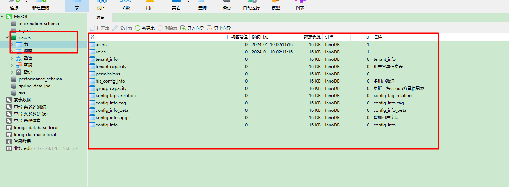  

2.创建nacos集群  
**nacos1:**  
```shell
docker run \
-p 8870:8848 \
-p 9880:9848 \
-p 9890:9849 \
--name nacos1 \
-e PREFER_HOST_MODE=ip \
-e MODE=cluster  \
-e NACOS_SERVERS="192.168.149.130:8871 192.168.149.130:8872" \
-e SPRING_DATASOURCE_PLATFORM=mysql \
-e MYSQL_SERVICE_HOST=192.168.149.130 \
-e MYSQL_SERVICE_PORT=7901 \
-e MYSQL_SERVICE_DB_NAME=nacos \
-e MYSQL_SERVICE_USER=root \
-e MYSQL_SERVICE_PASSWORD=root \
-e NACOS_AUTH_TOKEN_EXPIRE_SECONDS=18000 \
-e JVM_XMS=256m \
-e JVM_XMX=256m \
-e NACOS_SERVER_IP=192.168.149.130 \
-d nacos/nacos-server:v1.4.3
```
**解释:**  
* 这里192.168.149.130是虚拟机的IP,宿主机的IP;用于连接MySQL使用
* `MODE=cluster` 模式选择集群
* `NACOS_SERVERS = "192.168.149.130:8871 192.168.149.130:8872"` 另外两个集群的IP地址和端口
* `SPRING_DATASOURCE_PLATFORM=msyql` 使用的数据库为MySQL
* `MYSQL_SERVICE_HOST=192.168.149.130` 数据库的IP
* `MYSQL_SERVICE_PORT=7901` 数据库的端口
* `MYSQL_SERVICE_DB_NAME=nacos` 使用那个库作为nacos的数据库
* `MYSQL_SERVICE_USER=root` 连接数据库的用户名
* `MYSQL_SERVICE_PASSWORD=root` 连接数据库的密码
* `NACOS_SERVER_IP=192.168.149.130` 当前nacos服务器的IP,真实的生产环境中该IP就填Linux主机的IP即可;这里是填写的虚拟机IP

此时进入nacos集群管理页面,可以看到集群配置已经生效,效果如下:  
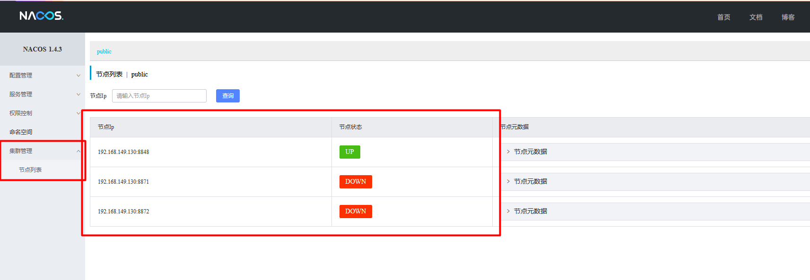
*只不过这里另外两台集群还没有上线所以是红色的*  

**nacos2:**
```shell
docker run \
-p 8871:8848 \
-p 9881:9848 \
-p 9891:9849 \
--name nacos2 \
-e PREFER_HOST_MODE=ip \
-e MODE=cluster  \
-e NACOS_SERVERS="192.168.149.130:8870 192.168.149.130:8872" \
-e SPRING_DATASOURCE_PLATFORM=mysql \
-e MYSQL_SERVICE_HOST=192.168.149.130 \
-e MYSQL_SERVICE_PORT=7901 \
-e MYSQL_SERVICE_DB_NAME=nacos \
-e MYSQL_SERVICE_USER=root \
-e MYSQL_SERVICE_PASSWORD=root \
-e NACOS_AUTH_TOKEN_EXPIRE_SECONDS=18000 \
-e JVM_XMS=256m \
-e JVM_XMX=256m \
-e NACOS_SERVER_IP=192.168.149.130 \
-d nacos/nacos-server:v1.4.3
```

**nacos3:**  
```shell
docker run \
-p 8872:8848 \
-p 9882:9848 \
-p 9892:9849 \
--name nacos3 \
-e PREFER_HOST_MODE=ip \
-e MODE=cluster  \
-e NACOS_SERVERS="192.168.149.130:8870 192.168.149.130:8871" \
-e SPRING_DATASOURCE_PLATFORM=mysql \
-e MYSQL_SERVICE_HOST=192.168.149.130 \
-e MYSQL_SERVICE_PORT=7901 \
-e MYSQL_SERVICE_DB_NAME=nacos \
-e MYSQL_SERVICE_USER=root \
-e MYSQL_SERVICE_PASSWORD=root \
-e NACOS_AUTH_TOKEN_EXPIRE_SECONDS=18000 \
-e JVM_XMS=256m \
-e JVM_XMX=256m \
-e NACOS_SERVER_IP=192.168.149.130 \
-d nacos/nacos-server:v1.4.3
```

**最终效果如下:**  
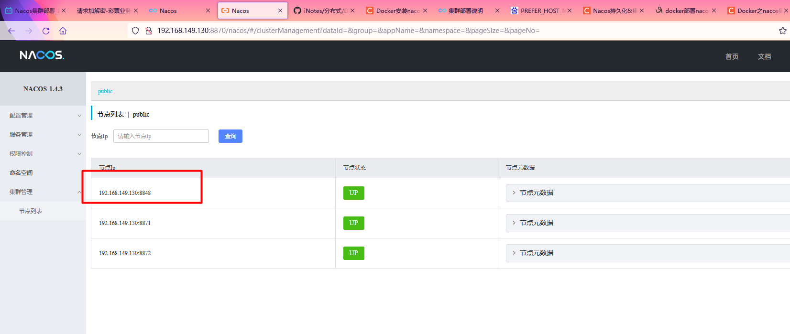  
*注意:这里的第一个IP的端口显示的是有点问题的,因为第一个默认是当前节点的在docker内部的IP和端口;IP已经通过NACOS_SERVER_IP修改为Linux宿主机IP了,但是端口是改不掉的(除非修改启动nacos的端口),不过只要注意NACOS_SERVERS填写不错误就行了*  
另外如果此时进入容器,查看<font color="#00FF00">cluster.conf</font>文件的内容就是我们配置的集群内容了:  
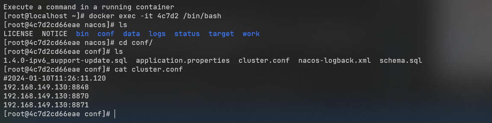

3.配置NGINX  
*需求:配置NGINX使用反向代理负载均衡流量到三台nacos服务器上*  

3.1 拉取镜像  
`docker pull nginx`  

3.2 直接先启动(为了拷贝配置文件)  
*提示:有的时候docker挂载配置文件,启动容器后会提示找不到conf,这是因为这种镜像在启动的时候并没有同步配置文件;那么一种解决方案就是先启动一个容器,把容器中的配置文件拷贝出来,然后把该容器删掉;之后再启动一次并且设置挂载*  
```shell
docker run \
-p 80:80 \
--name nginx \
-d nginx
```

3.3 拷贝文件  
```shell
mkdir {~/software/nginx,~/software/nginx/html,~/software/nginx/logs}
# 把containerID替换为你的NGINX镜像id
docker container cp [containerID]:/etc/nginx ~/software/nginx/conf/
```

3.4 停止容器删除容器  
```shell
docker stop [containerID]
docker rm [containerID]
```

3.5 启动nginx  
```shell
docker run -p 9001:80 --name nginx \
-v ~/software/nginx/html:/usr/share/nginx/html \
-v ~/software/nginx/logs:/var/log/nginx \
-v ~/software/nginx/conf:/etc/nginx \
-d nginx
```

此时访问`LinuxIP:9001`就能够看到nginx的响应信息了  


3.6 配置nacos负载均衡  
```shell
# 备份nginx配置文件
cp ~/software/nginx/conf/conf.d/default.conf ~/software/nginx/conf/conf.d/default_backup.conf
# 编辑nginx配置文件
vim ~/software/nginx/conf/conf.d/default.conf
```
**在配置文件中添加如下内容:**  
```shell
# 添加nacos集群的地址
upstream nacoscluster {
    server 192.168.149.130:8870 weight=1;
    server 192.168.149.130:8871 weight=1;
    server 192.168.149.130:8872 weight=1;
}

server{
  # something
  location /nacos/{
    proxy_pass http://nacoscluster/nacos/;
  }
}

```

3.7 重启nginx  
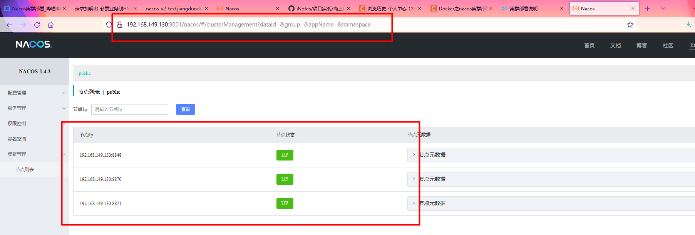  
集群搭建成功  

3.8 将微服务注册中心的地址改为nginx地址  
```yml
spring:
  cloud:
    nacos:
      discovery:
        server-addr: 192.168.149.130:9001
```
再次查看nacos情况,成功注册  
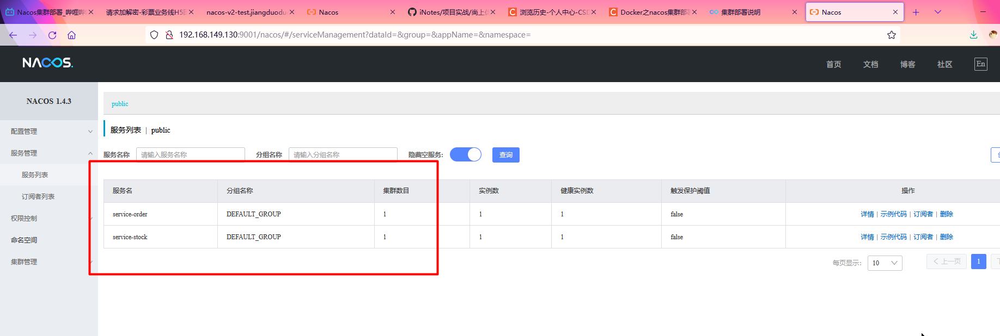  


## 2.负载均衡器
**目录**  
2.1 负载均衡的基本介绍  
2.2 Ribbon的使用方式  
2.3 Ribbon负载均衡策略  
2.4 LoadBalancer使用方式  


### 2.1 负载均衡的基本介绍
1.解决方案  
目前负载均衡分为两种解决方案:服务端负载均衡、客户端负载均衡  
* 服务端负载均衡:又分为硬件负载均衡(如F5)和软件负载均衡(如nginx)  
  * 硬件负载均衡:当一个服务调用另外一个服务发送请求时,因为流量最终肯定要走交换机,所以直接通过硬件交换机做负载均衡
  * 软件负载均衡:在服务消费者和服务提供者中间增加一层nginx服务器来做负载均衡

  <font color="#00FF00">区别:</font>硬件性能更好,但需要额外的成本,软件性能稍低但便宜
* 客户端负载均衡:直接在服务消费者端做负载均衡,通过获取目标服务列表在远程调用的时候通过代码来控制负载均衡

2.Ribbon  
`Ribbon`就是客户端的负载均衡,通过`LoadBalancer`获取到服务提供的所有机器实例,Ribbon会自动基于某种规则(轮询、随机、自定义)去调用这些服务

3.常见负载均衡算法  
* 轮询:负载均衡的默认实现方式,轮询调用目标服务
* 随机:随机调用目标服务
* 加权轮询:按照权重对目标服务进行调用
* 地址hash:对客户端请求的IP地址进行hash取模调用;这种调用方式的特点是,在服务器不动态扩缩容的情况下,同一个IP发出的所有请求的调用链是一致的
* 最小链接数:即使请求均衡了,但是压力不一定均衡;最小连接数就是根据服务器的情况(如请求积压等参数)将请求分配到压力最小的服务器上

### 2.2 Ribbon的使用方式
1.使用方式  
实际上在1.2 nacos基本环境搭建 =>第6步服务调用就是Ribbon的负载均衡器使用案例  
注意配置`@LoadBalanced`注解
nacos默认是支持Ribbon的,所以<font color="#00FF00">引入nacos依赖的时候会自动依赖ribbon</font>

### 2.3 Ribbon负载均衡策略
1.IRule接口  
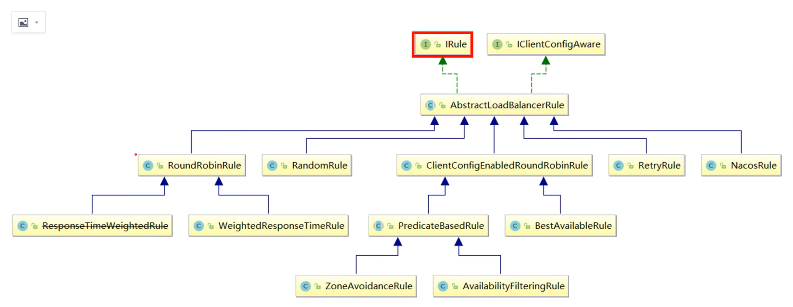  
*解释:所有的负载均衡策略都实现了IRule接口,它的每一种实现类都是一种负载均衡策略;choose是该接口最重要的方法,用来选择一个服务实例*  

AbstractLoadBalancerRule:抽象类,该抽象类主要定义了一个ILoadBalancer,这里定义它的主要目的是<font color="#00FF00">辅助负载均衡策略选取合适的服务端实例</font>

2.实现类详解  
* RandomRule:随机
* RoundRobinRule:轮询;通过一个计数器每次调用时都会增加1,将计数器的结果取模服务总数得到调用的实例下标
* RetryRule:在轮询的基础上增加**重试**功能,在调用时还是轮询获取服务,如果不能获取服务则会有一个重试的过程,重试时会依次轮询获取下一个服务,如果在deadline时间到来之前还没有获取到有效服务则会返回null
* WeightResponseTimeRule:这种策略会根据每一个实例的运行情况来计算出实例的**权重**,该策略内部有一个定时器,该定时器会每隔30s计算一次各个服务的实例,计算规则,<font color="#00FF00">如果一个服务的响应时间越短则权重越大</font>
* NacosRule:根据服务在nacos中配置的权重来进行负载均衡;服务在nacos中配置权重的方式见:1.3 nacos界面说明
* ClientConfigEnableRoundRobinRule:该策略类似RoundRobinRule
* BestAvaliable:继承自ClientConfigEnableRoundRobinRule;该策略会根据LoadBalancedStats中保存的服务实例的状态信息来<font color="#00FF00">过滤掉失效的服务实例,顺便找出并发请求最小的服务实例进行使用</font>;然而LoadBalancedStats有可能会null,如果为null时会退化为ClientConfigEnableRoundRobinRule策略
* ZoneAvoidanceRule:负载均衡默认规则(轮询),间接继承ClientConfigEnableRoundRobinRule;但该实现类增加了区域选择功能,假设现在服务消费者在北京,两个服务提供者一个在天津一个在上海,则最终肯定是调用在天津的服务提供者;并且每次都是调用天津的服务提供者,如果没有区域则会退化为负载均衡策略
* AvaliablityFilteringRule:先过滤掉故障实例再选择并发较小的实例

3.修改默认的负载均衡策略  
修改默认的负载均衡策略有两种方式:配置类、yml配置文件

3.1 通过配置类修改负载均衡策略
通过编写配置类,向容器中添加IRule实现类即可  
```java
@Configuration
public class RibbonConfig {
    public IRule iRule() {
        // 使用nacos负载均衡策略
        return new NacosRule();
    }
}
```

<font color="#00FF00">还可以针对不同服务提供方使用不同的负载均衡策略</font>  

```java
@SpringBootApplication
@RibbonClients(value = {
        @RibbonClient(name = "mall-order",configuration = RibbonConfig.class),
        @RibbonClient(name = "mall-account",configuration = RibbonConfig.class)
})
public class OrderApplication {
    @LoadBalanced
    public static void main(String[] args) {
        SpringApplication.run(OrderApplication.class, args);
    }
}
```
这里就对mall-order和mall-account服务提供方配置了具体的负载均衡策略,如果不配置默认就是对所有的服务提供方都使用上述RibbonConfig类配置的负载均衡策略  

**注意:** 这里有个坑,这个RibbonConfig不能被@ComponentScan注解扫描到;所以这里我修改了一下目录结构,将RibbonConfig类放到了启动类的父包的同级包下;如果该配置类能够被扫描到,则<font color="#FF00FF">会将所有服务提供方的负载均衡策略都设置为该配置类里的负载均衡策略</font>  
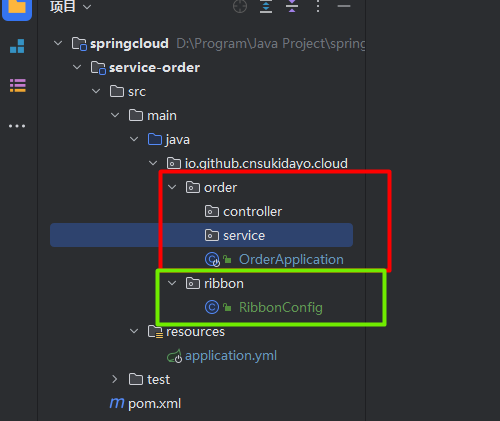  

3.2 通过配置类修改负载均衡策略
```yml
服务提供者名称:
  ribbon:
    NFLoadBalancerRuleClassName: 负载均衡策略的全限定名
```
例如:
```yml
service-stock:
  ribbon:
    NFLoadBalancerRuleClassName: com.alibaba.cloud.nacos.ribbon.NacosRule
```
这里就设置了调用目标服务service-stock时使用nacos的负载均衡策略

4.实现自定义负载均衡策略  
```java
public class CustomRule extends AbstractLoadBalancerRule {
    @Override
    public void initWithNiwsConfig(IClientConfig iClientConfig) {

    }

    @Override
    public Server choose(Object o) {
        // 获取当前服务列表
        ILoadBalancer loadBalancer = this.getLoadBalancer();
        List<Server> reachableServers = loadBalancer.getReachableServers();
        // 随机获取一个实例
        int random = ThreadLocalRandom.current().nextInt(reachableServers.size());

        return reachableServers.get(random);
    }
}
```
<font color="#00FF00">使用第三步将的方式来使用当前这个负载均衡策略即可</font>

5.立即加载  
*解释:默认所有的负载均衡器都是懒加载的,那么当服务第一次远程调用时有可能会卡顿甚至超时,所以可以将负载均衡器设置为立即加载*  
修改yml配置文件  
```yml
ribbon:
  eager-load:
    # 开启ribbon立即加载
    enabled: true
    # 还可以再这里配置哪些服务是需要立即加载的;这里配置mall-order服务的负载均衡器是立即加载
    # 多个配置用逗号,隔开;如果不配置则所有服务都是立即加载
    # clients: mall-order
```

### 2.4 LoadBalancer使用方式
Ribbon是nacos默认的负载均衡器,本节介绍LoadBalancer这个负载均衡器  
1.LoadBalancer提供两种负载均衡客户端  
* RestTemplate:基于HTTP的远程调用
* WebClient:基于WebFlux的远程调用(注意现在还没有讲OpenFeign,之前使用远程调用时一直是基于RestTemplate的),LoadBalancer支持使用响应式编程的方式进行远程调用

2.排除nacos中对ribbon的依赖  
*提示:高版本可能不需要排除,高版本nacos默认不再依赖ribbon*  
```xml
<!--服务注册发现-->
<dependencies>
    <dependency>
        <groupId>org.springframework.boot</groupId>
        <artifactId>spring-boot-starter-web</artifactId>
    </dependency>

    <!--服务注册发现-->
    <dependency>
        <groupId>com.alibaba.cloud</groupId>
        <artifactId>spring-cloud-starter-alibaba-nacos-discovery</artifactId>
        <exclusions>
            <exclusion>
                <!--将ribbon排除-->
                <groupId>org.springframework.cloud</groupId>
                <artifactId>spring-cloud-starter-netflix-ribbon</artifactId>
            </exclusion>
        </exclusions>
    </dependency>

    <!--添加LoadBalancer依赖-->
    <dependency>
        <groupId>org.springframework.cloud</groupId>
        <artifactId>spring-cloud-starter-loadbalancer</artifactId>
    </dependency>

</dependencies>
```

3.修改yml配置文件  
```yml
spring:
  cloud:
    loadbalancer:
      retry:
        # 启用loadbalancer
        enabled: true
```

4.自定义负载均衡策略  
和之前大同小异,需要往容器中添加ReactorLoadBalancer的实现类  
接着使用`@LoadBalancerClients`注解来针对某个服务提供者使用特定的负载均衡策略(类似之前@RibbonClients)  
只不过loadbalancer没有提供配置文件的方式来自定义负载均衡策略  

## 3.远程调用
**目录:**  
3.1 Feign基本环境搭建  
3.2 OpenFeign自定义配置  


### 3.1 Feign基本环境搭建
1.Feign基本介绍  
Feign是开放的声明式、模板化的HTTP客户端;Feign就是远程调用组件,Feign支持自带的注解以及JAX-RS注解等  
OpenFeign对Feign做了增强,使其支持SpringMVC注解,并且OpenFeign还整合了Ribbon和Nacos;所以OpenFeign没有支持LoadBalancer,OpenFeign不支持异步调用

2.OpenFeign基本环境搭建  
2.1 创建新模块order-openfeign  

2.2 修改pom文件,添加OpenFeign依赖
```xml
<dependency>
    <groupId>org.springframework.cloud</groupId>
    <artifactId>spring-cloud-starter-openfeign</artifactId>
</dependency>
```

2.3 添加主启动类  
在项目下创建io.github.cnsukidayo.cloud.order包,在该包下创建OrderApplication主启动类  
```java
@SpringBootApplication
@EnableFeignClients
public class OrderApplication {
    @LoadBalanced
    public static void main(String[] args) {
        SpringApplication.run(OrderApplication.class, args);
    }
}
```

2.4 编写yml文件  
这里就不用nacos集群环境了(别忘了service-stock模块的yml也要修改nacos地址)  
```yml
server:
  port: 8081
spring:
  application:
    name: service-order
  cloud:
    nacos:
      discovery:
        server-addr: 192.168.149.130:8870
        username: nacos
        password: nacos
        namespace: public
```

2.5 完善service-stock模块中的接口  
在该模块的io.github.cnsukidayo.cloud.stock包下创建api包单独作为本模块对外提供的接口;在该包下创建StockController类  
```java
@RestController()
@RequestMapping("/api/stock/inner")
public class StockController {

    @Value("${server.port}")
    private String port;

    @GetMapping("reduce")
    public String reduce() {
        return "扣减库存" + port;
    }

}
```

2.6 编写远程调用接口  
在io.github.cnsukidayo.cloud.order包下创建feign包,该包用于存放OpenFeign远程调用的接口;这里为了方便就没有单独建一个模块放这些远程调用接口  
在该包下创建StockFeignService接口  
```java
@FeignClient(name = "service-stock", path = "/api/stock/inner")
public interface StockFeignService {

    @GetMapping("reduce")
    String reduce();
}
```
`@FeignClient`  
* name:目标服务的名称(服务提供者的名称)
* path:远程调用的前缀(这里正好和StockController接口对应上)
* configuration:设置配置类(可以设置当前远程调用接口的日志级别)

<font color="#FF00FF">所以这里的实现和JPA很类似,都是使用动态代理完成的;</font>

2.7 编写服务消费者接口  
在order-openfeign模块中创建controller包,在该包下创建OrderController  
```java
@RestController
@RequestMapping("/api/order")
public class OrderController {

    private final StockFeignService stockFeignService;

    public OrderController(StockFeignService stockFeignService) {
        this.stockFeignService = stockFeignService;
    }

    @GetMapping("add")
    public String add() {
        return stockFeignService.reduce();
    }

}
```

2.8 测试运行  
访问地址[http://localhost:8081/api/order/add](http://localhost:8081/api/order/add)成功显示扣减库存8082  
并且OpenFeign也是默认支持负载均衡的  

### 3.2 OpenFeign自定义配置
1.OpenFeign日志级别  
OpenFeign有四种级别的日志  
* NONE:不记录任何日志
* BASIC:仅记录请求方法、URL、响应状态码以及执行时间
* HEADERS:在BASIC的基础上记录请求和响应的header
* FULL:记录请求和响应的header、body和元数据

使用示例-<font color="#00FF00">全局配置</font>(所有远程调用都使用该日志配置):
```java
@Configuration
public class FeignConfig {

    @Bean
    public Logger.Level feignLoggerLevel() {
        return Logger.Level.FULL;
    }

}
```
由于Feign的日志受到SpringBoot的管理,并且Feign默认的输出级别是debug;所以仅仅这样还不够,这里还需要把Feign接口所在的包的日志级别设置为至少debug  
在order-openfeign模块的yml添加如下配置
```yml
logging:
  level:
    io.github.cnsukidayo.cloud.order.feign: debug
```
测试运行,成功打印日志  

使用示例-<font color="#00FF00">局部配置</font>(针对不同的OpenFeign接口使用不同的日志级别)  
其实这里的配置类似3.1 通过配置类修改负载均衡策略=>@RibbonClients注解哪边的效果  
提供一个配置类然后不把该配置类添加到容器中
```java
public class FeignConfig {

    @Bean
    public Logger.Level feignLoggerLevel() {
        return Logger.Level.FULL;
    }
}
```

在远程调用接口StockFeignService的@FeignClient注解设置configuration为刚才的注解类  
```java
@FeignClient(name = "service-stock", path = "/api/stock/inner", configuration = FeignConfig.class)
public interface StockFeignService {

    @GetMapping("reduce")
    String reduce();
}
```

通过<font color="#00FF00">配置文件</font>完成Feign的日志配置  
```yml
feign:
  client:
    config:
      service-stock: #对应的服务名,这里不是设置接口;是整个系统中只要调用的目标服务是该服务就使用如下配置
        logger-level: full #设置日志等级为full
```

2.~~契约配置~~  
*提示:后续的配置将只记录yml的局部配置方式,暂时略过全局的配置方式;如果有需要后续额可以加上.全局配置指的是通过Config类进行配置的方式*  

*提示:之前说过OpenFeign是基于Feign的,使其支持SpringMVC注解*  
原生Feign的注解中,使用@RequestLine来替代@RequestMapping,使用@Param来替代@PathVariable注解,如果需要兼容老版本的Feign不使用现在SpringMVC的注解,则可以使用契约配置,切换为原来的Feign注解  
当然我们这里没这个需要,<font color="#00FF00">这节完全可以跳过</font>  

配置类的配置方式:
```java
@Bean
public Contract feignContract(){
  return new Contract.Default();
}
```

配置文件的配置方式:  
```yml
feign:
  client:
    config:
      service-stock:
      contract: feign.Contract.Default
```

3.超时时间配置  
配置类方式  
```java
@Configuration
public class FeignConfig {

    @Bean
    public Request.Options options() {
      /*
      args0:连接的超时时间(默认为2s)
      args1:请求处理的超时时间(默认为5s)
      */
      return new Request.Options(5000,10000);
    }
}
```

配置文件:  
```yml
feign:
  client:
    config:
      service-stock:
        # 连接超时时间
        connect-timeout: 5000
        # 处理超时时间
        read-timeout: 3000
```

4.配置请求拦截器  
*解释:这里的拦截器意思是,在OpenFeign请求前做一些前置处理*  
*提示:貌似没有响应拦截器*  
实现`RequestInterceptor`接口并添加到容器中即可  

配置类:
```java
@Component
public class FeignAuthRequestInterceptor implements RequestInterceptor {
    @Override
    public void apply(RequestTemplate template) {
        System.out.println("==============请求");
        // 业务逻辑
        String access_token = UUID.randomUUID().toString();
        template.header("Authorization", access_token);
    }
}
```

配置文件:  
```yml
feign:
  client:
    config:
      service-stock:
        # 指定拦截器数组
        request-interceptors:
          # 配置拦截器的类全限定名
          - io.github.cnsukidayo.cloud.order.config.FeignAuthRequestInterceptor
```

## 4.服务配置中心
**目录:**  
4.1 服务配置中心概念介绍  
4.2 nacos配置管理界面  

### 4.1 服务配置中心概念介绍
1.服务注册中心特征  
* 维护性:方便管理和维护,不需要记住每一个节点上有哪些配置信息;采用集中式管理
* 时效性:配置更改完成立马生效,不需要重启
* 安全性:不把配置文件信息放在应用本体中,保障了安全性;程序员只有开发环境的配置,没有生产环境的配置

2.配置中心组件对比  
目前配置中心的组件有:nacos、config、apollo
* Spring Cloud Config 大部分场景需要结合git使用,动态变更还需要依赖Spring Cloud Bus消息总线来通知所有客户端信息变化
* Spring Cloud Config不提供可视化界面
* <font color="#00FF00">nacos config 使用长轮询更新配置,一旦配置有变动后通知服务的速度非常快</font>
* apollo在功能上几乎和nacos差不多,<font color="#00FF00">但nacos的性能比apollo优秀很多</font>

### 4.2 nacos配置管理界面
1.命名空间  
之前在1.3节已经讲过命名空间
<font color="#FF00FF">命名空间的约定:产品线+环境</font> 例如这里有两个命名空间,淘宝-dev、天猫-test  


2.配置组  
*提示:配置组是基于命名空间的,即<font color="#00FF00">一个服务只能读取到它所在的命名空间下的配置</font>;远程调用的时候也只能调用该命名空间下面的服务列表*  

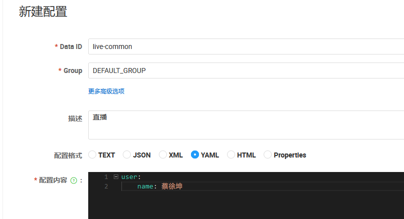  
* Data ID:可以按照项目来进行分组
  例如当前在淘宝-dev这个命名空间下,有一个配置分组是live-common,代表这是直播项目的配置,其中Group指定为gift(表示这是礼物微服务的配置)
  但实际上一般不会这么细致,一般Group都是使用默认
  可以通过live-common、live-database的这种方式来区分配置;前者是直播项目的通用配置,后者是直播项目数据库的配置
* Group:可以按照项目的服务来进行分组

3.历史版本  
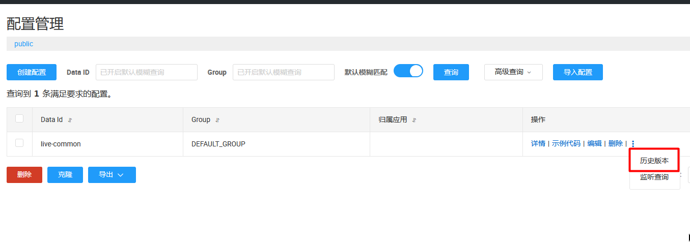  
发布成功之后就可以看到配置信息了,接着点击历史版本可以看到所有的历史修改记录  
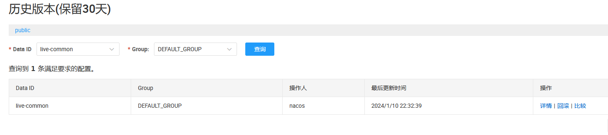  
<font color="#00FF00">另外这里的监听查询可以监听当前配置文件有没有正确的推送到服务上</font>  

4.克隆  
还可以针对配置文件进行克隆
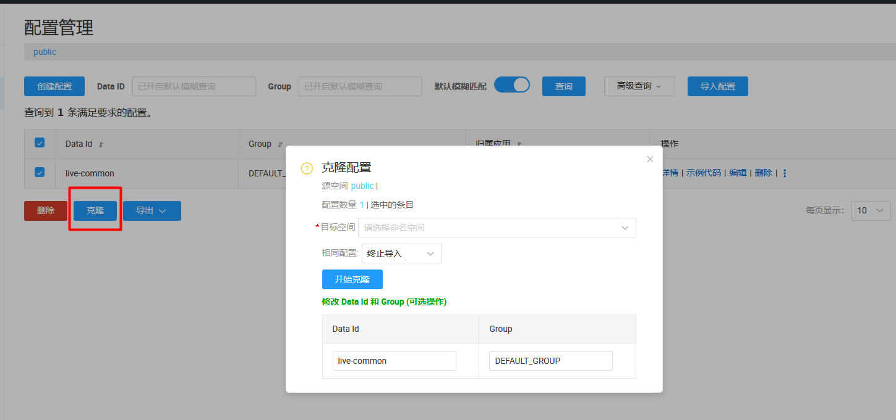  


## 5.服务降级
**目录:**  
5.1 服务降级基本环境搭建  
5.2 Sentinel上手体验  
5.3 Sentinel控制台  


### 5.1 服务降级基本环境搭建
1.分布式系统可用性问题  
在分布式系统中,如果系统遇到激增流量、被其它服务拖垮、异常未处理等情况时很有可能会导致服务可用性降低;说白了就是<font color="#FF00FF">缺乏高可用防护/容错机制尤其是针对流量的保护</font>  
所以在分布式系统中如果不进行容错机制的处理,很有可能造成<font color="#00FF00">服务雪崩</font>(见1.1 微服务基本概念介绍=>4.SOA)

2.常见服务不可用的原因  
* 激增流量导致系统CPU飚高,无法正常处理请求
* 激增流量打垮冷系统(数据库连接未创建,缓存未预热)
* 消息投递速度过快,导致消息处理积压
* 慢SQL查询卡爆连接池
* 第三方服务不响应,卡满连接池
* 业务调用持续出现异常

3.服务雪崩样例图  
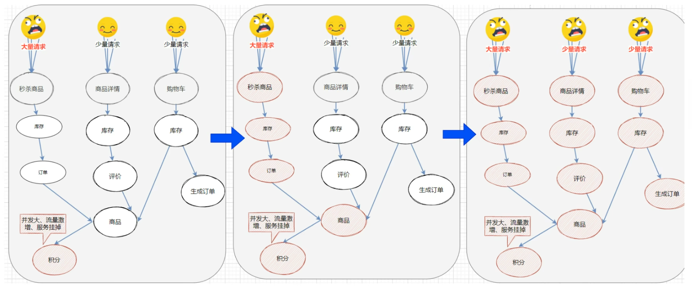  
假设图中积分服务能承受的压力较小,当大量请求来到秒杀商品这条调用链时,最终会将积分服务打垮,从而导致大量的请求积压在商品服务;最终导致整个秒杀商品不可用  
然而由于<font color="#00FF00">商品服务是别的服务的共享服务</font>最终会导致服务雪崩  
<font color="#FF00FF">服务雪崩:因服务提供者不可用导致服务调用者的不可用,并将不可用逐渐放大的过程就叫服务雪崩效应</font>  

4.常见的容错机制  
* 超时机制:原本服务提供者不可用会导致消费者请求强制等待,从而造成系统资源耗尽;加入超时机制,一旦超时就释放资源;这种方式一定程度上可以抑制资源耗尽的问题
  <font color="#00FF00">可以在OpenFeign的配置文件使用connectTimeout、readTimeout属性设置超时时间</font>
* 服务限流:一般会提前对服务进行压力测试,之后线上就会使用该压测数据对服务进行限流
* 线程池隔离:该效果类似限流,用户的请求将不再直接访问服务,而是通过线程池中的空闲线程来访问服务,<font color="#00FF00">如果线程池已满则会进行降级处理</font>,用户的请求不会被阻塞,可以立即看到一个结果(如友好的提示信息)
* <font color="#FF00FF">服务熔断</font>:熔断这个概念起源于股市或者电力系统中的保险丝,说白了就是防止流量(电量)太大从而烧毁整个系统
  但在分布式系统中如果调用一个服务屡次出现响应失败的情况,<font color="#00FF00">可以直接熔断该服务后续就不调用该服务</font>,它对比超时机制而言是不会再去调用服务的
  熔断一般会给目标服务设置阈值,例如十分钟供目标服务进行修复,如果修复成功就恢复使用不成功就继续熔断,<font color="#00FF00">在熔断期间必须要进行服务降级(服务熔断必服务降级)</font>
  服务降级说白了就是一个兜底的方法,当服务被熔断后服务将不再被调用,此时服务消费者需要准备一个本地的回调,<font color="#00FF00">快速返回一个缺省值</font>.例如使用<font color="#00FF00">备用接口、缓存、mock数据</font>等.不过这种使用方式也要看场景
  根据服务的性质还可以把服务分为强依赖和弱依赖
  * 弱依赖:例如这里的积分服务就是弱依赖,在秒杀商品这个功能里;就算积分服务挂掉了,它也不影响整个库存、订单、商品的调用链;实际上可以对该服务做降级处理,记录当前下单商品的id这条日志;后续采用调度通过该日志信息做<font color="#FF00FF">补偿</font>
  * 强依赖:例如这里的订单库存服务宕机后显然整个秒杀服务都不可用了

  <font color="#00FF00">所以降级一般会在弱依赖中进行实现</font>

5.Sentinel组件  
Sentinel组件是阿里巴巴开源的面向分布式微服务架构的高可用防护组件,是一个被广泛验证的组件  
Sentinel以流量为切入点,提供了<font color="#00FF00">限流、流量整形、熔断降级、系统负载保护、热点防护</font>等多个维度的防护手段  
Sentinel的高级版本-><font color="#FF00FF">AHAS(收费)</font>
<font color="#00FF00">可以对Sentinel组件进行扩展(高级部分)</font>
Sentinel由核心库与DashBoard组成,核心库是不依赖于DashBoard的;

### 5.2 Sentinel上手体验
**目录:**  
5.2.1 Java代码方式使用Sentinel  
5.2.2 @SentinelResource注解  
5.2.3 代码设置熔断规则  

#### 5.2.1 Java代码方式使用Sentinel
1.新建sentinel-demo模块  

2.修改pom文件
*提示:这里没有整合SpringcloudAlibab,只使用Sentinel核心库是可以不与springcloud整合的,因为Sentinel本质是基于接口进行限流的*
```xml
<?xml version="1.0" encoding="UTF-8"?>
<project xmlns="http://maven.apache.org/POM/4.0.0"
         xmlns:xsi="http://www.w3.org/2001/XMLSchema-instance"
         xsi:schemaLocation="http://maven.apache.org/POM/4.0.0 http://maven.apache.org/xsd/maven-4.0.0.xsd">
    <modelVersion>4.0.0</modelVersion>
    <parent>
        <groupId>org.springframework.boot</groupId>
        <artifactId>spring-boot-starter-parent</artifactId>
        <version>2.3.11.RELEASE</version>
        <relativePath/>
    </parent>

    <groupId>com.github.cnsukidayo</groupId>
    <artifactId>sentinel-demo</artifactId>

    <properties>
        <maven.compiler.source>9</maven.compiler.source>
        <maven.compiler.target>9</maven.compiler.target>
        <project.build.sourceEncoding>UTF-8</project.build.sourceEncoding>
    </properties>

    <dependencies>
        <dependency>
            <groupId>org.springframework.boot</groupId>
            <artifactId>spring-boot-starter-web</artifactId>
        </dependency>

        <!--sentinel核心库-->
        <dependency>
            <groupId>com.alibaba.csp</groupId>
            <artifactId>sentinel-core</artifactId>
            <version>1.8.0</version>
        </dependency>

        <dependency>
            <groupId>org.projectlombok</groupId>
            <artifactId>lombok</artifactId>
            <version>1.18.18</version>
        </dependency>

        <dependency>
            <groupId>com.alibaba.csp</groupId>
            <artifactId>sentinel-annotation-aspectj</artifactId>
            <version>1.8.0</version>
        </dependency>

    </dependencies>

</project>
```

3.写yml  
```yml
server:
  port: 8080
```

4.主启动类  
```java
@SpringBootApplication
public class Application {

    public static void main(String[] args) {
        SpringApplication.run(Application.class, args);
    }
}
```

5.controller  
```java
@RestController
@RequestMapping("/sentinel")
@Slf4j
public class HelloController {

    public static final String RESOURCE_NAME = "hello";
    public static final String USER_RESOURCE_NAME = "user";
    public static final String DEGRADE_RESOURCE_NAME = "degrade";

    @RequestMapping(value = "hello")
    public String hello() {
        Entry entry = null;
        try {
            // 定义资源名称,通常与接口请求地址一致
            entry = SphU.entry(RESOURCE_NAME);
            String str = "hello world";
            log.info("============" + str + "===========");
            return str;
        } catch (BlockException e) {
            log.info("block");
            return "被流控了!";
        } catch (Exception exception) {
            // 若需要配置降级规则,需要使用这种方式记录业务异常
            Tracer.traceEntry(exception, entry);
        } finally {
            if (entry != null) {
                entry.exit();
            }
        }

        return null;
    }

    // 初始化方法
    @PostConstruct
    private static void initFlowRules() {
        // 流控规则集合
        List<FlowRule> rules = new ArrayList<>();

        // 一个FlowRule就是一个流控规则
        FlowRule rule = new FlowRule();
        /*
        为哪个资源进行流控的规则限制
        这里就和上面controller中的方法对应起来了
        表明当前rule是针对上述RESOURCE_NAME的规则进行限制的,谁用了这个资源就会被该规则流控
         */
        rule0.setResource(RESOURCE_NAME);
        // 设置流控规则为QPS(实际上还有很多规则可以参考官方文档)
        rule.setGrade(RuleConstant.FLOW_GRADE_QPS);
        // 设置受保护的阈值,每秒只有一次
        rule.setCount(1);
        rules.add(rule);
        // 加载配置好的规则
        FlowRuleManager.loadRules(rules);
    }
}
```

6.启动测试  
一旦访问量超过1/s则会被流控

#### 5.2.2 @SentinelResource注解
**痛点:**  
5.2.1的写法代码侵入性太强,每一个controller都需要这么编写;解决方法是使用@SentinelResource注解  

1.创建配置文件添加SentinelResourceAspect  
```java
@Configuration
public class SentinelConfig {

    @Bean
    public SentinelResourceAspect sentinelResourceAspect(){
        return new SentinelResourceAspect();
    }
}
```

2.编写controller  
```java
@RestController
@RequestMapping("/sentinel")
@Slf4j
public class HelloController {


    public static final String RESOURCE_NAME = "hello";
    public static final String USER_RESOURCE_NAME = "user";
    public static final String DEGRADE_RESOURCE_NAME = "degrade";

    @RequestMapping(value = "hello")
    public String hello() {
        Entry entry = null;
        try {
            // 定义资源名称,通常与接口请求地址一致
            entry = SphU.entry(RESOURCE_NAME);
            String str = "hello world";
            log.info("============" + str + "===========");
            return str;
        } catch (BlockException e) {
            log.info("block");
            return "被流控了!";
        } catch (Exception exception) {
            // 若需要配置降级规则,需要使用这种方式记录业务异常
            Tracer.traceEntry(exception, entry);
        } finally {
            if (entry != null) {
                entry.exit();
            }
        }

        return null;
    }

    /*
    // 初始化方法
    @PostConstruct
    private static void initFlowRules() {
        // 流控规则集合
        List<FlowRule> rules = new ArrayList<>();

        // 一个FlowRule就是一个流控规则
        FlowRule rule = new FlowRule();
        为哪个资源进行流控的规则限制
        这里就和上面controller中的方法对应起来了
        表明当前rule是针对上述RESOURCE_NAME的规则进行限制的,谁用了这个资源就会被该规则流控
        rule.setRefResource(RESOURCE_NAME);
        // 设置流控规则为QPS(实际上还有很多规则可以参考官方文档)
        rule.setGrade(RuleConstant.FLOW_GRADE_THREAD);
        // 设置受保护的阈值,每秒只有一次
        rule.setCount(0);
        rules.add(rule);
        // 加载配置好的规则
        FlowRuleManager.loadRules(rules);
    }
    */

    @RequestMapping("user")
    @SentinelResource(value = USER_RESOURCE_NAME, blockHandler = "blockHandlerForGetUser")
    public User getUser(String id) {
        return new User("蔡徐坤");
    }

    /**
     * 流控方法必须为public
     * 方法返回值必须与被流控方法(原方法)保持一致
     * 参数必须与原方法保持一致(并且顺序也一直)
     * 可以在流控方法最后添加一个BlockException(可以通过该异常获取当前是类似类型的流控)
     * @param id 拿到被流控方法的入参
     * @param e  拿到异常
     */
    public User blockHandlerForGetUser(String id, BlockException e) {
        e.printStackTrace();
        return new User("流控");
    }
}
```

`@SentinelResource`  
* value:设置资源
* blockHandler:流控降级后的处理方法(不需要在耦合在接口中);默认该方法必须与被流控方法声明在一个类中
* blockHandlerClass:默认流控方式是和被流控方法在一个类中,如果想流控方法单独在一个类中,通过设置改属性提供流控方法所在的类;并且<font color="#00FF00">如果声明在别的类中则流控方法必须为静态方法</font>
* fallback:当接口中出现了异常就可以交给fallback指定的方法进行处理;注意和blockHandler区分,blockHandler是接口被流控后指定的处理方法;fallback的方法约定与blockHandler一致
  如果同时指定了fallback和blockHandler,<font color="#00FF00">则blockHandler方法的优先级是要高于fallback方法的</font>
* fallbackClass:同blockHandlerClass
* exceptionsToIgnore:排除哪些异常不使用fallback处理

*个人感觉异常处理的方法没必要,这可能会扰乱事务的处理*

#### 5.2.3 代码设置熔断规则
1.controller  
```java
@RestController
@RequestMapping("/sentinel")
@Slf4j
public class HelloController {
    public static final String DEGRADE_RESOURCE_NAME = "degrade";
    
    @RequestMapping("degrade")
    @SentinelResource(value = DEGRADE_RESOURCE_NAME, entryType = EntryType.IN, blockHandler = "blockHandlerForFb")
    public User degrade(String id) {
        throw new RuntimeException("异常");
    }

    public User blockHandlerForFb(String id, BlockException e) {
        return new User("熔断");
    }

    @PostConstruct
    public void initDegradeRule() {
        List<DegradeRule> degradeRules = new ArrayList<>();
        DegradeRule degradeRule = new DegradeRule();
        degradeRule.setResource(DEGRADE_RESOURCE_NAME);
        // 设置规则策略:异常数
        degradeRule.setGrade(RuleConstant.DEGRADE_GRADE_EXCEPTION_COUNT);
        // 阈值
        degradeRule.setCount(2);
        // 触发熔断最小请求数
        degradeRule.setMinRequestAmount(2);
        // 统计时长,一分钟执行了两次出现了两次异常则触发熔断
        degradeRule.setStatIntervalMs(60 * 1000);

        /*
        熔断降级独有的,设置熔断持续时长,一旦熔断之后在这个时间窗口内的所有请求都熔断
        时间窗口结束之后会恢复方法的请求,但如果在恢复之后第一次调用方法就出现异常则会直接熔断
         */
        degradeRule.setTimeWindow(10);


        degradeRules.add(degradeRule);
        DegradeRuleManager.loadRules(degradeRules);
    }
}
```

2.启动测试  
演示效果是,第一次请求异常、第二次请求异常;第三次请求返回Json熔断  

**<font color="#FF00FF">流控设置在服务提供者,降级设置在服务消费者</font>**

### 5.3 Sentinel控制台
**目录:**  
5.3.1 Sentinel基本环境搭建  
5.3.2 SpringCloudAlibaba整合Sentinel  
5.3.3 流控规则  
5.3.4 流控模式  

#### 5.3.1 Sentinel基本环境搭建
1.选择版本  
按照alibaba提供的版本说明进行下载[https://github.com/alibaba/spring-cloud-alibaba/wiki/%E7%89%88%E6%9C%AC%E8%AF%B4%E6%98%8E](https://github.com/alibaba/spring-cloud-alibaba/wiki/%E7%89%88%E6%9C%AC%E8%AF%B4%E6%98%8E)  

2.下载sentinel  
SentinelDocker地址:[https://hub.docker.com/r/bladex/sentinel-dashboard/tags?page=1&ordering=last_updated](https://hub.docker.com/r/bladex/sentinel-dashboard/tags?page=1&ordering=last_updated)  

拉取镜像:
```shell
docker pull bladex/sentinel-dashboard:1.8.0
```

运行容器:  
```shell
docker run -p 8858:8858 --name sentinelDashboard \
-d bladex/sentinel-dashboard:1.8.0
```

3.访问sentinelDashBoard  
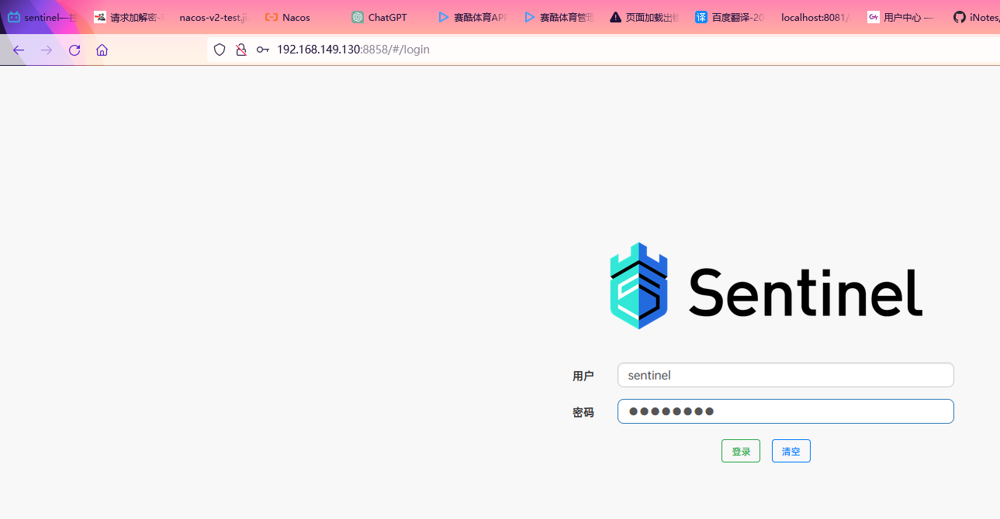  
账号密码都输入sentinel即可登陆  

4.详情配置  
sentinel的详情配置见:[https://github.com/alibaba/Sentinel/wiki/%E6%8E%A7%E5%88%B6%E5%8F%B0](https://github.com/alibaba/Sentinel/wiki/%E6%8E%A7%E5%88%B6%E5%8F%B0)  
docker的配置方式暂时还没有找到  

5.修改pom文件  
还是在sentinel-demo模块下,修改pom文件引入sentinelDashBoard依赖  
```xml
<!-- 整合控制台 -->
<dependency>
    <groupId>com.alibaba.csp</groupId>
    <artifactId>sentinel-transport-simple-http</artifactId>
    <version>1.8.0</version>
</dependency>
```

*注意:现在这个模块还没有整合SpringCloudAlibaba,后续整合Alibaba的时候这些pom都不需要这么麻烦*  

6.配置启动参数  
现在还需要配置服务启动时连接sentinel的地址,配置方式是使用Java运行时参数  
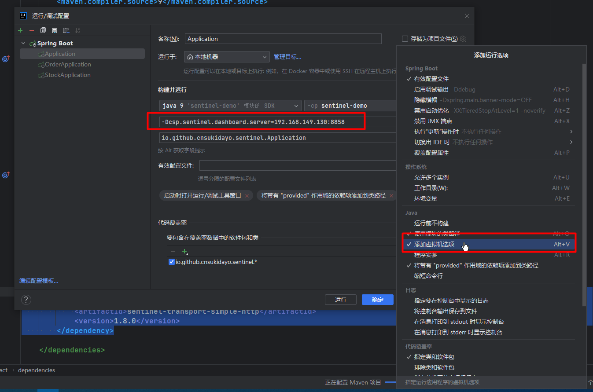  
`-Dcsp.sentinel.dashboard.server=192.168.149.130:8858`  
修改为对应的IP+端口即可  

7.启动测试  
启动微服务并且随便访问一个接口,一段时间之后刷新sentinel就可以看到相关服务了  
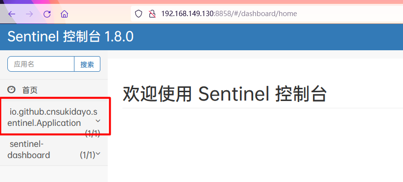  

#### 5.3.2 SpringCloudAlibaba整合Sentinel
1.创建sentinel-alibaba模块  

2.修改pom文件  
```xml
<?xml version="1.0" encoding="UTF-8"?>
<project xmlns="http://maven.apache.org/POM/4.0.0"
         xmlns:xsi="http://www.w3.org/2001/XMLSchema-instance"
         xsi:schemaLocation="http://maven.apache.org/POM/4.0.0 http://maven.apache.org/xsd/maven-4.0.0.xsd">
    <modelVersion>4.0.0</modelVersion>
    <parent>
        <groupId>io.github.cnsukidayo</groupId>
        <artifactId>springcloud</artifactId>
        <version>1.0-SNAPSHOT</version>
    </parent>

    <groupId>com.github.cnsukidayo</groupId>
    <artifactId>sentinel-alibaba</artifactId>

    <properties>
        <maven.compiler.source>9</maven.compiler.source>
        <maven.compiler.target>9</maven.compiler.target>
        <project.build.sourceEncoding>UTF-8</project.build.sourceEncoding>
    </properties>

    <dependencies>
        <dependency>
            <groupId>org.springframework.boot</groupId>
            <artifactId>spring-boot-starter-web</artifactId>
        </dependency>
        <!--sentinel启动器-->
        <dependency>
            <groupId>com.alibaba.cloud</groupId>
            <artifactId>spring-cloud-starter-alibaba-sentinel</artifactId>
        </dependency>
    </dependencies>

</project>
```

3.修改yml配置文件  
```yml
server:
  port: 8060
spring:
  application:
    name: sentinel-alibaba
  cloud:
    sentinel:
      transport:
        # 配置dashboard地址
        dashboard: 192.168.149.130:8858
```

4.启动测试  
*同理还是需要先访问一下服务的接口,否则不会在sentinel中进行显示*  
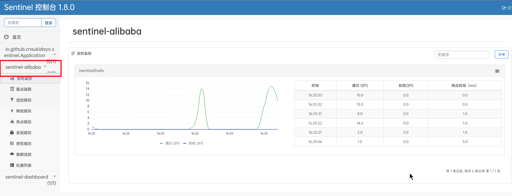  

#### 5.3.3 流控规则
提示:所有的规则都是服务于降级的,不能本末倒置  

1.实时监控  
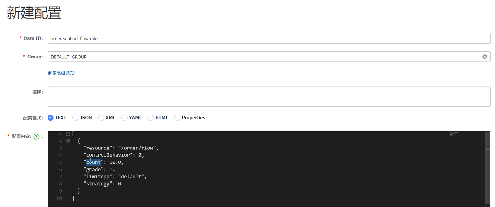  
<font color="#00FF00">用于实时监控所有服务调用情况的</font>  

2.簇点链路  
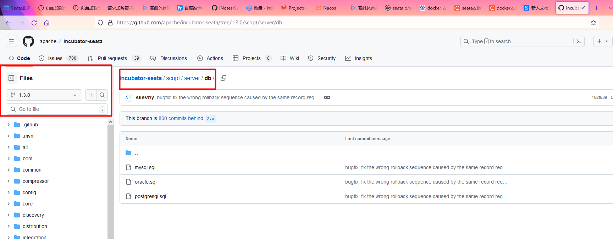  
<font color="#00FF00">用于显示所有可以进行流控、降级规则设置的资源</font>  

3.流控规则使用场景  
* 应多洪峰流量:秒杀、大促、下单、订单回流
* 消息型场景:削峰填谷、冷热启动
* 付费系统:根据流量付费

4.流控规则  
4.1 <font color="#00FF00">QPS</font>:设置QPS限制  
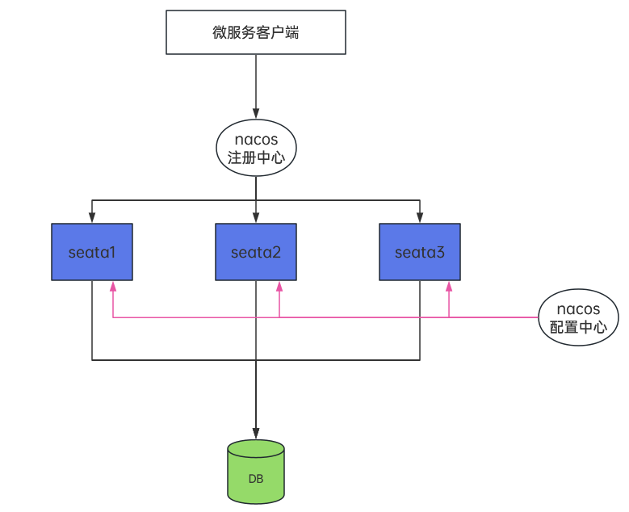  
这里新增了一个规则限制每秒的请求数量为2,当超过阈值后sentinel会返回默认的降级内容`Blocked by Sentinel (flow limiting)`  
如果需要自定义返回降级内容,可以通过之前的5.2.2 @SentinelResource注解节的内容来自定义  

4.2 <font color="#00FF00">线程数</font>:设置服务提供者线程数,也就是服务端当前创建了多少个线程来处理请求,一旦线程数量超过阈值则会降级  
这种流控方式用于保护业务线程池不被<font color="#00FF00">慢调用</font>耗尽,慢调用就是调用目标服务时间太长,从而导致大量的请求积压在服务调用方,<font color="#00FF00">导致服务调用方线程数飙升</font>,设置线程数流控规则可以避免  
这里直接测试不好显示效果,改造一下controller;并且把流控规则设置为线程数2  
然后用两个浏览器进行测试即可  
```java
@GetMapping("hello")
public String hello() {
    try {
        TimeUnit.MILLISECONDS.sleep(500);
    } catch (InterruptedException e) {
        throw new RuntimeException(e);
    }
    return "Hello";
}
```

5.统一降级信息返回结果  
*提示:之前如果想自定义降级的返回信息可以使用@SentinelResource注解,但是每一个controller都需要写一个对应的降级方法显得麻烦,实际上可以用一个统一的降级处理;<font color="#00FF00">两种方式实现降级处理的区别就是粒度</font>*  

5.1 创建BlockExceptionHandler实现类  
*统一异常处理(降级处理)是通过实现BlockExceptionHandler接口来完成的*  
在exception包下创建MyBlockExceptionHandler类  
```java
@Component
public class MyBlockExceptionHandler implements BlockExceptionHandler {
    private final Logger logger = LoggerFactory.getLogger(MyBlockExceptionHandler.class);

    @Override
    public void handle(HttpServletRequest request, HttpServletResponse response, BlockException e) throws Exception {
        // getRule() 获取规则的详情信息
        logger.info("BlockException ===============>" + e.getRule());
        Result r = null;
        if (e instanceof FlowException) {
            r = Result.error(101, "接口限流了");
        } else if (e instanceof DegradeException) {
            r = Result.error(102, "服务降级了");
        } else if (e instanceof ParamFlowException) {
            r = Result.error(103, "热点参数限流了");
        } else if (e instanceof SystemBlockException) {
            r = Result.error(104, "触发系统保护规则了");
        } else if (e instanceof AuthorityException) {
            r = Result.error(105, "授权规则不通过");
        }
        // 返回json数据
        response.setStatus(500);
        response.setCharacterEncoding("utf-8");
        response.setContentType(MediaType.APPLICATION_JSON_VALUE);
        new ObjectMapper().writeValue(response.getWriter(),r);
    }
}
```

5.2 在domian包下创建Result类  
```java
public class Result<T> {

    private Integer code;
    private String message;
    private T data;

    public Result(Integer code, String message) {
        this.code = code;
        this.message = message;
    }

    public Result(Integer code, String message, T data) {
        this.code = code;
        this.message = message;
        this.data = data;
    }

    public static Result error(Integer code, String message) {
        return new Result(code, message);
    }
    // 提供getter/setter方法
}
```

5.3 启动测试  
配置接口限流规则为QPS=1;快速刷新浏览器收到返回信息如下  
```json
{   
    "code":101,
    "message":"接口限流了",
    "data":null
}
```

#### 5.3.4 流控模式
**流控模式是流控规则的高级用法,点击流控规则的高级选项展开流控模式选项**  
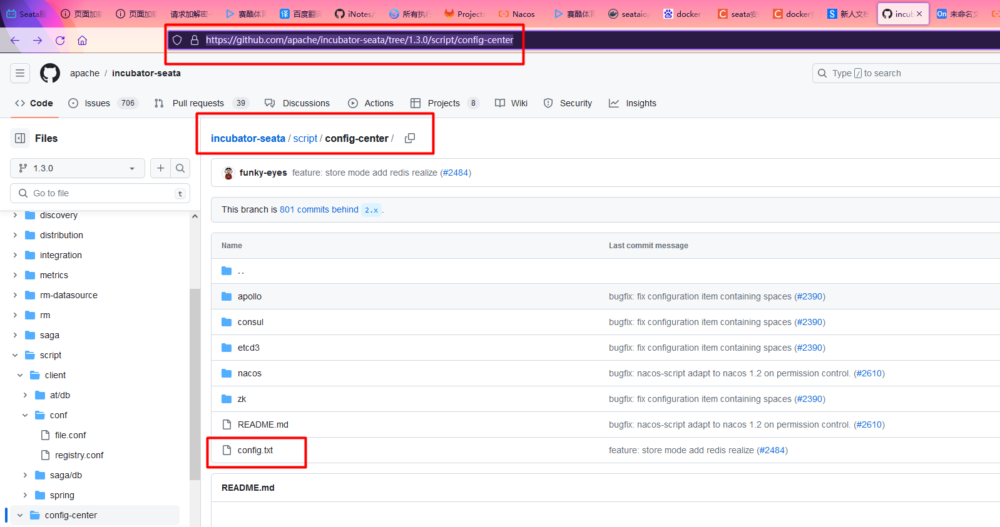  

1.直接  
默认选项,当资源名(资源名就是接口访问路径)超过阈值之后该接口就降级  

2.关联  
在关联界面中会让你输入<font color="#00FF00">关联资源</font>选项,关联资源也是一个**接口的路径**(当然可以直接从簇点链路里面查到所有的资源),它的意思是一旦关联资源的流量超过了限流规则的阈值之后,则会将当前资源降级(而不是关联资源)  

**使用场景:**  
假设现在有两个接口,一个是查询订单接口一个是下单接口;当下单接口流量较大时希望限制查询订单接口就可以使用关联  
注意在配置的时候,因为要对查询订单接口限流所以就在查询订单上配置限流规则,然后关联下单接口  
*提示:这里测试的话可以使用jmeter进行测试,持续请求下单接口然后访问查询接口看效果*  

3.链路  
在链路界面中需要设置<font color="#00FF00">入口资源</font>,它的意思是对当前资源进行流控判断,但受到影响的是入口资源  
假设现在有两个接口test1和test2接口它们都调用了getUser这个接口  
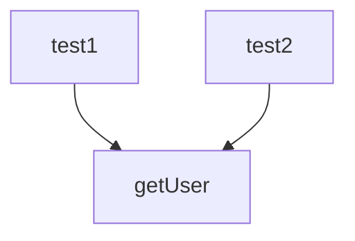
<font color="#00FF00">sentinel不仅可以对接口进行流控还可以对业务方法进行流控</font>  
此时如果对getUser接口进行流控则最终test1和test2都会受到影响,如果只希望test2受到影响而test1不受影响就可以使用链路  
同理在配置的时候,因为对getUser进行限流,所以就在getUser资源上配置限流规则;一旦getUser到达阈值后<font color="#00FF00">对链路test2进行限流</font>  
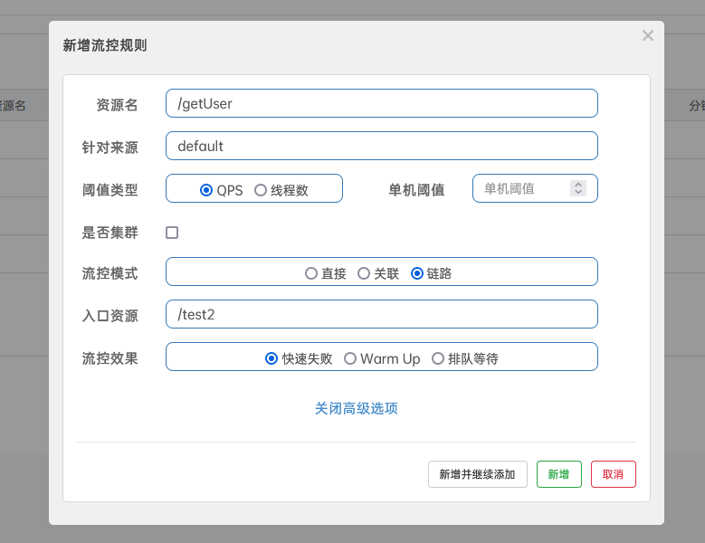  


# 附录:  
**目录:**  
1.微服务基本概念介绍  


## 1.微服务基本概念介绍
**目录:**  
1.1 微服务基本概念介绍  
1.2 实验环境介绍  
1.3 SpringBoot与Springcloud版本对应表  
1.4 组件说明  
1.5 基本环境搭建  

### 1.1 微服务基本概念介绍
一个微服务需要由哪些内容组成  
服务的注册与发现、服务调用、服务网关、服务配置中心、负载均衡、服务熔断、服务降级、服务消息队列、服务监控、全链路追踪  
*提示:这里的服务监控包含日志收集*  
SpringCloud是一套服务的总和  

**发展历史介绍:**  
1.ORM单体应用  

2.MVC垂直架构  
这种架构说白了就是拆分系统,例如将淘宝、天猫、支付宝都单独拆分为一个独立的单体应用  
*这种架构的问题是,系统与系统之间没有交互性,无法相互调用*  

3.RPC分布式服务  
这种架构就是将所有系统公共的部分抽离出一个单独的系统,供这些系统进行使用;例如淘宝、天猫这两个系统都有用户模块、订单模块、库存模块;于是乎就将这些模块拆分出来  
*在这个阶段很多分布式场景下的问题开始出现,比如分布式缓存、分布式session、分布式锁;并且在这种架构中使用远程调用一般是通过HTTP、Dubbo的方式去进行请求,还算不上真正的远程调用,因为真正的远程调用还要考虑负载均衡、节点的健康状况等因素,在这种架构下的实现是比较复杂的*  

4.SOA  
SOA架构就是为了解决在RPC分布式架构中调用关系复杂,难以维护的问题  
SOA使用治理中心ESB,ESB会管理所有的服务(模块),每个服务都需要将自已注册到治理中心ESB的总线(BUS)中,那么治理中心就会监控所有的服务,当某一个服务出现宕机的情况,那么治理中心就会将该服务排除  
并且ESB还可以进行协议转换,例如使用ESB就可以完成两个异构系统之间的服务调用  
*缺点:服务间会有依赖关系,一旦某个环节出错会影响较大(服务雪崩)*  
什么是服务雪崩,假设下单服务需要调用订单服务、库存服务、短信服务,此时短信服务崩溃那就有可能导致整个服务的不可用,从而使得服务雪崩;这种也称为<font color="#00FF00">扇出</font>  

5.微服务架构  

**一种可用的微服务架构**  
  
*提示:最外层的流量肯定还是走NGINX的,NGINX要通过负载均衡的算法把流量转到网关上,当然在这中间可以做分片*  

**名词解释:**  
* 水平扩容:增加节点的数量
* 垂直扩容:增加单台服务器的硬件

### 1.2 实验环境介绍  
经过慎重考虑,决定本次实验环境完全按照教程,使用OpenJdk9+SpringBoot2.0  

### 1.3 SpringBoot与Springcloud版本对应表  
  
也可以访问以下连接查看最新版本支持情况:[https://start.spring.io/actuator/info](https://start.spring.io/actuator/info)  
还可以访问SpringCloudAlibaba的说明:[https://github.com/alibaba/spring-cloud-alibaba/wiki/版本说明](https://github.com/alibaba/spring-cloud-alibaba/wiki/%E7%89%88%E6%9C%AC%E8%AF%B4%E6%98%8E)  


### 1.4 组件说明  
排名分先后顺序  
* 服务注册中心:`zookpeer`、`nacos`、consul、eureak
* 服务调用:`Dubbo`、`OpenFeign`、Feign
* 负载均衡:`Ribbon`、LoadBalancer
* 服务降级:`Sentinel`、Resilience4j、Hystrix
* 服务网关:`Kong`、`gateway`、Zuul
* 服务配置:`nacos`、Config
* 服务总线:`nacos`、Bus
* 链路追踪:`Zipkin`、`Skywalking`
* 分布式事务:`Seata`
* 服务网格:`Istio`

### 1.5 基本环境搭建
1.创建父工程  

2.修改pom文件  
```xml
<?xml version="1.0" encoding="UTF-8"?>
<project xmlns="http://maven.apache.org/POM/4.0.0"
         xmlns:xsi="http://www.w3.org/2001/XMLSchema-instance"
         xsi:schemaLocation="http://maven.apache.org/POM/4.0.0 http://maven.apache.org/xsd/maven-4.0.0.xsd">
    <modelVersion>4.0.0</modelVersion>

    <groupId>io.github.cnsukidayo</groupId>
    <artifactId>springcloud</artifactId>
    <version>1.0-SNAPSHOT</version>
    <!--修改为pom打包的时候不会打包为jar包,因为父工程只管理配置-->
    <packaging>pom</packaging>
    <modules>
        <module>service-order</module>
        <module>service-stock</module>
    </modules>

    <properties>
        <maven.compiler.source>9</maven.compiler.source>
        <maven.compiler.target>9</maven.compiler.target>
        <project.build.sourceEncoding>UTF-8</project.build.sourceEncoding>
        <spring.cloud.alibaba.version>2.2.5.RELEASE</spring.cloud.alibaba.version>
        <spring.boot.version>2.3.11.RELEASE</spring.boot.version>
        <spring.cloud.version>Hoxton.SR8</spring.cloud.version>
    </properties>

    <dependencies>
        <dependency>
            <groupId>org.springframework.boot</groupId>
            <artifactId>spring-boot-starter</artifactId>
        </dependency>


        <dependency>
            <groupId>org.springframework.boot</groupId>
            <artifactId>spring-boot-starter-test</artifactId>
            <scope>test</scope>
            <exclusions>
                <exclusion>
                    <groupId>org.junit.vintage</groupId>
                    <artifactId>junit-vintage-engine</artifactId>
                </exclusion>
            </exclusions>
        </dependency>
    </dependencies>

    <dependencyManagement>
        <!--type:pom 因为一个项目只能有一个parent,所以这里使用这种方式来变相让SpringCloudAlibaba来管理项目-->
        <dependencies>
            <dependency>
                <groupId>com.alibaba.cloud</groupId>
                <artifactId>spring-cloud-alibaba-dependencies</artifactId>
                <version>${spring.cloud.alibaba.version}</version>
                <type>pom</type>
                <scope>import</scope>
            </dependency>
            <!--SpringBoot的版本管理-->
            <dependency>
                <groupId>org.springframework.boot</groupId>
                <artifactId>spring-boot-starter-parent</artifactId>
                <version>${spring.boot.version}</version>
                <type>pom</type>
                <scope>import</scope>
            </dependency>
            <!--SpringCloud的版本管理-->
            <dependency>
                <groupId>org.springframework.cloud</groupId>
                <artifactId>spring-cloud-dependencies</artifactId>
                <version>${spring.cloud.version}</version>
                <type>pom</type>
                <scope>import</scope>
            </dependency>

        </dependencies>

    </dependencyManagement>

    <!--<build>-->
    <!--    <plugins>-->
    <!--        <plugin>-->
    <!--            <groupId>org.springframework.boot</groupId>-->
    <!--            <artifactId>spring-boot-maven-plugin</artifactId>-->
    <!--        </plugin>-->
    <!--    </plugins>-->
    <!--</build>-->


</project>
```

3.创建子模块  
分别创建两个子模块订单模块(service-order)和库存模块(service-stock)  
为这两个模块添加如下pom内容:  
```xml
<dependencies>
    <dependency>
        <groupId>org.springframework.boot</groupId>
        <artifactId>spring-boot-starter-web</artifactId>
    </dependency>
</dependencies>
```


