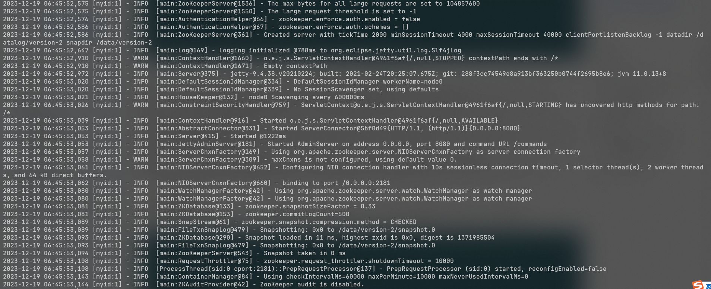

**目录:**  
1. dobbo基本介绍  

**附录:**  
A.1


## 1. dobbo基本环境搭建
**目录:**  
1.1 dubbo基本介绍  
1.2 部署dubbo  


### 1.1 dubbo基本介绍
1.背景  
dubbo是一个微服务框架,用于向用户提供`跨进程`的RPC`远程调用`;如下图所示,服务消费者可以通过注册中心(`zookeeper`)感知服务提供者,从而将请求发送给正确的服务提供者.  
  

### 1.2 部署dubbo
1.获取dubbo演示代码  
*提示:这里通过完成一个dubbo的远程调用来演示dubbo的效果*  
执行如下命令从获取项目代码:  
`git clone --depth=1 --branch master git@github.com:apache/dubbo-samples.git`  

2.项目结构  
下载后的项目结构如下:  
```console
.
├── codestyle        // 开发使用的 style 配置文件

├── 1-basic          // 基础的入门用例
├── 2-advanced       // 高级用法
├── 3-extensions     // 扩展使用示例
├── 4-governance     // 服务治理用例
├── 10-task          // Dubbo 学习系列示例

├── 99-integration   // 集成测试使用
├── test             // 集成测试使用
└── tools            // 三方组件快速启动工具
```
项目代码结构由三部分构成:代码风格文件、测试代码、集成测试  
* 代码风格:是开发dubbo代码时使用的,其中包括IDEA的配置文件
* 测试代码:教材的核心内容,其中包括五个部分  
  面向初学者的basic入门用例  
  面向开发人员的advanced高级用法  
  面向中间件维护者的extensions Dubbo周边扩展使用示例  
  面向生产的governance服务治理用例
  Dubbo学习系列
* 集成测试:是dubbo自身用于测试`测试代码`中所有sample示例是否正常的部分,保证dubbo每个版本的变更不会影响sample示例的使用  

3.启动zookpeer  
*提示:dubbo需要使用服务注册中心zookpeer,这里采用docker的方式启动*  
执行如下命令安装zookpeer  
```shell
docker run \
--name dubbo-zookeeper \
-p 2181:2181 \
-d zookeeper
```
启动成功之后查看docker日志:  
  

4.启动服务提供者  
在IDEA中点击右侧的Maven,执行`clean->compile`  
  

// todo 这里写的有问题,要进入dubbo的第一个项目再编译
