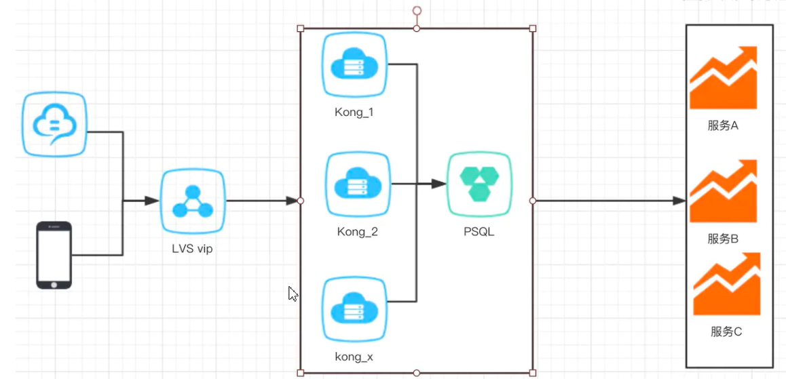
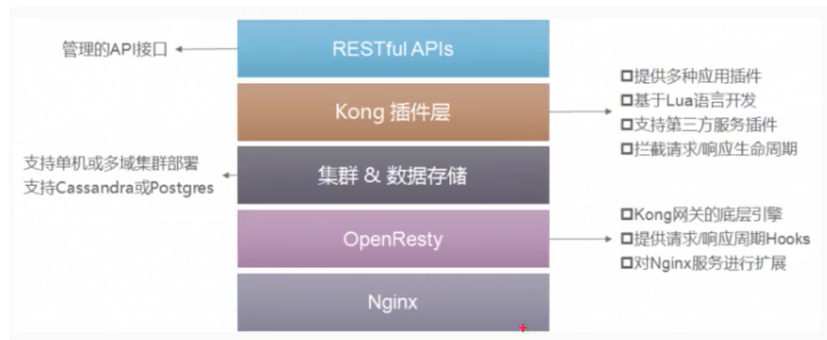

# 目录  
1.Kong环境搭建  


## 1. Kong环境搭建  
**目录:**  
1.1 Kong介绍  
1.2 Kong环境搭建(基于docker)  

### 1.1 Kong介绍  
1.Kong介绍  
Kong是一款基于OperResty(Nginx+Lua模块)编写的高可用、易扩展的,由Mashape公司开源的APl Gateway项目.Kong是基于NGINX和Apache Cassandra(`NOSQL`)或PostgreSQL(`关系型数据库`)构建的,能提供易于使用的`RESTful API`来操作和配置API管理系统,所以它可以水平扩展多个Kong服务器,通过前置的负载均衡配置把请求均匀地分发到各个server,来应对大批量的网络请求.  

kong调用示意图:  
  

使用网关的好处:  
  
这是kong官方的一张图,它的好处就是正常网关提供的好处,例如:统一的访问入口、统一的权限校验;把真正独立的业务下沉到各个具体的模块

**Kong主要有三个组件:**  
* Kong Server:基于nginx的服务器,用来接受API请求  
* Apache Cassandra/PostgreSQL:用来存储操作数据
* Kong dashboard:官方推荐UI管理工具;当然Kong本身支持restful风格管理kong(类似于ElasticSearch)

Kong采用插件机制进行功能定制,插件集(可以是O或N个)在APl请求响应循环的生命周期中被执行.插件使用Lua编写,目前已有几个基础功能:HTTP基本认证、密钥认证、CORS(跨域请求)、TCP、UDP、文件日志、API请求限流、请求转发以及Nginx监控.

2.Kong网关的特性  
* 可扩展性:通过简单地添加更多的服务器,可以轻松地进行横向扩展,这意味着您的平台可以在一个较低负载的情况下处理任何请求
* 模块化:可以通过添加新的插件进行扩展,这些插件可以通过RESTful Admin API轻松配置
* 在任何基础架构上运行:Kong网关可以在任何地方都能运行.您可以在云或内部网络环境中部署Kong,包括单个或多个数据中心设置,以及public,private或invite-only APls.

3.Kong架构  
  

* Kong核心基于OpenResty构建,实现了请求/响应的Lua处理化
* Kong插件拦截请求/响应
* Kong Restful管理API提供了API/API消费者/插件的管理
* 数据中心用于存储Kong集群节点信息、APl、消费者、插件等信息,目前提供了PostgresQL和Cassandra支持,如果需要高可用建议使用Cassandra
* Kong集群中的节点通过gossip协议自动发现其他节点,当通过一个Kong节点的管理APl进行一些变更时也会通知其他节点.每个Kong节点的配置信息是会缓存的,如插件,那么当在某一个Kong节点修改了插件配置时,需要通知其他节点配置的变更

### 1.2 Kong环境搭建(基于docker)
[官网安装教程](https://konghq.com/install)  
Kong支持docker、K8S等方式的安装,可以安装在Linux、Ubuntu、Amazon Linux等操作系统上.  

1.安装docker  

2.构建Kong的容器网络  
创建一个Docker自定义网络,以允许容器相互发现和通信;下面创建的`kong-net`就是创建的Docker网络名称  
`docker network create kong-net`  

3.搭建数据库环境  
Kong使用Cassandra(NOSQL)或者PostgreSQL(关系型),两者选一即可;推荐使用PostgreSQL(因为和MySQL非常相似).  
*注意:自定义网络为--network=kong-net*  

`Cassandra`安装如下:
```shell
docker run -d --name kong-database \
--network=kong-net \
-p 9024:9024 \
cassandra:3
```

`PostgreSQL`安装如下:  
如果需要将PostgreSQL的数据挂载到宿主机,直接使用-v命令是不好用的,推荐使用`docker volume create`命令来创建一个挂载  
于是乎PostgreSQL就可以通过`-v kong-volume:/var/lib/postgresql/data`进行挂载了  
*提示:镜像启动成功后可以直接使用Navicat进行连接*  

```shell
docker run -d --name kong \
--network=kong-net \
-p 5432:5432 \
-v kong-volume:/var/lib/postgresql/data \ 
-e "POSTGRES_USER=kong" \
-e "POSTGRES_DB=kong" \
-e "POSTGRES_PASSWORD=kong"
postgres:9.6
```

**解释:**  
* POSTGRES_USER:指定数据库用户为kong
* POSTGRES_PASSWORD:指定数据库用户kong的密码为kong
* POSTGRES_DB:指定数据库为kong
* -p:PostgreSQL默认端口为5432

4.初始化数据库  
*注意:这一步使用的是kong来初始化数据库,因为数据是存储于kong里的,PostgreSQL只是一个支撑数据库*

```shell
docker run --rm \
--network=kong-net \
-e "KONG_DATABASE=postgres" \
-e "KONG_PG_HOST=kong-database" \
-e "KONG_PG_PASSWORD=kong" \
-e "KONG_CASSANDRA_CONTACT_POINTS=kong-database" \
kong:latest kong migrations bootstrap
```

**解释:**  
* docker run --rm:使用这种方式运行docker(初始化数据库);该命令执行后会退出容器但保留内部的数据卷(volume)  


