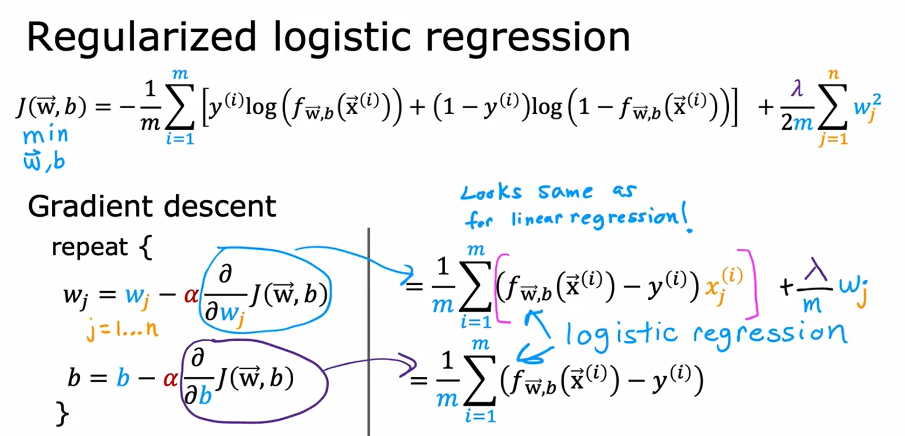
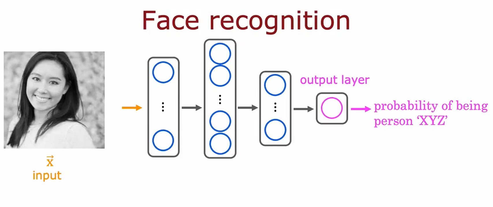

# 目录:  
1.监督学习  
2.多维特征  
3.逻辑回归  
4.神经网络(深度学习)  
5.模型评估  
3.无监督学习  

机器学习分为三类:  
监督学习、无监督学习、强化学习  

## 1.监督学习  
**目录:**  
1.1 监督学习的概念介绍  
1.2 如何训练模型  
1.3 成本函数初识  
1.4 可视化的成本函数  
1.5 梯度下降  
1.6 用于线性回归的梯度下降(综合)  

### 1.1 监督学习的概念介绍
1.监督学习的分类  
监督学习分为两类:回归、分类  
* 回归:就是input一个X就有与之对应的y,并且y的可能是无限多的  
  任何预测诸如200或1.5或-3.2之类的数字的监督学习模型都在解决所谓的回归问题  
  回归有很多模型,线性回归就是回归模型的一种(还有很多其它模型可以解决回归问题)
* 分类:input一个x会有与之对应的y,但是y的个数是有限的,y更类似于一种类别  
  比如图像识别;y可能的取值有cat、dog、mouse  
  解决分类问题的模型就是分类模型,它是监督学习中的另一种模型

2.基本名称介绍  
监督学习中需要使用训练集,在训练集中需要知道如下概念:input、output、m  
监督学习在学习时给定一个input 'x' (输入特征)时同时也会给出其对应的output 'y'(输出目标);训练集的数据量就称之为m(number of training examples)  
可以使用(x,y)来代表单个训练集(single training example)  
比如对于某单个训练集可以表示成:(x,y)=(2104,400)  
假设现在有m个训练集,为了表示其中某个具体的训练集可以在(x,y)的右上角指定一个角标i;例如:(xi,yi)来代表第i个训练集(0<i<m)  

泛化能力:假如一个从未出现的训练集能被模型很好地预测,则说该模型的泛化能力不错;反之该模型有较差的泛化能力  

### 1.2 如何训练模型  
1. 需要将训练集(包括输入特征和输出目标)提供给您的算法  
2. 接着你的监督学习算法会产生一些function,这些function的功能就是对新的输入x和输出进行估计和预测,我们将输出写为y-hat;即y上多一个^;在机器学习中y-hat是y的估计或预测  
3. 如何表示函数function?  
  假设函数可以写成fw,b(x)=wx+b  
  此时只要知道w和b的值,就可以根据输入特征x确定预测y-hat  
  所以这个fw,b(x)=wx+b函数意味着这个function是一个以x作为输入的函数,并且根据w和b的值,function将输出预测y-hat的某个值  
  之后就可以将该函数简写为f(x)它就等价于fw,b(x)
  *提示:f(x)实际上就是y-hat*  
  
  这里这条图像指代的模型实际上就是线性回归,这是具有一个变量的线性回归(只有一个输入x);这种单变量的线性回归也被称为单变量线性回归
4. 成本函数  
  * 作用:成本函数用于度量曲线的拟合情况,告诉模型它的运行情况如何
  * 概念介绍:  
    对于线性函数fw,b(x)=wx+b  
    其中w和b被称为模型的参数,在机器学习的过程中,模型参数可以在训练期间进行更改即调参  
    根据不同的参数(w和b),将会得到不同的函数f(x)  
      
  * 对某个模型进行分析:  
      
    假设图中的蓝色直线为现在的function(模型),对于训练集x(i)它对应的结果为y(i);而模型预测的结果为y-hat(i)  
    所以它可以写成下面这种形式:  
    y-hat(i)=fw,b(x(i))  
    fw,b(x(i))=wx(i)+b  
    可以看到当前模型的预测结果y-hat与真实的结果y是有差距的,所以训练模型的目标应当是找到w和b的值,使得对于大部分训练集(xi,yi)模型的预测结果y-hati能够更加接近yi  
  * 成本函数(cost function):  
    计算预测结果y-hat与真实结果y之间的距离,即(y-hat(i)-y(i))2接着需要测量整个训练集的误差,所以要将这些误差值连加即(m是训练集的数量):  
    $\sum_{i=1}^{m} (\hat{y}^{(i)} - y^{(i)})$  
    计算平均值:  
    $\frac{1}{m} \sum_{i=1}^{m} (\hat{y}^{(i)} - y^{(i)})$
    此时该公式已经可以使用了,但是按照惯例取平均值的时候不是1/m,而是1/2m;所以最终的公式是:$J(w, b) = \frac{1}{2m} \sum_{i=1}^{m} (\hat{y}^{(i)} - y^{(i)})$
    J(w,b)指代成本函数  
    不同的应用程序会定义不同的成本函数,但线性回归中上述的这种平方误差是最常用的函数.  
    由于y-hat(i)=fw,b(x(i)),所以上述公式也可以写成:$J(w, b) = \frac{1}{2m} \sum_{i=1}^{m} (f_{w, b}(x^{(i)}) - y^{(i)})$  
    最终我们要找到使成本函数变小的w和b的值,它可以描述为:**minimizeJ(w,b)** 

### 1.3 成本函数分析:  
首先先简化之前的模型;将线性函数线性函数fw,b(x)=wx+b简化为线性函数fw(x)=wx  
那么该模型对应的成本函数为:$J(w) = \frac{1}{2m} \sum_{i=1}^{m} (f_{w}(x{(i)}) - y^{(i)})$  
所以成本函数J(w)实际上是关于w的一个函数  
目标变为:minimizeJ(w)  
当w的取值为1时,成本函数的结果为:  
  
图中红叉是训练集,横轴x是input 纵轴y是对应的output
当w=1时fw(x)=wx实际上就等价于f(x)=x(该函数曲线正好是图中粉色的线)  
- - -
当w=0.5时,成本函数的结果为:
  
此时成本函数的值大约为0.58  
- - -
当w=0时(w是可以取负数的),成本函数的结果为:  
  
此时成本函数的值大约为2.3  
图中浅蓝色的直线为当w=-0.5时的函数图像  
通过计算一系列值,最终可以找到成本函数J的样子(也就是右侧棕色图像)

### 1.4 可视化的成本函数
1.3为了简单简化了成本函数,现在回到一开始的成本函数:fw,b(x)=wx+b  
它的图像如下面所示:  
  
此时成本函数J的值就是(w=-10,b=-15)时的高度值  

**可视化之等高线:**  
  
注意看最下面那张图的红色线,假设有一个水果刀按平面切一刀;**此时这一刀切下去的所有点的高度都是相等的**  
再看右上角的椭圆线,每一个椭圆上的点的代价都是相同的,所以这里蓝色、黄色、绿色三个×的成本函数的结果J都是一样的;**对应到左边三个线性模型(蓝色、黄色、绿色直线)它们的成本都是一样的**(即这三个模型的成本是一样的),即使它们的w和b不相同  
右上角椭圆的中心值就是成本函数最小的w和b的取值  
**通过梯度下降算法可以帮助我们来找到w和b的值**  

### 1.5 梯度下降
1.作用  
**通过梯度下降算法可以帮助我们来找到w和b的值**   

2.介绍  
梯度下降是一种可用于最小化任何函数的算法,而不仅仅是线性回归的成本函数,适用于两个以上参数的模型和其他成本函数  
最开始可以给定w和b一些初始值,在线性回归中初始值是多少并不重要,比较常见的选择是将它们都设置为0  
使用梯度下降算法,只需要每次都稍微改变参数w和b以尝试降低w和b参数对应的成本j,直到j稳定或接近最小值  

3.非凸形函数  
**但对于某些非凸形函数,可能存在不止一个最小值;同理凸形函数永远只有一个最小值不存在局部最小值**  
  

4.梯度下降的流程(非凸形函数)  
  
* 在梯度下降中你可以选定模型的初始参数,假设这里小人所在的位置对应的w和b是本次梯度下降的初始参数(**注意这里两个红圈分别对应两个不同的初始输入**)  
* 先看黑色的那条线,在最开始的时候站在高点环顾一周,找到一个能最快下山的下一步目标点,然后移动到目标点再环顾一周,找到下一个能最快下山的目标点,重复这个过程直到你进入山谷
* 可以看到选择不同的起始点(即不同的模型初始参数),最终很有可能得到不同的最低点(最小值);这里的黑色线和蓝色线就对应两个不同初始值的情况;我们称这种值为**局部最小值**,并且不能通过局部最小值得到全局最小值  

5.梯度下降的实现  
对于最开始给定的参数w和b,每次做如下操作:  
$$w=w-α\frac{\partial J(w,b)}{\partial w}$$
$$b=b-α\frac{\partial J(w,b)}{\partial b}$$

其中α被称为学习率,它的取值范围是0-1之间的一个小数;它的作用是控制下降(下坡)的幅度,如果α非常大就会采用非常激进的梯度下降过程,如果α非常小就会采用非常精细的梯度下降过程.  
*注意:这里是对成本函数J(w,b)求偏导而不是对模型求偏导(fw,b(x))*

6.理解梯度下降  
再次简化之前的模型,使得现在模型变为fw(x)=wx;与之对应的成本函数变为J(w)  
  
首先看上面的图,一开始参数w选择在右侧(**红色方框圈出的点**);根据第5节讲的公式对w进行梯度下降,因为α永远是大于0的,而此时对函数j(w)的w求导得到的结果就是该点的切线的斜率,结果也是大于0的.所以w会变小即往中间收敛  

接着看下面的图,一开始参数w选择在左侧(**红色方框圈出的点**);根据第5节讲的公式对w进行梯度下降,因为α永远是大于0的,而此时对函数j(w)的w求导得到的结果就是该点的切线的斜率,结果是小于0的.所以w会变大同样往中间收敛

7.关于学习率α  
**前言:** 学习率α的选择将对实现梯度下降的效率产生巨大的影响  

**α取值大小分析:**
* α取值很小的情况:  
  如果学习率很小,梯度下降能够正常生效,但是速度会非常慢
* α取值很大的情况:  
  由于α很大导致每次跨步很大,所以可能最终也不会达到最小值  
  另一种说法是,α过大可能无法收敛反而会发散(即随着不断的学习可能导致得到越来越差的模型)  

  

**局部最小值:**  
  
对于本图的成本函数J,它有两个局部最小值;当我们的参数w已经来到了图中黄色点处时(w=5);此时此时无论再执行多少次梯度下降,w始终都是等于5;因为黄色点对应的切线斜率为0(粉红色的线)则导数对应的值也是0,无论你的学习率为多少最终计算的表达式将变为w=w  
**结论:** 如果模型参数的成本已经达到局部最小值了,那么进一步计算梯度下降是完全没有用的.  
*提示:关于学习率的确定参见2.5如何设置学习率α*

### 1.6 用于线性回归的梯度下降(综合)
**1.概念回顾:**
* 线性回归模型:fw,b(x)=wx+b
* 成本函数:$J(w, b) = \frac{1}{2m} \sum_{i=1}^{m} (f_{w, b}(x^{(i)}) - y^{(i)})$
* 梯度下降:
  * $w=w-α\frac{\partial J(w,b)}{\partial w}$
    * 其中$\frac{\partial J(w,b)}{\partial w}$求导后的结果为$\frac{1}{m} \sum_{i=1}^{m} (f_{w, b}(x^{(i)}) - y^{(i)})(x^{(i)})$
    * $w=w-α\frac{1}{m} \sum_{i=1}^{m} (f_{w, b}(x^{(i)}) - y^{(i)})(x^{(i)})$
  * $b=b-α\frac{\partial J(w,b)}{\partial b}$
    * 其中$\frac{\partial J(w,b)}{\partial b}$求导后的结果为$\frac{1}{m} \sum_{i=1}^{m} (f_{w, b}(x^{(i)}) - y^{(i)})$
    * 

**2.偏导计算过程:**  
  

3.运行梯度下降  
* 初始点(蓝色)  
    
* 第一步(橙色)
    
* 最终结果  
    

## 2.多维特征
**目录:**  
2.1 多维特征  
2.2 多元线性回归的梯度下降  
2.3 特征缩放  
2.4 如何判断梯度下降是否收敛(是否真的起效)  
2.5 如何设置学习率α  
2.6 特征工程  
2.7 多项式回归  

### 2.1 多维特征
1.多维特征符号介绍  
  
在之前的训练集中,只有一个input即房屋的size它对应的output是房屋的价格  
现在进化到多维,有多个input(如size、房间数量、楼层、年龄)对应一个output房屋的价格  
* xj:指代某个特征;如x2指代房屋卧室数量这个特诊
* n:特征的个数;本例中n=4
* $\overrightarrow{\mathbf{x}}^{(i)}$:同理还是指代某个训练集;但由于现在是多维特征所以头上用了一个向量的标识  
  注意:训练集是不包含结果的,即$\overrightarrow{\mathbf{x}}^{(2)}$它就指代[1416,3,2,40]这个训练集;ouput是用y(i)来表示的
* $\overrightarrow{\mathbf{x}}_j^{(i)}$:指代第i个训练集中的第j个特征

2.多维特征模型  
那么这个多维特征的线性模型是什么样的呢?  
  
**模型解释:(不重要)**  
假设对于一个房屋,它没有面积没有房间没有楼层没有年龄,它的初始价格就为80  
之后房屋的面积每上升1平方米房屋的价格就增加0.1  
每有一间房间时价格就上涨4  
楼层每提高1层价格就上涨10  
年龄每增加1年价格就下降-2  

3.多维特征模型符号化  
我们可以把模型的参数w定义为一个向量$\overrightarrow{\mathbf{w}}$;同样把特征(input)也定义为一个向量$\overrightarrow{\mathbf{x}}$;数字b不变  
最终可以将模型表达式写成:  
$f_{(\overrightarrow{\mathbf{w}}, b)}(\overrightarrow{\mathbf{X}}) = \overrightarrow{\mathbf{W}} · \overrightarrow{\mathbf{X}} + b$

  
其中向量W·向量X的计算(点积),实际上就是两两相乘;可以看到下面的式子与上面的式子展开后的效果是一样的  
该模型被称为多元线性回归  

### 2.2 多元线性回归的梯度下降
1.多维模型中梯度下降的介绍  
假设我们已经分别计算出每个参数wj它对应的导数dj的值,那么每次梯度下降的更新方法如下:  
$w_{j}=w_j-αd_{j}$ (j=1..n)*提示:n是特征数量*  
  

2.梯度下降的实现  

图中红色方框就是梯度下降的实现  

3.求导的结果  
即对第2步中$J{(\overrightarrow{\mathbf{w}},b)}$进行求导  

4.多元回归的梯度下降  
  
**注意图中红色范围划出的公式**,即对第i个训练集第n个特征训练后的结果公式  

### 2.3 特征缩放
1.作用  
可以使梯度下降运行地更快  
*提示:本章重点讲解的对象是特征(input)*  

2.例子  
首先将模型简化为fw,b=w1x1 + w2x2 + b  
其中x1代表房屋的大小size,x2代表房间的数量;这两个特征的取值范围分别为300-2000和0-5  
某个训练集的内容为x1=2000,x2=5,price(output)=500k  
看两种不同情况的取值与结果:
* w1=50,w2=0.1,b=50; price=100050.5k
* w1=0.1,w2=50,b=50; price=500k

显然第二种取值要优于第一种取值  

3.结论  
如果一个特征的取值范围很 **大** ,那么该特征对应的模型参数w在最开始就尽可能地 **小**  
如果一个特征的取值范围很 **小** ,那么该特征对应的模型参数w在最开始就尽可能地 **大**  

4.第3步的原因  
  
左侧图是模型函数图像,右侧图是成本函数图像的等高线图  
可以发现对于input特征参数取值范围较大的情况下,对应的模型参数w只要略微的小幅度改动就会对最终的成本造成影响.  
同样对于input特征参数取值范围较小的情况下,对应的模型参数w需要较大幅度的改动才能对最终的成本造成影响.  

5.特征缩放  
  
* 上面一组,如果按照原样训练数据,因为等高线又高又瘦梯度下降可能会在它最终找到全局最小值之前来回弹跳很长时间.就像右上方的梯度下降轨迹那样.
* 下面一组,将x1和x2这两个特征进行等比例转换,**使得size特征和bedroom特征之间能对应上**,也就是让他俩1:1;那么最终通过梯度下降找到全局最小值可能就是很丝滑.  

6.特征缩放的方式  
在第5点中x1与x2的特征缩放是如何实现的?  
特征缩放有三种方式:最大值、均值归一化、Z分数归一化
* 最大值:将特征值除以特征值的最大值得到特征缩放后的值  
  例如:size的取值范围为300-2000,将300/2000后得到的结果为0.15;所以size的特征值缩放后的取值范围为**0.15<=x1<=1**  
  同理bedroom的特征值范围为0-5,将0/5后得到的结果为0;所以bedroom的特征值范围为**0<=x2<=1**  
    
* 均值归一化:在均值归一化中特征值可以为负数,一般情况下取值范围是[-1,1]  
  * 首先求得某项特征xj在训练集中的平均值μ1(j=1)  
  * 接着得到该特征对应的特征值计算公式:$x_1 = \frac{x_1 - μ1}{2000-300}$
  * 在本例中得到的特征值取值范围为-0.18<=x1<=0.82;-0.46<=x2<=0.54
  
* Z分数归一化  

7.特征缩放的时机  
**结论:**  
实际上并不是任何时候都需要特征缩放,假如原本某个特征的最大值与最小值的取值范围就比较接近,实际上是不需要进行特征缩放的,具体可以参开下面这张图的例子  
  
图中蓝色字体标注的特征值取值范围是不需要缩放的,红色字体标注的特征值缩放区间是需要缩放的.

### 2.4 如何判断梯度下降是否收敛(是否真的起效)
1.学习曲线  
  
这张图的横轴是迭代次数即梯度下降的次数,纵轴是该迭代次数对应的成本值  
图中粉色点是迭代100次后对应的成本值,图中紫色的点是迭代200次后对应的成本值  
如果梯度下降正常工作,那么成本J将在每次迭代后减少;如果J在某次迭代后增加,这意味着α值选择不当(学习率不当),通常意味着α太大或者代码中可能存在错误.  

2.自动收敛测试  
这种方式也可以判断梯度下降是否收敛(但推荐使用学习曲线来分析)  
它的思想是确定一个ε,ε是很小的一个变量,例如0.001;如果成本J在某次迭代中减少的幅度小于ε,那么此时学习的状态可能就位于学习曲线中红色的平坦部分,此时就可以断定为收敛.  
但ε的确定通常非常困难,所以这种方式并不推荐;还是推荐使用学习曲线  

### 2.5如何设置学习率α
*提示:学习率如果设置的太小会导致学习进度缓慢,如果设置的太大可能会导致最终成本不收敛*  
1.不正确的学习率导致不收敛  
  
假如学习率设置的非常大可能会得到右上角的那条学习曲线,每次迭代后发现成本都变高了.它的运作过程是左下角.  
可以使用较小的α作为debug变量,观察每次学习后成本是否降低,从而来判断是否是代码出现了问题.注意较小的学习率只能用于debug分析,在真正的机器学习中不会使用很小的学习率.  

2.如何找到正确的学习率α?  
  
一开始使用α=0.001作为学习率,然后观察学习曲线后,下一次选择将本次的学习率乘上3倍后进行学习,即0.003;接着再进行学习观察学习曲线的情况  
慢慢尝试选择最大可能的学习率,或者只是略小于发现的最大合理值即可  

### 2.6 特征工程
*提示:本章重概念*  
1.重组模型  
重新审视预测房屋的价格来了解特征工程
假设每个房屋有两个特征,x1是房屋所在地块大小的宽度(在实际生活中也称为地块的临街面),x2是地块大小的深度.  
由这两个特征可以构建对应的模型$f_{(\overrightarrow{\mathbf{w}}, b)}(\overrightarrow{\mathbf{X}}) = w_1x_1 + w_2x_2 + b$  
  

然而实际上土地面积就等于x1 * x2,即area = frontage * depth  
实际上土地面积比作为单独特征的临街面积和深度更能预测房屋价格  
于是乎可以将新特征x3定义为x1 * x2;该新特征x3就等于地块的面积  
有了这个功能,您就可以得到一个新的模型$f_{(\overrightarrow{\mathbf{w}}, b)}(\overrightarrow{\mathbf{X}}) = w_1x_1 + w_2x_2 + w_3x_3 + b$这样模型就可以选择参数w1、w2、w3具体取决于数据是否显示,临街面frontage还是深度depth或者是地块的面积area,x3是预测房屋价格的最重要因素.  
  

创建一个新特征是特征工程的一个例子,你可以利用个人对问题的知识或直觉来设计新特征,通常是通过转换或组合问题的原始特征来使学习算法更容易做出准确的预测.  
特征工程不仅可以用于拟合直线,还可以拟合曲线、非线性函数  
特征是可以自已构造的!!!  

### 2.7 多项式回归
1.介绍  
使用多元线性回归和特征工程的思想提出一种称为多项式回归的新算法,这种算法可以将曲线、非线性函数(模型)拟合到数据中(训练集).  

2.区别  
之前都是单元/多元一次项函数(模型)  
* fw,b(x)=wx+b:一元一次(项)  
* $f_{(\overrightarrow{\mathbf{w}}, b)}(\overrightarrow{\mathbf{X}}) = \overrightarrow{\mathbf{W}} · \overrightarrow{\mathbf{X}} + b$:多元一次(项)
* $f_{(\overrightarrow{\mathbf{w}}, b)}({X}) = w_1x + w_2x^2 + b$:多元多次(多项式)  

3.新的数据集  
  
假设现在房屋价格的计算训练集大致如上图所示,很显然很难通过一条直线来拟合本次训练集,一种想法是使用抛物线二次函数来拟合曲线,但该曲线的问题在于它最终会回归,即随着面积的变大导致房屋价格的下降.  

通过另外一个新的三次函数来拟合本次训练集(紫色曲线)  
  
例如本图中的紫色三次函数,随着房屋面积的上升最终价格会回归正常  
对于该三次函数模型而言有三个特征,第一个特征是房屋的面积,第二个特征是房屋面积的平方,第三个特征是房屋面积的立方.  
从这两个函数就已经能看出特征构造的威力,通过构造自已的特征来拟合数据  

*注意:在特征工程中需要额外注意特征缩放问题,如果房屋的面积是1-1000;则第一个特征的取值范围为1-1000;第二个特征的取值范围为1-1000000;第三个特征的取值范围为1-1000000000;如果使用梯度下降算法要注意特征缩放*  

还可以通过平方根来构建模型(蓝色曲线)  
  
所以特征工程很强大,通过它可以构造出很多模型;如何选择不同的特征以及如何选择包含或不包含这些特征的模型;并且可以来衡量这些不同模型的表现  

## 3.逻辑回归
**目录:**  
3.1 逻辑回归基本介绍  
3.2 逻辑回归算法  
3.3 决策边界  
3.4 逻辑回归中的成本函数  
3.5 实现梯度下降  
3.6 过拟合问题  
3.7 梯度下降与正则化  

### 3.1 逻辑回归基本介绍  
1.作用  
逻辑回归是用于解决分类问题的一种分类模型  
`逻辑回归并不是解决回归问题的,这个名字是历史原因`  

2.二元分类  
对于只有两种输出结果的分类问题就称为二元分类  
比如垃圾邮件识别的分类就是二元分类,对于不是垃圾邮件的电子邮件被称为`反例`;而是垃圾邮件的电子邮件被称为`正例`  

3.线性回归不能很好的使用在分类问题上  
  
此图形横轴是肿瘤的大小,纵轴是目标output即肿瘤是良性的还是恶性的(`0表示肿瘤不是恶性的,1表示肿瘤是恶性的`因为这个问题本质上是判断肿瘤是否为恶性的)  
如果使用线性回归来拟合训练集,最终会得到图中所示的蓝色直线;因为线性回归的预测结果不是只有0和1这两种情况,所以可以人为将预测结果小于0.5的认为是0(良性);将预测结果大于0.5的认为是1(恶性)  
那么图中蓝色圆圈对应的肿瘤大小就是良性的,红色叉对应的肿瘤大小就是恶性的  

假设现在新增了一个训练集在`右侧`  
  
新增训练集后的拟合曲线为绿色曲线,同样还是认为小于0.5的是0良性,大于0.5的是1恶性  
此时会发现问题,原本两个被认为是恶性的肿瘤在新增了一个训练集的情况下变成了良性;对于本例而言将新的训练集添加到右侧不应该改变我们之前对恶性肿瘤与良性肿瘤的任何分析结果

4.有了逻辑回归算法,最终输出的结果就只会是0或者1  

### 3.2 逻辑回归算法
1.逻辑回归拟合的曲线  
因为线性回归解决分类问题并不是很出色,逻辑回归最终会为这个数据集拟合一条类似`S形的曲线`  
  
假设肿瘤的大小为紫色点,最终得到的结果值为0.7;但这里的0.7并不是数值(稍后讲解0.7的含义)  

2.sigmoid函数  
sigmoid函数就很类似于第1步中的S形曲线  
  
**分析:**  
首先它的取值范围可以是负数与0;图中的横坐标是z  
则得出的函数表达式为$g(z) = \frac{1}{1 + e^{-z}}$其中e是自然常数,通常取值为2.7  
并且当z的取值非常大时g(z)的结果将无限接近于1;当z的取值非常小时g(z)的结果将无限接近于0  

3.构造逻辑回归模型  
* 将z定义为之前的线性回归的函数;即$Z = \overrightarrow{\mathbf{W}} · \overrightarrow{\mathbf{X}} + b$  
* 接着将z带入到sigmoid函数中得到:$g(\overrightarrow{\mathbf{W}} · \overrightarrow{\mathbf{X}} + b) = g(z) = \frac{1}{1 + e^{-}(\overrightarrow{\mathbf{W}} · \overrightarrow{\mathbf{X}} + b)}$  
* 模型为:$f_{(\overrightarrow{\mathbf{w}}, b)}(\overrightarrow{\mathbf{X}}) = \frac{1}{1 + e^{-}(\overrightarrow{\mathbf{W}} · \overrightarrow{\mathbf{X}} + b)}$
  * *提示:这种公式往往是指代模型,不一定说的是线性回归*  

4.结果  
对于第一步中那个紫色点所对应的肿瘤大小,最终计算出的结果是0.7;这代表模型认为有70%的可能性它会被归为恶性那一类;并且它有30%的概率被归为良性那一类(因为总概率是100%,现在是二元,所以就是100-70=30)  
同理如果计算的结果是0则代表模型认为有0%的可能性它会被归为恶性那一类  
*注意:这里只是举例子,因为第一步的函数曲线并不是逻辑回归模型*

### 3.3 决策边界
1.阈值问题  
逻辑回归最终算出的结果是特征等于1的概率,假设现在模型算出的结果是0.7;那它的结果应该是0还是1呢?  
1.1 一种做法是设置阈值  
  
例如本图中,计算结果超过0.5的则预测结果y-hat将认为是1;计算结果小于0.5的则预测结果y-hat则认为是0  

1.2 模型的预测方法
  
注意看图中的箭头  
* 如果模型$f_{(\overrightarrow{\mathbf{w}}, b)}(\overrightarrow{\mathbf{X}})$的计算结果大于等于0.5则y-hat的预测结果为1;否则为0  
* 而模型又等于g(z)即如果g(z)的计算结果大于0.5则y-hat的预测结果为1;否则为0  
* 而g(z)的函数图像为左上角的曲线,观察函数图像发现当z>=0的时候g(z)>=0.5  
* 而z>=0即$\overrightarrow{\mathbf{W}} · \overrightarrow{\mathbf{X}} + b$>=0
* 所以当$\overrightarrow{\mathbf{W}} · \overrightarrow{\mathbf{X}} + b$>=0时y-hat为1;当$\overrightarrow{\mathbf{W}} · \overrightarrow{\mathbf{X}} + b$<0时y-hat为0

*提示:z实际上就是之前线性回归模型(函数)表达式*

2.决策边界  
通过一个小例子来了解什么是决策边界  
  
对于这个例子有两个特征input(x1,x2)  
使用模型$f_{(\overrightarrow{\mathbf{w}}, b)}(\overrightarrow{\mathbf{X}})= g(w_1x_1+w_2x_2 +b)$对结果进行预测;在这个例子中假设w1=1 w2=1 b=-3  
根据1.2中得出的结论当$\overrightarrow{\mathbf{W}} · \overrightarrow{\mathbf{X}} + b$>=0时y-hat为1;当$\overrightarrow{\mathbf{W}} · \overrightarrow{\mathbf{X}} + b$<0时y-hat为0  
于是乎我们判断什么情况下当$\overrightarrow{\mathbf{W}} · \overrightarrow{\mathbf{X}} + b$=0;实际上这条函数对应的图像曲线就称为决策边界  
在决策边界上对y的结果取0还是取1几乎持中立态度  
所以对于上面写下的参数z=x1+x2-3=0对应的函数图像曲线就是决策边界(即图中的紫色直线)  
如果特征x位于这条线的右侧则逻辑回归将预测1,而在这条线的左侧,逻辑回归将预测为0  

2.1 非直线的决策边界  

模型:$f_{(\overrightarrow{\mathbf{w}}, b)}(\overrightarrow{\mathbf{X}})= g(w_1x_1^2+w_2x_2^2 +b)$这是一个多项式模型  
假设模型参数w1=1 w2=1 b=-1  
则$z=x_1^2 + x_2^2 - 1 $  
则决策边界函数图像为:$z=x_1^2 + x_2^2 - 1 = 0$  
它的图像是一个圆形  

2.2 高阶多项式决策边界  
  

### 3.4 逻辑回归中的代价函数
1.线性回归中的平方误差成本函数不适用于逻辑回归  
  
左侧是线性回归中的成本函数可以使用梯度下降,右侧是逻辑回归中使用相同成本函数的图像,很难使用梯度下降(因为它存在很多局部最小值)  

2.代价函数(损失函数)  
在逻辑回归中不再使用成本函数取而代之的是损失函数  
**区别:成本函数是针对整个训练集而言的,损失函数是针对单个训练集而言的**  
用L来表示损失函数  
  
**解释:**  
当y的真实值为1时,它的代价为上面那个式子(蓝色字体)  
当y的真实值为0时,它的代价为下面那个式子  

3.代价函数解释  
  
蓝色代价函数的成本函数图像如图所示(紫色的就是给你看看的)  
因为逻辑回归中函数(模型)的结果只能是0-1;所以这里f的范围是0-1;对应到log(f)这个复合函数上,它的定义域与值域就是图中粉色方框所选区域  

3.1 当y的真实值为1时  
假设现在所有训练集的肿瘤都是恶性的;即y(output)=1  
  
由于现在所有的肿瘤都是恶性的,如果模型预测的结果越接近1,在函数图像上的表现就是代价越接近0;  
反之如果模型预测的结果越接近0,在函数图像上的表现就是代价越接近无穷(因为现在所有肿瘤都是1你预测错了代价就高了)  

3.2 当y的真实值为0时  
假设现在所有训练集的肿瘤都是良性的;即y(output)=0  
  
*注意:现在说的函数图像已经变化了*  
由于现在所有的肿瘤都是良性的,如果模型预测的结果越接近0,在函数图像上的表现就是代价越接近0;
反之如果模型预测的结果越接近1,在函数图像上的表现就是代价越接近无穷(因为现在所有肿瘤都是0你预测错了代价就高了)

4.成本函数
  
**红色方框中的函数就是成本函数**  
它是损失函数的总和的平均值
通过这种损失函数的选择,整体成本函数将是凸的,因此可以放心地使用梯度下降来得到全局最小值  
**目标:找到参数w和b的值并将其最小化**

5.简化代价函数  
*提示:目前还是在解决二元分类问题*  

简化成本函数,将两行写成一样  
  
我们可以将之前得到的两行成本函数简化为下面这一行成本函数,它们起到的效果是一样的  

6.简化成本函数  
  
将第5步得到的代价函数代入到第4步得到的成本函数中去,它的效果如上图所示  
注意:现在的成本函数就是一个凸形函数了!

### 3.5 实现梯度下降
1.梯度下降的算法  
  

**误导:**  
这里可能有误导;貌似逻辑回归的成本函数求导后和线性回归的成本函数求导后的结果是一样的?  
但实际上是不一样的,因为这里模型的定义已经发生改变了;即:$f_{(\overrightarrow{\mathbf{w}}, b)}(\overrightarrow{\mathbf{X}}) = \frac{1}{1 + e^{-}(\overrightarrow{\mathbf{W}} · \overrightarrow{\mathbf{X}} + b)}$
  

2.特征缩放  
在2.3节特征缩放中讲过,特征缩放作用是可以使梯度下降运行地更快;同样在逻辑回归中也可以对特征进行缩放  

### 3.6 过拟合问题
1.线性回归拟合问题  
还是预测房价的例子  
  
* 第一张图是单特征,从图像可以看出它的拟合效果不是很好,即欠拟合,也叫高偏差  
* 第二张图是多维特征多项式,从图像可以看出它的拟合效果还不错
* 第三张图是多维特征多项式,从图像可以看出它貌似与训练集拟合的效果很好,但是它有点太适合于训练集了.比如在粉色圆圈标注的位置上,更大面积的房屋价格反而更低,即过拟合,也叫高方差

*提示:过拟合就是高方差、欠拟合就是高偏差*
**从另一角度来说,机器学习的目标就是找到一个既不欠拟合又不过拟合模型;即希望模型即没有高偏差又没有高方差**  

**结论:**  
从这个图中能得到的结论是,特征既不要太多也不要太少;要正好适中  

2.分类回归拟合问题  
还是预测肿瘤的例子,分类问题中同样有拟合问题  
  
* 第一张图的特征较少,从最终的图像可以看出它拟合的效果不是很好,即欠拟合
* 第二张图的特征适中,从最终图像可以看出它虽然误判了一些结果,但是还可以接受
* 第三张图的特征较多,从最终的图像可以看出它过于拟合数据了,这种模型很难泛化到新的数据集,即过拟合

3.解决过拟合问题  

3.1 可以加大训练集来解决这个问题  
如果你确定需要使用多元多次项函数,只要你有足够多的训练样本,就可以解决过拟合问题  

3.2 通过减少特征来实现  
还是房屋价格预测的例子,假设你有很多的特征但是部分特征却没有足够的数据来进行训练;  
那么可以选择只使用其中的部分最相关的特征进行训练;但是这样做可能会丢失部分信息;不过之后介绍的算法可以自动选择合适的特征子集来训练模型  
  

3.3 正则化
**介绍:**  
正则化不像3.2步讲的那样一下子舍去一个特征,而是使用较小的参数(w)从而降低对应特征的影响;
**作用:**  
正则化可以保留所有的特征,但正则化只是防止特征产生过大的影响  
  

4.正则化  
*提示:正则化的作用是减少过拟合问题*  
*提示:本节的例子都是以线性回归来介绍的,不是逻辑回归*

4.1 通过惩罚机制来计算参数w  
还是上图的那个例子,现在要想办法使得w3与w4尽可能地小;但不是直接最小化目标函数(模型)中的参数,而是利用成本函数来最小化参数(毕竟参数是通过成本函数调教出来的)  
修改成本函数使w3的平方乘上1000加上w4的平方乘上1000  
选择1000的原因在于它是一个很大的数,其它的大数也是可以的,这么做的目的在于:修改后的成本函数w3和w4都很大,所以在梯度下降的时候就会将这两个参数调地很小  
所以最小化成本函数最终会使w3、w4接近0  
  

4.2 如何确定降低哪些特征参数  
当训练集的参数很多时,可能一下子并不知道要降低哪些特征的影响;哪些特征是最重要的  
因此正则化的典型实现方式是惩罚所有的特征,这样可以使得模型不会那么容易拟合  
  
$J(\overrightarrow{w}, b) = \frac{1}{2m} \sum_{i=1}^{m} (f_{\overrightarrow{\mathbf{w}}, b}(\overrightarrow{x}^{(i)}) - y^{(i)})^2 + \frac{λ}{2m}\sum_{j=1}^{n}w_j^2$  
使用这个新的成本函数来确定特征对应的参数,其中λ(lambda)和α一样由自已来确定  
后面的是对所有参数wj的平方进行求和再乘上λ除以2m  
  
修改后的成本如上图所示,它由均方误差成本加上正则化项  
尝试最小化第一项会鼓励算法通过最小化预测值和实际值的平方差来很好地拟合训练数据,并尽量减少第二项,该算法还试图使参数wj保持较小,这将倾向于减少过度拟合.  
其中lambda值指定了相对重要性或相对权衡或您如何在这两个目标值之间取得平衡  

4.3 新成本函数的运行效果&lambda值的选择  

* 如果λ=0则代表正则项没有生效,结果就是最终的拟合曲线会过拟合(图中蓝色线)  
* 如果λ=10^10即一个很大的值,学习算法最终会将所有参数都设置地很接近0,因此最终模型的就等于b,结果就是最终的拟合曲线会是一条直线,欠拟合(图中粉色直线)
* 当λ值正好的时候,最终四元多项式将保留所有特征(图中紫色曲线)  

### 3.7 梯度下降与正则化
**目录:**  
3.7.1 用于线性回归的正则化方法
3.7.2 用于逻辑回归的正则化方法

#### 3.7.1.用于线性回归的正则化方法  
1.带有正则化的成本函数  
$J(\overrightarrow{w}, b) = \frac{1}{2m} \sum_{i=1}^{m} (f_{\overrightarrow{\mathbf{w}}, b}(\overrightarrow{x}^{(i)}) - y^{(i)})^2 + \frac{λ}{2m}\sum_{j=1}^{n}w_j^2$  

2.目标  
使用梯度下降找到使正则化成本函数最小化的参数w和b  

3.不会正则化b  
新增的正则化项只是对wj(模型参数w)进行正则化,而没有对b进行正则化;所以使用梯度下降的时候不会正则化b和以前一样  

4.梯度下降算法  
  
在线性回归中它仅仅只是多了一项对正则化的计算  
其中对参数b的梯度下降是不变的

#### 3.7.2.用于逻辑回归的正则化方法  
1.带正则化的逻辑回归成本函数  
  

2.作用  
使用这种带正则化的成本函数,即使逻辑回归模型是高阶多项式,最终仍然可以得到类似紫色框内的**决策边界**  
  

3.不会正则化b  
新增的正则化项只是对wj(模型参数w)进行正则化,而没有对b进行正则化;所以使用梯度下降的时候不会正则化b和以前一样  

4.梯度下降算法  
  
它看起来貌似和上面线性回归的梯度下降算法一样,实际上只是形式上相同;因为模型函数指代的是逻辑回归的函数(注意看蓝色箭头指向的fw,b函数)  

## 4.神经网络(深度学习)
**目录:**  
4.1 神经网络基本介绍  
4.2 神经网络的工作流程  
4.3 神经网络中的隐藏层  
4.4 sigmoid激活函数的替代方案  
4.5 如何选择激活函数  
4.6 多分类问题  
4.7 多标签分类问题  
4.8 高级优化方法  
4.9 其他类型的网络层(卷积)  

### 4.1 神经网络基本介绍  
1.神经网络的目标  
早期的目标是尝试构建模仿大脑的软件;现在的目标则不是;现在深度学习被用于语音识别、图像识别等  

2.神经网络发展迅猛的原因  
  
这张图的横轴是针对某一问题的数据量,纵轴是该算法的性能(效果)  
随着数据量的提升,传统的线性回归或者逻辑回归会有边际效应;即随着数据量的提示它很难在有很多扩展;而训练一个神经网络可以随着数据量的提升得到更好的性能  
伴随着大数据时代的到来,如果能够训练一个非常大的神经网络则可以在语音识别、图像识别、NLP自然语言处理方面得到良好的性能;这是传统机器学习算法做不到的  

### 4.2 神经网络的工作流程  
1.需求预测  
通过一个需求预测例子来观察神经网络的工作原理  

这是一个预测不同价格出售的衣服是否会成为热销商品的例子,图片中横轴是衣服的价格;纵轴是该价格对应的衣服是否是热销商品;通过逻辑回归来拟合数据;最终就是图片中的蓝色曲线;红色方框是模型(函数)  

2.构建神经网络  
使用a来表示逻辑回归算法的输出;这个a实际上就是activity;$a=f(x)=\frac{1}{1 + e^{-}(\overrightarrow{\mathbf{W}} · \overrightarrow{\mathbf{X}} + b)}$;a指的是一个神经元向它下游的其它神经元发送多少高输出  
实际上这个逻辑回归可以被认为是单个神经元的简化模型  
神经元需要输入价格x,然后使用上述的逻辑回归公式;最终得到结果a;a就是模型预测该价格的衣服是否能成为热销的概率;下图中`粉圈灰框`就是一个神经元  
神经元的工作就是输入一个或几个数字,然后输出一个或几个其它可能的数字  
  

3.更复杂的需求预测  
现在使用4个特征来预测衣服是否畅销,它们分别是:衣服的价格、运费、衣服的营销量、材料质量  
而一件衣服是否能成为畅销品实际上取决于几个因素:实惠性、知名度、感知质量(买家人为认定这件衣服的质量如何)  
实惠性由衣服的价格+运费决定  
知名度由衣服的营销量来决定  
感知质量由衣服的价格+材料质量决定

图中的三个蓝色神经元
* 第一个是实惠性;该神经元对应的逻辑回归通过输入衣服的价格+运费来预测该衣服的实惠性
* 第二个是知名度;它由营销量来决定  
* 第三个是感知质量;它由衣服的价格+材料质量决定

将这三个蓝色神经元连接到另一个神经元构建一个新的逻辑回归单元;最终通过输入三个蓝色神经元的值通过逻辑回归来预测衣服是畅销商品的概率  
在神经网络术语中将这三个神经网络组合在一起成为所谓的层(layer)  
一层就是一组神经元,神经元的数量可以是一个也可以是多个  
  

特别的右侧紫色圈所在的这一层也被称为输出层;因为这个最终层输出的是神经网络预测的输出概率  
在神经网络术语中,还将这三个蓝色神经元称为激活(activations);它实际上指在某一层神经网络计算中使用到的神经元;而且它们的输出也是下一层神经网的输入;被神经元计算过的值也称为激活值(activity values)  
在神经网络中最初的输入特征也称为输入层;也就是图中最左侧的四个输入  
  

在神经网络中的中间层可以访问上一层的每个输入特征  
  
比如这里三个蓝色神经元可以访问上一层的每个输入特征  

计算流程:从输入层输入有四个特征的特征向量,接着特征向量被送到中间的这一层,然后计算三个激活值,接着三个激活值成为一个向量被送入输出层,最终输出这件衣服成为畅销商品的概率  
但是你的数据集只告诉你什么是正确的输入,以及它对应的输出;但是你的数据集并没有告诉你这三个神经元(即实惠性、知名度、感知质量)的正确值;这些正确值是隐藏的  
所以中间这一层也称为隐藏层(hidden layer)  

与特征工程不同的是,在当时的例子是手动进行特征工程的,是人为查看特征x1和x2并手动决定如何将它们组合在一起;而神经网络是不需要手动设计特征,它可以自已学习出中间的这些神经元并自已决定这些神经元使用哪些特征作为输入  

隐藏层可以不止一个;所以神经网络中有多少个隐藏层以及每层有多少个神经元是需要自已构建的,这也称为神经网络架构;神经网络的架构设计将在后续进行介绍  

4.神经网络在计算机视觉中的应用  
*提示:上面的例子是神经网络在预测中的例子,现在来看看神经网络在图像感知中的应用*  

对于人脸识别的神经网络,假设对神经网络的输入是图像的像素向量  
  

计算流程就是,输入向量被送入第一层神经元提取一些特征后;再将结果输出到第二层神经元、第三层神经元最终到输出层输出这是某个人概率  
  

这三层神经元它们计算的内容分别如下:  
* 第一层神经元:会试图寻找低垂直线或类似垂直边缘的线(寻找图像中非常短的线或非常短的边缘)  
* 第二层神经元:试图学习将许多小的短线和小的短边段组合在一起,以寻找面部的各个部分
* 第三层神经元:神经元会聚合面部的不同部分,然后检测是否存在更大、更粗糙的面部形状;最后检测面部与不同面部形状的对应程度可以创建一组丰富的特征,从而帮助输出层尝试确定人物图片的身份

  
神经网络的一大特点就是它可以自已学习不同的隐藏层的这些特征检测器;在这个例子中没有人告诉他在第一层寻找短小的边缘线、在第二层寻找眼睛、鼻子等面部部位、在第三层寻找更完整的面部形状;神经网络能够自已从数据中找到这些特征  

### 4.3 神经网络中的隐藏层  
**目录:**  
4.3.1 简单神经网络  
4.3.2 更复杂的神经网络  
4.3.3 神经网络向前传播  

#### 4.3.1 简单神经网络
1.第一层神经网络  
*提示:这里还是以需求预测为例子*  
  
输入层输入4个数字,这四个数字是第一层神经网络中三个神经元的每一个输入;这三个神经元第各自对应一个逻辑回归模型(函数)  

对于第一个神经元使用w1 b1来表示该神经元逻辑回归模型的参数;该神经元输出的结果就是a1(激活值);w1 b1 a1表明它是第一个神经元;以此类推第二个神经元就是w2 b2 a2  
由第一层神经元计算出的激活值向量会作为输出层的输入  
使用上标来表明当前神经元是隶属于第几层的神经元,例如这里a11就代表第一层第一个神经元逻辑回归的计算结果  
注意:a1表示的是第一层神经网络的输出
  

2.第二层神经网络
  
第2层的输入是第一层的输出  
最终a1就表示输出层中第一个神经元逻辑回归计算出的结果为0.84;即该衣服成为畅销商品的概率  
a2表示的是第二层神经网网络的输出

3.预测结果  
  
  
参考之前的阈值设定,这里a2的结果实际上就是g(z);即逻辑回归的输出,所以当阈值设置为0.5时;最终的预测结果就是该衣服会成为畅销商品  

#### 4.3.2 更复杂的神经网络
  
在这张图中需要注意的是红色圈中给出的内容,实际上此时逻辑回归的input向量并不是x;而是上一层(第二层)神经网络的输出a2  

某层某神经元结果的公式:  
  
图中灰色方框即该公式  
a是激活值;所以g也被称为激活函数;目前我们只使用过一个激活函数即sigmoid  

#### 4.3.3 神经网络向前传播
**介绍:**  
向前传播算法用于使神经网络进行推测或预测  
*提示:这里使用识别手写数字的例子,为了简单只区分手写数字0和1*  

  
这里将使用8*8的手写图像作为输入,其中255表示白色像素,0表示黑色像素  
本例将使用2个隐藏层的神经网络,第一层有25个神经元,第二层有15个神经元;输出层输出数字是1的概率  
`计算顺序先去x然后计算a1,然后计算a2再计算a3,a3也是神经网络的输出;这种计算是从左到右进行的,所以这也称为向前传播`

`向前传播将于后面学习的反向传播形成对比`

此外这种类似的神经网络在最初层有更多的神经元,随着离输出层越来越近神经元的数量会减少  

### 4.4 sigmoid激活函数的替代方案
**补充:**
这里很多章的内容被省略了,因为它们是介绍如何用Python来训练一个模型的,主讲代码  
Tensorflow是一个Python库,可以让你只使用5行代码来构建一个神经网络,非常强大.  
除了Tensorflow库之外,还有一个比较流行的训练神经网络模型的库是Pytorch  

1.前情回顾  
*提示:sigmoid的替代方案也是逻辑回归模型(函数)的替代方案*  
a是激活值;所以g也被称为激活函数;目前我们只使用过一个激活函数即sigmoid  

2.畅销预测  
依旧是使用之前衣服畅销预测的例子;给定价格、运费、营销量、材料的情况下;通过三个神经元实惠性、知名度、高质量来预测这件衣服是否能够成为畅销商品  
因为当时使用的神经元都是sigmoid逻辑回归模型,所以它只能输出是否是实惠的、是否是知名的、是否是高质量的概率  
所以当时假设知名度是二元的,即卖家要么能直到这件衣服要么完全不知道这件衣服;但实际上买家对于衣服的知名度可能不是二元的,它有可能了解、有些了解、非常了解、完全传播开来  
所以与其将知名度建模为二进制数0或1,不如尝试直接估计知名度的概率,而不是将知名度建模为0和1之间的数字,并且知名度只要是任何非负数即可  
之前使用sigmoid激活函数来计算第二个神经单元的激活值(即了解程度);该激活函数的结果正好在0-1之间  
如果想让计算结果取得更大的正值,就可以使用不同的激活函数,比如`ReLu`  

  

3.Relu函数  
为了实现第2步的需求,一般在神经网络中会使用ReLu激活函数  
它的函数表达式为:$g(z) = max(0,z)$  
  
对于这个函数,那么计算出的激活值a将不能取0或任何非负数  
`Relu`是目前最常见的激活函数  

4.线性激活函数  
除了sigmoid、ReLu函数之外还有一种激活函数称为线性激活函数  
  
线性激活函数的意识是好像没有使用激活函数,因为它的结果就是函数z的结果  
这三种激活函数的公式都在图片中显示出来了  

5.softmax函数  
见4.6多分类问题  

### 4.5 如何选择激活函数
*提示:现在我们已经有了很多激活函数,那该如何选择使用哪种激活函数呢?*  
**注意:** 这里说的所有选择都是针对输出神经元的激活函数的选择  
对于所有的隐藏层(hidden layer)推荐使用ReLu作为默认的激活函数  

1.什么时候选择sigmoid函数  
如果处理的需求是预测结果为0或1这样的分类问题,即二元分类问题;则sigmoid激活函数几乎总是最自然的选择,因为这样神经网络就会预测y等于1的概率是多少(比如把该函数应用于畅销例子的输出层)  
**如果在处理二元分类问题,在输出层使用sigmoid函数**  

2.什么时候选择线性激活函数  
如果要解决线性回归问题,例如预测明天的股票与今天的股票价格相比该如何变化;那么结果是可以上升或下降;所以在这种情况下预测结果y将可以是一个正数或者负数的数字(可以把该函数应用于股票例子的输出层,这样最终输出结果就可以是正值或者负值),这种情况下建议使用**线性激活函数**  

3.什么时候选择Relu激活函数  
如果预测结果只能去非负值,例如预测房屋价格的例子,因为预测值永远不会为负;所以最自然的选择是使用ReLu激活函数  

  

**总结:**  
所以选择什么激活函数通常取决于要预测的y是什么  

4.为什么ReLu函数比sigmoid函数更常见了?  
* ReLu的计算速度比sigmoid函数要更快,因为sigmoid需要先取幂再取反;所以它的效率有点低,而ReLu仅仅是计算0与z的最大值即可  
* ReLu函数仅在图形的一部分变平,它在左边是完全平坦的,而sigmoid在两个地方都变得平坦;即图像的左侧和右侧;如果使用梯度下降来训练模型可能会导致函数在很多地方下降缓慢  

  

5.对于所有的隐藏层(hidden layer)推荐使用ReLu作为默认的激活函数  
  
看图中layer1和layer2使用的是relu函数而layer3使用的是sigmoid函数  

6.为什么需要激活函数  
假设对之前畅销衣服预测的例子中,所有的神经元都使用线性激活函数;结果就是神经网络会变得和线性回归没有什么不同;所以这会破坏神经网络的功能,使得神经网络无法适应比线性回归模型更复杂的数据  
  

神经元全部使用线性模型:  
  
假设有两个神经元它们的激活函数都是线性激活函数,则按照右侧的式子化简到最后会发现它实际上是一个线性回归模型,那与其使用两个神经元不如使用一个线性回归模型,并且该神经元也无法完成更复杂的数据拟合  

隐藏层使用线性回归,输出层使用逻辑回归:  
  
那么最终的效果就是神经网络只能完成逻辑回归模型完成的功能  

所以建议在隐藏层使用`ReLu`函数就可以了  

### 4.6 多分类问题
1.背景  
之前的分类一直都是二元分类,多分类就是指对于input可以有两个及以上的output输出标签  

2.多类分类问题的定义  
多分类问题仍然是一个分类问题,因为y只能取少量的离散类别而不是任何数字,但y现在可以取的不仅仅是两个值.  
比如如下有四种类型,现在模型就需要预测y=1、y=2、y=3、y=4的概率是多少  
通过softmax算法可以学习出一个决策边界(图中蓝色线)  
  

3.softmax回归算法  
softmax回归算法是对逻辑回归的推广  
在之前二元分类问题中,假设对于某特征它属于1类的概率为0.71;那么它属于2类的概率就为0.29.因为a1+a2的总和为1  
  

softmax回归算法:  
  
假设现在有四种类型;在右侧图的左侧公式z1、z2、z3、z4和之前一样是线性回归的样例;右侧a1、a2、a3、a4就是softmax算法,也是预测值的结果  
假设a1=0.3、a2=0.2、a3=0.15则最终a4=0.35;因为它们的和加起来为1  

4.softmax一般公式  
上述是以4种可能输出情况下的softmax回归公式,下面推导出一般公式  
* 假设y可以取n个值(即n种类别)
* 对于第j种类别他的线性回归样例为$z_j = \overrightarrow{\mathbf{w}_j} · \overrightarrow{\mathbf{x}} + b_j$ 其中j = 1..n

最终的一般公式如下:  
  

5.softmax成本函数  
同理还是先看损失函数,再次提醒损失函数是预测结果和真实结果之间的差值  
  

原本左侧逻辑回归的成本函数是进过简化的;还记得吗?它原本是两个函数,只不过被简化为了一个函数;所以按照原来损失函数的思路,可以得到softmax的损失函数;就是上图右侧大括号里面的公式;它还是根据你预测的概率来定段损失的(它只会计算真实值对应的那个log函数),假设y=1的情况下,模型预测的概率也非常接近1,那么它的损失就非常小;否则如果预测的概率非常接近0那么损失的就非常大  

6.softmax实战  
*提示:识别手写数字的例子,但现在不是预测0和1;而是预测0-9之间的所有数字*  

现在输出层的神经元变成了10个(也称为softmax-layer);在给定输入x的情况下,此神经网络向前传播方式的计算方式与之前完全相同  
对于输出层的激活值a3的计算,它的套路和之前类似,参考图片中的公式  
  

并且对于softmax回归而言,它的函数是关于z1...z10的;而逻辑回归中它的函数仅仅是关于它自身,例如g(z)  
  

### 4.7 多标签分类问题
1.什么是多标签分类问题?  
例如之前手写数字识别问题,对于一个input最终输出只有可能是0-9这10类中的一类(即其中的一个数字);虽然它的y已经能取两个值以上的结果了  

但多标签问题是,最终的输出是多个标签;如果每个标签可以有多个不同的类别取值就是多标签多分类  

2.道路识别问题  
  
对于道路图片的情况识别,input特征仍然是道路图片;但删除结果变为了道路上是否有汽车、公交车、行人;所以此时output变为了三个数字的向量  
对于手写数字分类而言,y只是一个数字,即使该数字可以承担10个不同的功能值  
**总结:**  
y能取多少种情况称为多分类;有多少个y称为多标签 

3.解决方案  
一种思路是将该问题视作三个完全独立的神经网络,即图中有没有汽车、有没有公交车、有没有行人  
  
显然上面的这种思路不太行,另外一种可行的思路是训练一个神经网络可以同时识别是否有汽车、公交车、行人  
在最终的输出层将会有三个输出神经元a3,它的输出是一个由三个数字组成的向量,又由于这是三个二元分类问题,所以可以对这三个神经元都采用逻辑回归函数;最终的输出激活值就对应是否有汽车、公交车、行人  

### 4.8 高级优化方法
1.作用  
比梯度下降能够更快地训练模型

2.梯度下降回顾  
在之前梯度下降中,如果α设置的太小会造成学习缓慢,能否有一种算法当发现学习率太小时自动调大alpha  
如果α设置的太大就会造成学习路线震荡,所以能否自动把α自动调小  
  

3.adam算法  
adam算法并没有使用单一的全局学习率α,它对模型的每个参数w都会使用不同的学习率  

  

adam算法的思想:  
* 如果参数wj或b似乎继续沿大致相同的方向移动,那就增加它的学习率
* 如果参数不断来回震荡,那就减少学习率

### 4.9 其他类型的网络层(卷积)
1.卷积层举例  
**区别:**  
在之前每一层第可以读取上一层的所有数据;卷积的特点是每个神经元只能读取上一层的部分内容  

  
图中左右两边是对应上的;  
* 采用这种方式可以加快计算速度  
* 减少训练数据而且也不太容易过拟合

2.多层卷积层(卷积神经网络)  
如果神经网络中有多个卷积层则称为卷积神经网络  
  
图中是对心电图的进行分析判断患者是否患有心脏疾病  
其中输入特征是特定时间点其对应的高度值  
在构建的神经网络中,看第一层的第一个神经单元并没有查看权利查看每一个input;仅仅是查看x1-x20;同样对于该层的第二个神经元只能查看x11-x30的input  
同理在构建的第二层神经元中,第一个神经元不会查看前一层的所有激活;而是只查看前一层的5个激活  
最终将输入输出到一个逻辑回归神经单元中,即最右侧第三层的神经元;通过它来对是否存在心脏病进行二元分类  

## 5.模型评估
**目录:**  
5.1 模型评估  
5.2 通过偏差、方差进行诊断  

### 5.1 模型评估  
1.如果训练模型发现它的预测出现了无法接受的错误,可以有如下解决方案  
* 获取更多的训练集
* 尝试更少的特征集
* 添加额外的特征(训练集添加/定义新的特征)
* 尝试添加新特征(通过特征工程)
* 增加lambda参数
* 降低lambda参数

2.问题  
但实际上这些方式可能有些有效,有些无效;  
所以通过一组诊断,来了解什么原因会对当前模型起效或不起效,从而获得更好的性能建议  
其中一些诊断会告诉你是否值得花费更多的时间来收集训练集数据,从而来帮助你节省时间

3.难以绘制的模型  
  
还是之前预测房价的例子,因为使用了高阶多项式来拟合数据集所以产生了过拟合的现象,即它不具有很强的泛化能力,假设现在由更多的特征来拟合模型,例如右侧指出的四条:房子大小、房间数量、楼层、年龄  

4.训练集和测试集  
假设有一个训练集它的10个数据,在训练模型的时候并不是直接全部使用这10个数据来获取参数w和b;可以将训练集分为两个子集;例如将70%的数据放入训练集,剩下30%的数据放入测试集;  
使用训练集训练模型,并使用测试集测试模型的性能  

  

使用xtrain下标来表示训练集,使用xtest来表示测试集  
右侧mtrain表示的是训练集的大小;mtest表示的是测试集的大小  

5.成本函数(线性回归)  
带上正则化的线性回归成本函数如下第一个公式:  
  

使用compute test error公式来评估模型的表现
使用compute training error(训练误差)公式来评估模型在训练集上的表现

6.如何使用成本函数评估  
  
在本图中可以看到模型曲线与训练集拟合的非常好,所以Jtrain(w,b)的结果会很低集训练集误差很低,但新增的测试集Jtest(w,b)的结果很高;所以尽管训练集在这上面表现的很出色,但模型并不擅长将新的示例泛化到不在训练集中的测试集上面  

7.成本函数(逻辑回归)  
  
* 第一个公式是逻辑回归带上正则化以及测试集的成本函数
* 第二个公式是测试集的成本函数
* 第三个公式是训练集的成本函数

8.总结  
获取一个数据集并将其分成一个训练集和一个单独的测试集,可以让你系统地评估模型的学习性能.通过计算Jtest和Jtrain可以衡量在测试集和训练集上的表现.

9.问题  
还是房价预测的问题,现在有了模型性能评估的算法,但模型是该使用直线、二阶多项式、三阶多项式、四阶多项式中的哪个来拟合曲线呢?  

10.模型选择方法之使用测试集  
  

比如在这张图中,可以穷举所有情况;比如使用直线、二阶多项式、三阶多项式时它们的测试成本函数分别都是多少,最后选测试成本函数最低的那个模型即可.  
但这种方法并不推荐,因为最终计算出的测试成本结果往往过于乐观(即低于实际的泛化误差)

11.1 模型选择  
现在将数据分为三个集合:训练集、交叉验证集、测试集  

  

* 将数据的60%纳入训练集,它的符号表示方法和之前一样;用train下标来表示训练集  
* 将数据的20%纳入交叉验证集(corss validation),它的符号表示方法是xcv来表示交叉验证集,mcv=2 表示交叉验证集的大小为2  
* 将数据的20%纳入测试集,它的符号表示方法和之前一样,用test下标表示测试集  

通过交叉验证集来检查或信任检查不同模型的有效性或准确性  

**注意:交叉验证集又叫验证集**  

11.2 成本函数  
  
使用这三个成本函数来判断模型在这三种训练集上的`成本是多少`  

11.3 模型选择  
同样还是穷举上述的模型,不过现在不是在测试集上评估模型,而是在交叉验证集上评估模型,即使用jcv来完成;最终选择交叉验证集成本最低的模型;最终该模型在新数据上表现的泛化误差值是jtest的结果(使用测试集来表现模型泛化误差)  

12.神经网络选择  
  

现在有三个神经网络,该如何选择其中的一个?同样还是使用训练集得到神经网络的w、b;接着使用交叉验证集来评估模型,选择成本(jcv)最低的模型,最终使用测试集的jtest结果作为神经网络泛化能力的估计值.  

**原话:**  
只有在你想出一个模型作为你的最终模型后,才可以在测试集上对其进行评估,并且因为你没有使用测试集做出任何决定,这可以确保你的测试集是公平的而不是过度地对新数据的泛化能力的估计.  
*所以之前没有交叉验证集时,测试集是可能对模型产生影响的,而现在只有当模型完完整整确定后才使用测试集,这样就保证测试集的公信力.*

### 5.2 通过偏差、方差进行诊断
1.线性回归的诊断  
之前在线性回归的时候有谈到过欠拟合、过拟合问题;当时是通过图像来判断模型与数据的拟合情况的,这种方式并不使用与多特征的情况;更正规的方式是使用训练集和交叉验证集的成本来判断模型是否有高偏差或高方差.  

  

* 计算图中第一条曲线的jtrain,该算法在训练集上的成本较高,因为结果值与模型的预测值之间有很大的误差.  
  计算该曲线的jcv,因为交叉验证集中的数据模型也没有训练过,所以模型在交叉验证集上的成本也会很高  
  如果模型的训练成本很高,就表明该模型是高偏差的
* 计算图中第三条曲线的jtrain,该算法在训练集的成本较低,非常拟合训练集数据  
  计算该曲线的jcv,因为模型已经过拟合了,所以模型在交叉验证集上的成本也会很高  
  如果交叉验证集成本远高于训练集成本,那模型就是方差
* 最后是第二条曲线,它的jtrain和jcv都非常低
  
2.d与训练集成本、交叉验证集成本之间的关系

  
图中横轴d代表模型的阶数(次项),蓝色曲线代表的是训练集的成本;随着多项式次数的增加,jtrain一般会随着下降(因为模型过拟合了)  
绿色曲线代表的是交叉成本函数的成本;当多项式的次数很小时jcv会很高(因为欠拟合了),当多项式的次数很大时jcv也会很高(因为过拟合了);所以它的曲线会先下降再上升  

**总结:**  
当训练集成本很高并且交叉验证集成本很高时是欠拟合,当训练集成本很低并且交叉验证成本很高时是过拟合  

*提示:在线性回归中可能不会存在方差和偏差都很高的情况,但在神经网络中可能出现偏差和方差都很高的情况*  

3.正则化之选择lambda  
之前已经讲解过一次正则化了,正则化就是用于解决过拟合的情况;其中lambda参数的的不同对模型最终的训练结果也有非常大的影响(下面的例子是一个四次项函数)  

* 如果lambda参数非常大,那么算法就会积极地使得特征的影响尽可能小,使得参数w非常小;所以最终这些参数都会接近于0;那么最终模型就大约为b一个常数值
* 假设lambda参数非常小,假如将lambda设置为0;那么最终的效果就是正则化没有起效,导致最后的曲线还是过拟合曲线
* 如果选择恰到好处的lambda值,那么最终它将非常好的拟合数据集(jtrain和jcv都很小)

通过交叉验证集可以帮助选择lambda参数:使用大范围的lambda可能值,使用这些不同的正则化参数拟合曲线,评估模型的交叉验证集成本,选择成本最低的lambda值(看第4步)  

4.训练误差和交叉验证误差随参数lambda的变化情况  

  

* 如果lambda很小甚至为0,那么jtrain会很小而jcv会很大(对应正则化不起效)
* 如果lambda很大,那么jtrain和jcv都会很大(对应正则化效果很大)

最终中间红色方框框出的两个点将是lambda值  

## 3.无监督学习

无监督学习分为三类:  
聚类、异常检测、降维

聚类:它很强的一点就是它是自主的,大部分情况下它可能会将数据聚类  
* 比如文章的聚类就是通过无监督学习完成的,例如十万篇文章;点击了一篇关于大熊猫的文章,在该文章的下面有推荐文章,这些推荐文章与当前文章之间就是一种组(聚类)关系,那么无监督学习就能分别出这些文章.  
* 再比如对人的基因进行聚类,无监督学习通过学习DNA信息,能够将不喜欢吃西蓝花的人的基因聚类到一起.所以在机器学习给出的某个组中,这组的人可能都有相同的特性.  
  这就是无监督学习,因为我们没有提前告诉算法,某种DNA的人会有哪些特性(而监督学习是会提前告知的)

异常检测:比如可以用于转账的检测看这笔交易是否合法  

降维:将一个大数据集神奇地压缩成一个小得多的数据集,同时丢失尽可能少的信息  

