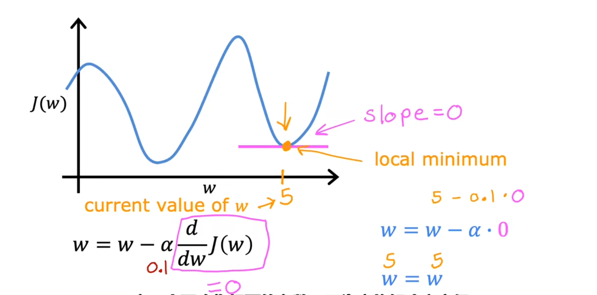
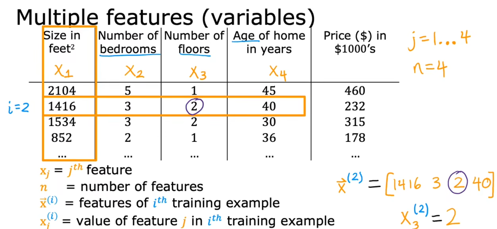
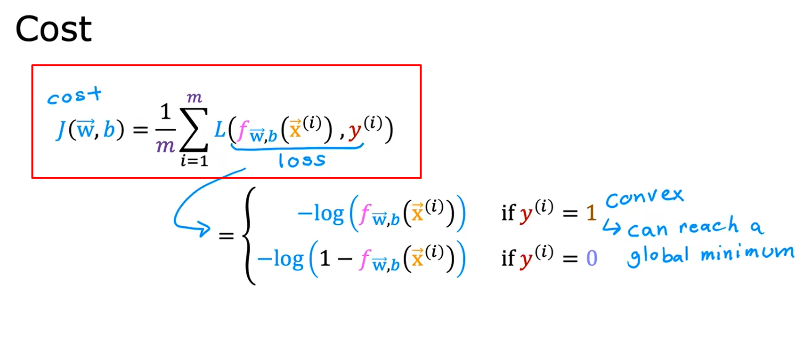

# 目录:  
1.监督学习  
2.多维特征  
3.逻辑回归  
3.无监督学习  

机器学习分为三类:  
监督学习、无监督学习、强化学习  

## 1.监督学习  
**目录:**  
1.1 监督学习的概念介绍  
1.2 如何训练模型  
1.3 成本函数初识  
1.4 可视化的成本函数  
1.5 梯度下降  
1.6 用于线性回归的梯度下降(综合)  

### 1.1 监督学习的概念介绍
1.监督学习的分类  
监督学习分为两类:回归、分类  
* 回归:就是input一个X就有与之对应的y,并且y的可能是无限多的  
  任何预测诸如200或1.5或-3.2之类的数字的监督学习模型都在解决所谓的回归问题  
  回归有很多模型,线性回归就是回归模型的一种(还有很多其它模型可以解决回归问题)
* 分类:input一个x会有与之对应的y,但是y的个数是有限的,y更类似于一种类别  
  比如图像识别;y可能的取值有cat、dog、mouse  
  解决分类问题的模型就是分类模型,它是监督学习中的另一种模型

2.基本名称介绍  
监督学习中需要使用训练集,在训练集中需要知道如下概念:input、output、m  
监督学习在学习时给定一个input 'x' (输入特征)时同时也会给出其对应的output 'y'(输出目标);训练集的数据量就称之为m(number of training examples)  
可以使用(x,y)来代表单个训练集(single training example)  
比如对于某单个训练集可以表示成:(x,y)=(2104,400)  
假设现在有m个训练集,为了表示其中某个具体的训练集可以在(x,y)的右上角指定一个角标i;例如:(xi,yi)来代表第i个训练集(0<i<m)  

### 1.2 如何训练模型  
1. 需要将训练集(包括输入特征和输出目标)提供给您的算法  
2. 接着你的监督学习算法会产生一些function,这些function的功能就是对新的输入x和输出进行估计和预测,我们将输出写为y-hat;即y上多一个^;在机器学习中y-hat是y的估计或预测  
3. 如何表示函数function?  
  假设函数可以写成fw,b(x)=wx+b  
  此时只要知道w和b的值,就可以根据输入特征x确定预测y-hat  
  所以这个fw,b(x)=wx+b函数意味着这个function是一个以x作为输入的函数,并且根据w和b的值,function将输出预测y-hat的某个值  
  之后就可以将该函数简写为f(x)它就等价于fw,b(x)
  *提示:f(x)实际上就是y-hat*  
  
  这里这条图像指代的模型实际上就是线性回归,这是具有一个变量的线性回归(只有一个输入x);这种单变量的线性回归也被称为单变量线性回归
4. 成本函数  
  * 作用:成本函数用于度量曲线的拟合情况,告诉模型它的运行情况如何
  * 概念介绍:  
    对于线性函数fw,b(x)=wx+b  
    其中w和b被称为模型的参数,在机器学习的过程中,模型参数可以在训练期间进行更改即调参  
    根据不同的参数(w和b),将会得到不同的函数f(x)  
      
  * 对某个模型进行分析:  
      
    假设图中的蓝色直线为现在的function(模型),对于训练集x(i)它对应的结果为y(i);而模型预测的结果为y-hat(i)  
    所以它可以写成下面这种形式:  
    y-hat(i)=fw,b(x(i))  
    fw,b(x(i))=wx(i)+b  
    可以看到当前模型的预测结果y-hat与真实的结果y是有差距的,所以训练模型的目标应当是找到w和b的值,使得对于大部分训练集(xi,yi)模型的预测结果y-hati能够更加接近yi  
  * 成本函数(cost function):  
    计算预测结果y-hat与真实结果y之间的距离,即(y-hat(i)-y(i))2接着需要测量整个训练集的误差,所以要将这些误差值连加即(m是训练集的数量):  
    $\sum_{i=1}^{m} (\hat{y}^{(i)} - y^{(i)})$  
    计算平均值:  
    $\frac{1}{m} \sum_{i=1}^{m} (\hat{y}^{(i)} - y^{(i)})$
    此时该公式已经可以使用了,但是按照惯例取平均值的时候不是1/m,而是1/2m;所以最终的公式是:$J(w, b) = \frac{1}{2m} \sum_{i=1}^{m} (\hat{y}^{(i)} - y^{(i)})$
    J(w,b)指代成本函数  
    不同的应用程序会定义不同的成本函数,但线性回归中上述的这种平方误差是最常用的函数.  
    由于y-hat(i)=fw,b(x(i)),所以上述公式也可以写成:$J(w, b) = \frac{1}{2m} \sum_{i=1}^{m} (f_{w, b}(x^{(i)}) - y^{(i)})$  
    最终我们要找到使成本函数变小的w和b的值,它可以描述为:**minimizeJ(w,b)** 

### 1.3 成本函数分析:  
首先先简化之前的模型;将线性函数线性函数fw,b(x)=wx+b简化为线性函数fw(x)=wx  
那么该模型对应的成本函数为:$J(w) = \frac{1}{2m} \sum_{i=1}^{m} (f_{w}(x{(i)}) - y^{(i)})$  
所以成本函数J(w)实际上是关于w的一个函数  
目标变为:minimizeJ(w)  
当w的取值为1时,成本函数的结果为:  
  
图中红叉是训练集,横轴x是input 纵轴y是对应的output
当w=1时fw(x)=wx实际上就等价于f(x)=x(该函数曲线正好是图中粉色的线)  
- - -
当w=0.5时,成本函数的结果为:
  
此时成本函数的值大约为0.58  
- - -
当w=0时(w是可以取负数的),成本函数的结果为:  
  
此时成本函数的值大约为2.3  
图中浅蓝色的直线为当w=-0.5时的函数图像  
通过计算一系列值,最终可以找到成本函数J的样子(也就是右侧棕色图像)

### 1.4 可视化的成本函数
1.3为了简单简化了成本函数,现在回到一开始的成本函数:fw,b(x)=wx+b  
它的图像如下面所示:  
  
此时成本函数J的值就是(w=-10,b=-15)时的高度值  

**可视化之等高线:**  
  
注意看最下面那张图的红色线,假设有一个水果刀按平面切一刀;**此时这一刀切下去的所有点的高度都是相等的**  
再看右上角的椭圆线,每一个椭圆上的点的代价都是相同的,所以这里蓝色、黄色、绿色三个×的成本函数的结果J都是一样的;**对应到左边三个线性模型(蓝色、黄色、绿色直线)它们的成本都是一样的**(即这三个模型的成本是一样的),即使它们的w和b不相同  
右上角椭圆的中心值就是成本函数最小的w和b的取值  
**通过梯度下降算法可以帮助我们来找到w和b的值**  

### 1.5 梯度下降
1.作用  
**通过梯度下降算法可以帮助我们来找到w和b的值**   

2.介绍  
梯度下降是一种可用于最小化任何函数的算法,而不仅仅是线性回归的成本函数,适用于两个以上参数的模型和其他成本函数  
最开始可以给定w和b一些初始值,在线性回归中初始值是多少并不重要,比较常见的选择是将它们都设置为0  
使用梯度下降算法,只需要每次都稍微改变参数w和b以尝试降低w和b参数对应的成本j,直到j稳定或接近最小值  

3.非凸形函数  
**但对于某些非凸形函数,可能存在不止一个最小值;同理凸形函数永远只有一个最小值不存在局部最小值**  
  

4.梯度下降的流程(非凸形函数)  
  
* 在梯度下降中你可以选定模型的初始参数,假设这里小人所在的位置对应的w和b是本次梯度下降的初始参数(**注意这里两个红圈分别对应两个不同的初始输入**)  
* 先看黑色的那条线,在最开始的时候站在高点环顾一周,找到一个能最快下山的下一步目标点,然后移动到目标点再环顾一周,找到下一个能最快下山的目标点,重复这个过程直到你进入山谷
* 可以看到选择不同的起始点(即不同的模型初始参数),最终很有可能得到不同的最低点(最小值);这里的黑色线和蓝色线就对应两个不同初始值的情况;我们称这种值为**局部最小值**,并且不能通过局部最小值得到全局最小值  

5.梯度下降的实现  
对于最开始给定的参数w和b,每次做如下操作:  
$$w=w-α\frac{\partial J(w,b)}{\partial w}$$
$$b=b-α\frac{\partial J(w,b)}{\partial b}$$

其中α被称为学习率,它的取值范围是0-1之间的一个小数;它的作用是控制下降(下坡)的幅度,如果α非常大就会采用非常激进的梯度下降过程,如果α非常小就会采用非常精细的梯度下降过程.  
*注意:这里是对成本函数J(w,b)求偏导而不是对模型求偏导(fw,b(x))*

6.理解梯度下降  
再次简化之前的模型,使得现在模型变为fw(x)=wx;与之对应的成本函数变为J(w)  
  
首先看上面的图,一开始参数w选择在右侧(**红色方框圈出的点**);根据第5节讲的公式对w进行梯度下降,因为α永远是大于0的,而此时对函数j(w)的w求导得到的结果就是该点的切线的斜率,结果也是大于0的.所以w会变小即往中间收敛  

接着看下面的图,一开始参数w选择在左侧(**红色方框圈出的点**);根据第5节讲的公式对w进行梯度下降,因为α永远是大于0的,而此时对函数j(w)的w求导得到的结果就是该点的切线的斜率,结果是小于0的.所以w会变大同样往中间收敛

7.关于学习率α  
**前言:** 学习率α的选择将对实现梯度下降的效率产生巨大的影响  

**α取值大小分析:**
* α取值很小的情况:  
  如果学习率很小,梯度下降能够正常生效,但是速度会非常慢
* α取值很大的情况:  
  由于α很大导致每次跨步很大,所以可能最终也不会达到最小值  
  另一种说法是,α过大可能无法收敛反而会发散(即随着不断的学习可能导致得到越来越差的模型)  

  

**局部最小值:**  
  
对于本图的成本函数J,它有两个局部最小值;当我们的参数w已经来到了图中黄色点处时(w=5);此时此时无论再执行多少次梯度下降,w始终都是等于5;因为黄色点对应的切线斜率为0(粉红色的线)则导数对应的值也是0,无论你的学习率为多少最终计算的表达式将变为w=w  
**结论:** 如果模型参数的成本已经达到局部最小值了,那么进一步计算梯度下降是完全没有用的.  
*提示:关于学习率的确定参见2.5如何设置学习率α*

### 1.6 用于线性回归的梯度下降(综合)
**1.概念回顾:**
* 线性回归模型:fw,b(x)=wx+b
* 成本函数:$J(w, b) = \frac{1}{2m} \sum_{i=1}^{m} (f_{w, b}(x^{(i)}) - y^{(i)})$
* 梯度下降:
  * $w=w-α\frac{\partial J(w,b)}{\partial w}$
    * 其中$\frac{\partial J(w,b)}{\partial w}$求导后的结果为$\frac{1}{m} \sum_{i=1}^{m} (f_{w, b}(x^{(i)}) - y^{(i)})(x^{(i)})$
    * $w=w-α\frac{1}{m} \sum_{i=1}^{m} (f_{w, b}(x^{(i)}) - y^{(i)})(x^{(i)})$
  * $b=b-α\frac{\partial J(w,b)}{\partial b}$
    * 其中$\frac{\partial J(w,b)}{\partial b}$求导后的结果为$\frac{1}{m} \sum_{i=1}^{m} (f_{w, b}(x^{(i)}) - y^{(i)})$
    * 

**2.偏导计算过程:**  
  

3.运行梯度下降  
* 初始点(蓝色)  
    
* 第一步(橙色)
    
* 最终结果  
    

## 2.多维特征
**目录:**  
2.1 多维特征  
2.2 多元线性回归的梯度下降  
2.3 特征缩放  
2.4 如何判断梯度下降是否收敛(是否真的起效)  
2.5 如何设置学习率α  
2.6 特征工程  
2.7 多项式回归  

### 2.1 多维特征
1.多维特征符号介绍  
  
在之前的训练集中,只有一个input即房屋的size它对应的output是房屋的价格  
现在进化到多维,有多个input(如size、房间数量、楼层、年龄)对应一个output房屋的价格  
* xj:指代某个特征;如x2指代房屋卧室数量这个特诊
* n:特征的个数;本例中n=4
* $\overrightarrow{\mathbf{x}}^{(i)}$:同理还是指代某个训练集;但由于现在是多维特征所以头上用了一个向量的标识  
  注意:训练集是不包含结果的,即$\overrightarrow{\mathbf{x}}^{(2)}$它就指代[1416,3,2,40]这个训练集;ouput是用y(i)来表示的
* $\overrightarrow{\mathbf{x}}_j^{(i)}$:指代第i个训练集中的第j个特征

2.多维特征模型  
那么这个多维特征的线性模型是什么样的呢?  
  
**模型解释:(不重要)**  
假设对于一个房屋,它没有面积没有房间没有楼层没有年龄,它的初始价格就为80  
之后房屋的面积每上升1平方米房屋的价格就增加0.1  
每有一间房间时价格就上涨4  
楼层每提高1层价格就上涨10  
年龄每增加1年价格就下降-2  

3.多维特征模型符号化  
我们可以把模型的参数w定义为一个向量$\overrightarrow{\mathbf{w}}$;同样把特征(input)也定义为一个向量$\overrightarrow{\mathbf{x}}$;数字b不变  
最终可以将模型表达式写成:  
$f_{(\overrightarrow{\mathbf{w}}, b)}(\overrightarrow{\mathbf{X}}) = \overrightarrow{\mathbf{W}} · \overrightarrow{\mathbf{X}} + b$

  
其中向量W·向量X的计算(点积),实际上就是两两相乘;可以看到下面的式子与上面的式子展开后的效果是一样的  
该模型被称为多元线性回归  

### 2.2 多元线性回归的梯度下降
1.多维模型中梯度下降的介绍  
假设我们已经分别计算出每个参数wj它对应的导数dj的值,那么每次梯度下降的更新方法如下:  
$w_{j}=w_j-αd_{j}$ (j=1..n)*提示:n是特征数量*  
  

2.梯度下降的实现  

图中红色方框就是梯度下降的实现  

3.求导的结果  
即对第2步中$J{(\overrightarrow{\mathbf{w}},b)}$进行求导  

4.多元回归的梯度下降  
  
**注意图中红色范围划出的公式**,即对第i个训练集第n个特征训练后的结果公式  

### 2.3 特征缩放
1.作用  
可以使梯度下降运行地更快  
*提示:本章重点讲解的对象是特征(input)*  

2.例子  
首先将模型简化为fw,b=w1x1 + w2x2 + b  
其中x1代表房屋的大小size,x2代表房间的数量;这两个特征的取值范围分别为300-2000和0-5  
某个训练集的内容为x1=2000,x2=5,price(output)=500k  
看两种不同情况的取值与结果:
* w1=50,w2=0.1,b=50; price=100050.5k
* w1=0.1,w2=50,b=50; price=500k

显然第二种取值要优于第一种取值  

3.结论  
如果一个特征的取值范围很 **大** ,那么该特征对应的模型参数w在最开始就尽可能地 **小**  
如果一个特征的取值范围很 **小** ,那么该特征对应的模型参数w在最开始就尽可能地 **大**  

4.第3步的原因  
  
左侧图是模型函数图像,右侧图是成本函数图像的等高线图  
可以发现对于input特征参数取值范围较大的情况下,对应的模型参数w只要略微的小幅度改动就会对最终的成本造成影响.  
同样对于input特征参数取值范围较小的情况下,对应的模型参数w需要较大幅度的改动才能对最终的成本造成影响.  

5.特征缩放  
  
* 上面一组,如果按照原样训练数据,因为等高线又高又瘦梯度下降可能会在它最终找到全局最小值之前来回弹跳很长时间.就像右上方的梯度下降轨迹那样.
* 下面一组,将x1和x2这两个特征进行等比例转换,**使得size特征和bedroom特征之间能对应上**,也就是让他俩1:1;那么最终通过梯度下降找到全局最小值可能就是很丝滑.  

6.特征缩放的方式  
在第5点中x1与x2的特征缩放是如何实现的?  
特征缩放有三种方式:最大值、均值归一化、Z分数归一化
* 最大值:将特征值除以特征值的最大值得到特征缩放后的值  
  例如:size的取值范围为300-2000,将300/2000后得到的结果为0.15;所以size的特征值缩放后的取值范围为**0.15<=x1<=1**  
  同理bedroom的特征值范围为0-5,将0/5后得到的结果为0;所以bedroom的特征值范围为**0<=x2<=1**  
    
* 均值归一化:在均值归一化中特征值可以为负数,一般情况下取值范围是[-1,1]  
  * 首先求得某项特征xj在训练集中的平均值μ1(j=1)  
  * 接着得到该特征对应的特征值计算公式:$x_1 = \frac{x_1 - μ1}{2000-300}$
  * 在本例中得到的特征值取值范围为-0.18<=x1<=0.82;-0.46<=x2<=0.54
  
* Z分数归一化  

7.特征缩放的时机  
**结论:**  
实际上并不是任何时候都需要特征缩放,假如原本某个特征的最大值与最小值的取值范围就比较接近,实际上是不需要进行特征缩放的,具体可以参开下面这张图的例子  
  
图中蓝色字体标注的特征值取值范围是不需要缩放的,红色字体标注的特征值缩放区间是需要缩放的.

### 2.4 如何判断梯度下降是否收敛(是否真的起效)
1.学习曲线  
  
这张图的横轴是迭代次数即梯度下降的次数,纵轴是该迭代次数对应的成本值  
图中粉色点是迭代100次后对应的成本值,图中紫色的点是迭代200次后对应的成本值  
如果梯度下降正常工作,那么成本J将在每次迭代后减少;如果J在某次迭代后增加,这意味着α值选择不当(学习率不当),通常意味着α太大或者代码中可能存在错误.  

2.自动收敛测试  
这种方式也可以判断梯度下降是否收敛(但推荐使用学习曲线来分析)  
它的思想是确定一个ε,ε是很小的一个变量,例如0.001;如果成本J在某次迭代中减少的幅度小于ε,那么此时学习的状态可能就位于学习曲线中红色的平坦部分,此时就可以断定为收敛.  
但ε的确定通常非常困难,所以这种方式并不推荐;还是推荐使用学习曲线  

### 2.5如何设置学习率α
*提示:学习率如果设置的太小会导致学习进度缓慢,如果设置的太大可能会导致最终成本不收敛*  
1.不正确的学习率导致不收敛  
  
假如学习率设置的非常大可能会得到右上角的那条学习曲线,每次迭代后发现成本都变高了.它的运作过程是左下角.  
可以使用较小的α作为debug变量,观察每次学习后成本是否降低,从而来判断是否是代码出现了问题.注意较小的学习率只能用于debug分析,在真正的机器学习中不会使用很小的学习率.  

2.如何找到正确的学习率α?  
  
一开始使用α=0.001作为学习率,然后观察学习曲线后,下一次选择将本次的学习率乘上3倍后进行学习,即0.003;接着再进行学习观察学习曲线的情况  
慢慢尝试选择最大可能的学习率,或者只是略小于发现的最大合理值即可  

### 2.6 特征工程
*提示:本章重概念*  
1.重组模型  
重新审视预测房屋的价格来了解特征工程
假设每个房屋有两个特征,x1是房屋所在地块大小的宽度(在实际生活中也称为地块的临街面),x2是地块大小的深度.  
由这两个特征可以构建对应的模型$f_{(\overrightarrow{\mathbf{w}}, b)}(\overrightarrow{\mathbf{X}}) = w_1x_1 + w_2x_2 + b$  
  

然而实际上土地面积就等于x1 * x2,即area = frontage * depth  
实际上土地面积比作为单独特征的临街面积和深度更能预测房屋价格  
于是乎可以将新特征x3定义为x1 * x2;该新特征x3就等于地块的面积  
有了这个功能,您就可以得到一个新的模型$f_{(\overrightarrow{\mathbf{w}}, b)}(\overrightarrow{\mathbf{X}}) = w_1x_1 + w_2x_2 + w_3x_3 + b$这样模型就可以选择参数w1、w2、w3具体取决于数据是否显示,临街面frontage还是深度depth或者是地块的面积area,x3是预测房屋价格的最重要因素.  
  

创建一个新特征是特征工程的一个例子,你可以利用个人对问题的知识或直觉来设计新特征,通常是通过转换或组合问题的原始特征来使学习算法更容易做出准确的预测.  
特征工程不仅可以用于拟合直线,还可以拟合曲线、非线性函数  
特征是可以自已构造的!!!  

### 2.7 多项式回归
1.介绍  
使用多元线性回归和特征工程的思想提出一种称为多项式回归的新算法,这种算法可以将曲线、非线性函数(模型)拟合到数据中(训练集).  

2.区别  
之前都是单元/多元一次项函数(模型)  
* fw,b(x)=wx+b:一元一次(项)  
* $f_{(\overrightarrow{\mathbf{w}}, b)}(\overrightarrow{\mathbf{X}}) = \overrightarrow{\mathbf{W}} · \overrightarrow{\mathbf{X}} + b$:多元一次(项)
* $f_{(\overrightarrow{\mathbf{w}}, b)}({X}) = w_1x + w_2x^2 + b$:多元多次(多项式)  

3.新的数据集  
  
假设现在房屋价格的计算训练集大致如上图所示,很显然很难通过一条直线来拟合本次训练集,一种想法是使用抛物线二次函数来拟合曲线,但该曲线的问题在于它最终会回归,即随着面积的变大导致房屋价格的下降.  

通过另外一个新的三次函数来拟合本次训练集(紫色曲线)  
  
例如本图中的紫色三次函数,随着房屋面积的上升最终价格会回归正常  
对于该三次函数模型而言有三个特征,第一个特征是房屋的面积,第二个特征是房屋面积的平方,第三个特征是房屋面积的立方.  
从这两个函数就已经能看出特征构造的威力,通过构造自已的特征来拟合数据  

*注意:在特征工程中需要额外注意特征缩放问题,如果房屋的面积是1-1000;则第一个特征的取值范围为1-1000;第二个特征的取值范围为1-1000000;第三个特征的取值范围为1-1000000000;如果使用梯度下降算法要注意特征缩放*  

还可以通过平方根来构建模型(蓝色曲线)  
  
所以特征工程很强大,通过它可以构造出很多模型;如何选择不同的特征以及如何选择包含或不包含这些特征的模型;并且可以来衡量这些不同模型的表现  

## 3.逻辑回归
**目录:**  
3.1 逻辑回归基本介绍  
3.2 逻辑回归算法  
3.3 决策边界  
3.4 逻辑回归中的成本函数  
3.5 实现梯度下降  
3.6 过拟合问题  

### 3.1 逻辑回归基本介绍  
1.作用  
逻辑回归是用于解决分类问题的一种分类模型  
`逻辑回归并不是解决回归问题的,这个名字是历史原因`  

2.二元分类  
对于只有两种输出结果的分类问题就称为二元分类  
比如垃圾邮件识别的分类就是二元分类,对于不是垃圾邮件的电子邮件被称为`反例`;而是垃圾邮件的电子邮件被称为`正例`  

3.线性回归不能很好的使用在分类问题上  
  
此图形横轴是肿瘤的大小,纵轴是目标output即肿瘤是良性的还是恶性的(`0表示肿瘤不是恶性的,1表示肿瘤是恶性的`因为这个问题本质上是判断肿瘤是否为恶性的)  
如果使用线性回归来拟合训练集,最终会得到图中所示的蓝色直线;因为线性回归的预测结果不是只有0和1这两种情况,所以可以人为将预测结果小于0.5的认为是0(良性);将预测结果大于0.5的认为是1(恶性)  
那么图中蓝色圆圈对应的肿瘤大小就是良性的,红色叉对应的肿瘤大小就是恶性的  

假设现在新增了一个训练集在`右侧`  
  
新增训练集后的拟合曲线为绿色曲线,同样还是认为小于0.5的是0良性,大于0.5的是1恶性  
此时会发现问题,原本两个被认为是恶性的肿瘤在新增了一个训练集的情况下变成了良性;对于本例而言将新的训练集添加到右侧不应该改变我们之前对恶性肿瘤与良性肿瘤的任何分析结果

4.有了逻辑回归算法,最终输出的结果就只会是0或者1  

### 3.2 逻辑回归算法
1.逻辑回归拟合的曲线  
因为线性回归解决分类问题并不是很出色,逻辑回归最终会为这个数据集拟合一条类似`S形的曲线`  
  
假设肿瘤的大小为紫色点,最终得到的结果值为0.7;但这里的0.7并不是数值(稍后讲解0.7的含义)  

2.sigmoid函数  
sigmoid函数就很类似于第1步中的S形曲线  
  
**分析:**  
首先它的取值范围可以是负数与0;图中的横坐标是z  
则得出的函数表达式为$g(z) = \frac{1}{1 + e^{-z}}$其中e是自然常数,通常取值为2.7  
并且当z的取值非常大时g(z)的结果将无限接近于1;当z的取值非常小时g(z)的结果将无限接近于0  

3.构造逻辑回归模型  
* 将z定义为之前的线性回归的函数;即$Z = \overrightarrow{\mathbf{W}} · \overrightarrow{\mathbf{X}} + b$  
* 接着将z带入到sigmoid函数中得到:$g(\overrightarrow{\mathbf{W}} · \overrightarrow{\mathbf{X}} + b) = g(z) = \frac{1}{1 + e^{-}(\overrightarrow{\mathbf{W}} · \overrightarrow{\mathbf{X}} + b)}$  
* 模型为:$f_{(\overrightarrow{\mathbf{w}}, b)}(\overrightarrow{\mathbf{X}}) = \frac{1}{1 + e^{-}(\overrightarrow{\mathbf{W}} · \overrightarrow{\mathbf{X}} + b)}$
  * *提示:这种公式往往是指代模型,不一定说的是线性回归*  

4.结果  
对于第一步中那个紫色点所对应的肿瘤大小,最终计算出的结果是0.7;这代表模型认为有70%的可能性它会被归为恶性那一类;并且它有30%的概率被归为良性那一类(因为总概率是100%,现在是二元,所以就是100-70=30)  
同理如果计算的结果是0则代表模型认为有0%的可能性它会被归为恶性那一类  
*注意:这里只是举例子,因为第一步的函数曲线并不是逻辑回归模型*

### 3.3 决策边界
1.阈值问题  
逻辑回归最终算出的结果是特征等于1的概率,假设现在模型算出的结果是0.7;那它的结果应该是0还是1呢?  
1.1 一种做法是设置阈值  
  
例如本图中,计算结果超过0.5的则预测结果y-hat将认为是1;计算结果小于0.5的则预测结果y-hat则认为是0  

1.2 模型的预测方法
  
注意看图中的箭头  
* 如果模型$f_{(\overrightarrow{\mathbf{w}}, b)}(\overrightarrow{\mathbf{X}})$的计算结果大于等于0.5则y-hat的预测结果为1;否则为0  
* 而模型又等于g(z)即如果g(z)的计算结果大于0.5则y-hat的预测结果为1;否则为0  
* 而g(z)的函数图像为左上角的曲线,观察函数图像发现当z>=0的时候g(z)>=0.5  
* 而z>=0即$\overrightarrow{\mathbf{W}} · \overrightarrow{\mathbf{X}} + b$>=0
* 所以当$\overrightarrow{\mathbf{W}} · \overrightarrow{\mathbf{X}} + b$>=0时y-hat为1;当$\overrightarrow{\mathbf{W}} · \overrightarrow{\mathbf{X}} + b$<0时y-hat为0

2.决策边界  
通过一个小例子来了解什么是决策边界  
  
对于这个例子有两个特征input(x1,x2)  
使用模型$f_{(\overrightarrow{\mathbf{w}}, b)}(\overrightarrow{\mathbf{X}})= g(w_1x_1+w_2x_2 +b)$对结果进行预测;在这个例子中假设w1=1 w2=1 b=-3  
根据1.2中得出的结论当$\overrightarrow{\mathbf{W}} · \overrightarrow{\mathbf{X}} + b$>=0时y-hat为1;当$\overrightarrow{\mathbf{W}} · \overrightarrow{\mathbf{X}} + b$<0时y-hat为0  
于是乎我们判断什么情况下当$\overrightarrow{\mathbf{W}} · \overrightarrow{\mathbf{X}} + b$=0;实际上这条函数对应的图像曲线就称为决策边界  
在决策边界上对y的结果取0还是取1几乎持中立态度  
所以对于上面写下的参数z=x1+x2-3=0对应的函数图像曲线就是决策边界(即图中的紫色直线)  
如果特征x位于这条线的右侧则逻辑回归将预测1,而在这条线的左侧,逻辑回归将预测为0  

2.1 非直线的决策边界  

模型:$f_{(\overrightarrow{\mathbf{w}}, b)}(\overrightarrow{\mathbf{X}})= g(w_1x_1^2+w_2x_2^2 +b)$这是一个多项式模型  
假设模型参数w1=1 w2=1 b=-1  
则$z=x_1^2 + x_2^2 - 1 $  
则决策边界函数图像为:$z=x_1^2 + x_2^2 - 1 = 0$  
它的图像是一个圆形  

2.2 高阶多项式决策边界  
  

### 3.4 逻辑回归中的代价函数
1.线性回归中的平方误差成本函数不适用于逻辑回归  
  
左侧是线性回归中的成本函数可以使用梯度下降,右侧是逻辑回归中使用相同成本函数的图像,很难使用梯度下降(因为它存在很多局部最小值)  

2.代价函数(损失函数)  
在逻辑回归中不再使用成本函数取而代之的是损失函数  
**区别:成本函数是针对整个训练集而言的,损失函数是针对单个训练集而言的**  
用L来表示损失函数  
  
**解释:**  
当y的真实值为1时,它的代价为上面那个式子(蓝色字体)  
当y的真实值为0时,它的代价为下面那个式子  

3.代价函数解释  
  
蓝色代价函数的成本函数图像如图所示(紫色的就是给你看看的)  
因为逻辑回归中函数(模型)的结果只能是0-1;所以这里f的范围是0-1;对应到log(f)这个复合函数上,它的定义域与值域就是图中粉色方框所选区域  

3.1 当y的真实值为1时  
假设现在所有训练集的肿瘤都是恶性的;即y(output)=1  
  
由于现在所有的肿瘤都是恶性的,如果模型预测的结果越接近1,在函数图像上的表现就是代价越接近0;  
反之如果模型预测的结果越接近0,在函数图像上的表现就是代价越接近无穷(因为现在所有肿瘤都是1你预测错了代价就高了)  

3.2 当y的真实值为0时  
假设现在所有训练集的肿瘤都是良性的;即y(output)=0  
  
*注意:现在说的函数图像已经变化了*  
由于现在所有的肿瘤都是良性的,如果模型预测的结果越接近0,在函数图像上的表现就是代价越接近0;
反之如果模型预测的结果越接近1,在函数图像上的表现就是代价越接近无穷(因为现在所有肿瘤都是0你预测错了代价就高了)

4.成本函数
  
**红色方框中的函数就是成本函数**  
它是损失函数的总和的平均值
通过这种损失函数的选择,整体成本函数将是凸的,因此可以放心地使用梯度下降来得到全局最小值  
**目标:找到参数w和b的值并将其最小化**

5.简化代价函数  
*提示:目前还是在解决二元分类问题*  

简化成本函数,将两行写成一样  
  
我们可以将之前得到的两行成本函数简化为下面这一行成本函数,它们起到的效果是一样的  

6.简化成本函数  
  
将第5步得到的代价函数代入到第4步得到的成本函数中去,它的效果如上图所示  
注意:现在的成本函数就是一个凸形函数了!

### 3.5 实现梯度下降
1.梯度下降的算法  
  

**误导:**  
这里可能有误导;貌似逻辑回归的成本函数求导后和线性回归的成本函数求导后的结果是一样的?  
但实际上是不一样的,因为这里模型的定义已经发生改变了;即:$f_{(\overrightarrow{\mathbf{w}}, b)}(\overrightarrow{\mathbf{X}}) = \frac{1}{1 + e^{-}(\overrightarrow{\mathbf{W}} · \overrightarrow{\mathbf{X}} + b)}$
  

2.特征缩放  
在2.3节特征缩放中讲过,特征缩放作用是可以使梯度下降运行地更快;同样在逻辑回归中也可以对特征进行缩放  

### 3.6 过拟合问题

## 3.无监督学习

无监督学习分为三类:  
聚类、异常检测、降维

聚类:它很强的一点就是它是自主的,大部分情况下它可能会将数据聚类  
* 比如文章的聚类就是通过无监督学习完成的,例如十万篇文章;点击了一篇关于大熊猫的文章,在该文章的下面有推荐文章,这些推荐文章与当前文章之间就是一种组(聚类)关系,那么无监督学习就能分别出这些文章.  
* 再比如对人的基因进行聚类,无监督学习通过学习DNA信息,能够将不喜欢吃西蓝花的人的基因聚类到一起.所以在机器学习给出的某个组中,这组的人可能都有相同的特性.  
  这就是无监督学习,因为我们没有提前告诉算法,某种DNA的人会有哪些特性(而监督学习是会提前告知的)

异常检测:比如可以用于转账的检测看这笔交易是否合法  

降维:将一个大数据集神奇地压缩成一个小得多的数据集,同时丢失尽可能少的信息  

